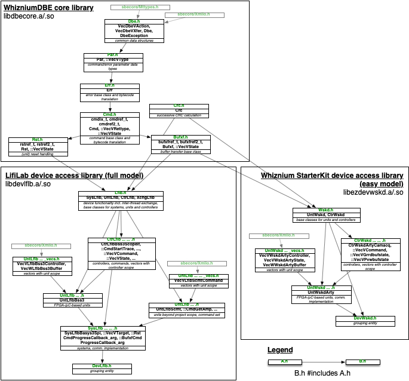

[back](./README.md)

# WhizniumDBE-Backed Project Source Code Organization

Whiznium StarterKit / LifiLab use cases; for any other project, replace 'Lflb'/'Brly' by its respective four-letter acronym.

