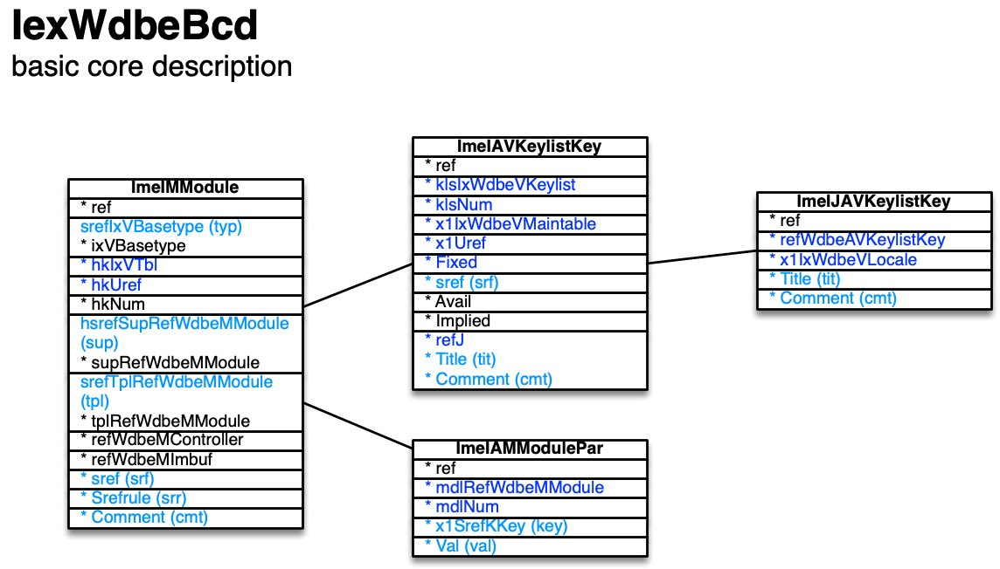

[back](../dbemdl.md)

Basic core description ``IexWdbeBcd``
===

**NOTE: The basic/detailed core description feature is intended for future use. Modelling roughly follows the device description counterparts.**

Schema
---

<em>Figure 1: Basic core description schema - table columns in light blue are part of the input file, table columns in dark blue are inferred</em>

Structure
---

[//]: # (IP structure - BEGIN)

&nbsp;&nbsp;&nbsp;&nbsp;\+ Module [``[ImeIMModule]``](#1-module-imeimmodule)
 &nbsp;&nbsp;&nbsp;&nbsp;&nbsp;&nbsp;&nbsp;&nbsp;\- Parameters [``[ImeIAMModulePar]``](#11-parameters-imeiammodulepar)
 &nbsp;&nbsp;&nbsp;&nbsp;&nbsp;&nbsp;&nbsp;&nbsp;\+ Keys [``[ImeIAVKeylistKey]``](#12-keys-imeiavkeylistkey)
 &nbsp;&nbsp;&nbsp;&nbsp;&nbsp;&nbsp;&nbsp;&nbsp;&nbsp;&nbsp;&nbsp;&nbsp;\- Name and comment by locale [``[ImeIJAVKeylistKey]``](#121-name-and-comment-by-locale-imeijavkeylistkey)

[//]: # (IP structure - END)

Details
---

### 1 Module ``[ImeIMModule]``

[//]: # (IP ImeIMModule.superUse - BEGIN)

Use:

[//]: # (IP ImeIMModule.superUse - END)

[//]: # (IP ImeIMModule.columns - BEGIN)

Column|Content|
-|-|
srefIxVBasetype (string)|type top: top hostif: host interface ehostif: easy model host interface cmdbus: command bus controller cmdinv: command invocation buffer cmdret: command return buffer imbuf: inter-module buffer mnfcore: manufacturer core mnfprim: manufacturer primitive ctr: controller fwdctr: forwarding controller ectr: easy model controller wrp: wrapper oth: other|
hsrefSupRefWdbeMModule (string)|super module|
srefTplRefWdbeMModule (string)|template|
sref (string)|identifier|
Srefrule (string)|identifier rule|
Comment (string)|comment|

[//]: # (IP ImeIMModule.columns - END)

### 1.1 Parameters ``[ImeIAMModulePar]``

[//]: # (IP ImeIAMModulePar.superUse - BEGIN)

Super import: module (1:N)

Use:

[//]: # (IP ImeIAMModulePar.superUse - END)

[//]: # (IP ImeIAMModulePar.columns - BEGIN)

Column|Content|
-|-|
x1SrefKKey (string)|key|
Val (string)|value|

[//]: # (IP ImeIAMModulePar.columns - END)

### 1.2 Keys ``[ImeIAVKeylistKey]``

[//]: # (IP ImeIAVKeylistKey.superUse - BEGIN)

Super import: module (1:N)

Use:

[//]: # (IP ImeIAVKeylistKey.superUse - END)

[//]: # (IP ImeIAVKeylistKey.columns - BEGIN)

Column|Content|
-|-|
sref (string)|identifier|
Title (string)|name|
Comment (string)|comment|

[//]: # (IP ImeIAVKeylistKey.columns - END)

### 1.2.1 Name and comment by locale ``[ImeIJAVKeylistKey]``

[//]: # (IP ImeIJAVKeylistKey.superUse - BEGIN)

Super import: keys (1:N)

Use:

[//]: # (IP ImeIJAVKeylistKey.superUse - END)

[//]: # (IP ImeIJAVKeylistKey.columns - BEGIN)

Column|Content|
-|-|
Title (string)|Title|
Comment (string)|Comment|

[//]: # (IP ImeIJAVKeylistKey.columns - END)

<small>Markdown for WhizniumDBE v1.1.3 auto-generated (what else ;-) ) by WhizniumSBE on 1 Jan 2021</small>
