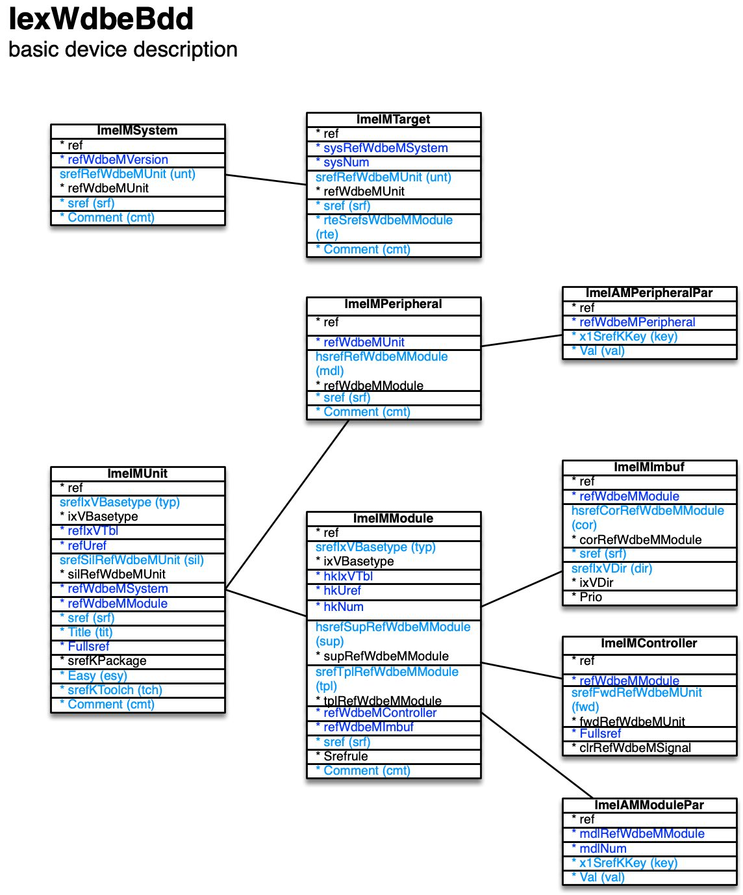

[back](../dbemdl.md)

Basic device description ``IexWdbeBdd``
===

Schema
---

<em>Figure 1: Basic device description schema - table columns in light blue are part of the input file, table columns in dark blue are inferred</em>

Structure
---

[//]: # (IP structure - BEGIN)

&nbsp;&nbsp;&nbsp;&nbsp;\+ System [``[ImeIMSystem]``](#1-system-imeimsystem)
 &nbsp;&nbsp;&nbsp;&nbsp;&nbsp;&nbsp;&nbsp;&nbsp;\- Target [``[ImeIMTarget]``](#11-target-imeimtarget)
 &nbsp;&nbsp;&nbsp;&nbsp;\+ Unit [``[ImeIMUnit]``](#2-unit-imeimunit)
 &nbsp;&nbsp;&nbsp;&nbsp;&nbsp;&nbsp;&nbsp;&nbsp;\+ Module [``[ImeIMModule]``](#21-module-imeimmodule)
 &nbsp;&nbsp;&nbsp;&nbsp;&nbsp;&nbsp;&nbsp;&nbsp;&nbsp;&nbsp;&nbsp;&nbsp;\- Parameters [``[ImeIAMModulePar]``](#211-parameters-imeiammodulepar)
 &nbsp;&nbsp;&nbsp;&nbsp;&nbsp;&nbsp;&nbsp;&nbsp;&nbsp;&nbsp;&nbsp;&nbsp;\- Controller [``[ImeIMController]``](#212-controller-imeimcontroller)
 &nbsp;&nbsp;&nbsp;&nbsp;&nbsp;&nbsp;&nbsp;&nbsp;&nbsp;&nbsp;&nbsp;&nbsp;\- Inter-module buffer [``[ImeIMImbuf]``](#213-inter-module-buffer-imeimimbuf)
 &nbsp;&nbsp;&nbsp;&nbsp;&nbsp;&nbsp;&nbsp;&nbsp;\+ Peripheral [``[ImeIMPeripheral]``](#22-peripheral-imeimperipheral)
 &nbsp;&nbsp;&nbsp;&nbsp;&nbsp;&nbsp;&nbsp;&nbsp;&nbsp;&nbsp;&nbsp;&nbsp;\- Parameters [``[ImeIAMPeripheralPar]``](#221-parameters-imeiamperipheralpar)

[//]: # (IP structure - END)

Details
---

### 1 System ``[ImeIMSystem]``

[//]: # (IP ImeIMSystem.superUse - BEGIN)

Use: full model only - a system is one possible hierarchical combination of units.

[//]: # (IP ImeIMSystem.superUse - END)

[//]: # (IP ImeIMSystem.columns - BEGIN)

Column|Content|
-|-|
srefRefWdbeMUnit (string)|root unit|
sref (string)|identifier|
Comment (string)|comment|

[//]: # (IP ImeIMSystem.columns - END)

### 1.1 Target ``[ImeIMTarget]``

[//]: # (IP ImeIMTarget.superUse - BEGIN)

Super import: system (1:N)

Use: full model only - a target combines a system's unit with the routing to be followed in order to reach it.

[//]: # (IP ImeIMTarget.superUse - END)

[//]: # (IP ImeIMTarget.columns - BEGIN)

Column|Content|
-|-|
srefRefWdbeMUnit (string)|unit|
sref (string)|identifier|
rteSrefsWdbeMModule (string)|routing - sequence of other units' forwarding controllers starting from root unit|
Comment (string)|comment|

[//]: # (IP ImeIMTarget.columns - END)

### 2 Unit ``[ImeIMUnit]``

[//]: # (IP ImeIMUnit.superUse - BEGIN)

Use: as "slicon" a unit represents a specific chip. In actual projects, a unit typically represents a PCB which can be addressed individually from the host.

[//]: # (IP ImeIMUnit.superUse - END)

[//]: # (IP ImeIMUnit.columns - BEGIN)

Column|Content|
-|-|
srefIxVBasetype (string)|type fpga: FPGA-based mcu: microcontroller-based oth: other|
srefSilRefWdbeMUnit (string)|silicon base unit|
sref (string)|identifier|
Title (string)|name|
Easy (bool)|easy model|
srefKToolch (string)|tool chain ise: Xilinx ISE mplab: Microchip MPLAB X syswb: ST SystemWorkbench vivado: Xilinx Vivado vivzynq: Xilinx Vivado for Zynq|
Comment (string)|comment|

[//]: # (IP ImeIMUnit.columns - END)

### 2.1 Module ``[ImeIMModule]``

[//]: # (IP ImeIMModule.superUse - BEGIN)

Super import: unit (1:N)

Use: equivalent to VHDL module.

[//]: # (IP ImeIMModule.superUse - END)

[//]: # (IP ImeIMModule.columns - BEGIN)

Column|Content|
-|-|
srefIxVBasetype (string)|type top: top hostif: host interface ehostif: easy model host interface cmdbus: command bus controller cmdinv: command invocation buffer cmdret: command return buffer imbuf: inter-module buffer mnfcore: manufacturer core mnfprim: manufacturer primitive ctr: controller fwdctr: forwarding controller ectr: easy model controller wrp: wrapper oth: other|
hsrefSupRefWdbeMModule (string)|super module|
srefTplRefWdbeMModule (string)|template|
sref (string)|identifier|
Comment (string)|comment|

[//]: # (IP ImeIMModule.columns - END)

### 2.1.1 Parameters ``[ImeIAMModulePar]``

[//]: # (IP ImeIAMModulePar.superUse - BEGIN)

Super import: module (1:N)

Use: customize template-based modules with key/value pairs.

[//]: # (IP ImeIAMModulePar.superUse - END)

[//]: # (IP ImeIAMModulePar.columns - BEGIN)

Column|Content|
-|-|
x1SrefKKey (string)|key|
Val (string)|value|

[//]: # (IP ImeIAMModulePar.columns - END)

### 2.1.2 Controller ``[ImeIMController]``

[//]: # (IP ImeIMController.superUse - BEGIN)

Super import: module (1:1)

Use: manually attach to forwarding controller to state the unit it is forwarding to. Inferred for ctr, ectr module types.

[//]: # (IP ImeIMController.superUse - END)

[//]: # (IP ImeIMController.columns - BEGIN)

Column|Content|
-|-|
srefFwdRefWdbeMUnit (string)|unit forwarding to|

[//]: # (IP ImeIMController.columns - END)

### 2.1.3 Inter-module buffer ``[ImeIMImbuf]``

[//]: # (IP ImeIMImbuf.superUse - BEGIN)

Super import: module (1:1)

Use: attach to inter-module buffer to state the corresponding module and data flow direction.

[//]: # (IP ImeIMImbuf.superUse - END)

[//]: # (IP ImeIMImbuf.columns - BEGIN)

Column|Content|
-|-|
hsrefCorRefWdbeMModule (string)|corresponding module|
sref (string)|identifier|
srefIxVDir (string)|direction in: input out: output|

[//]: # (IP ImeIMImbuf.columns - END)

### 2.2 Peripheral ``[ImeIMPeripheral]``

[//]: # (IP ImeIMPeripheral.superUse - BEGIN)

Super import: unit (1:N)

Use: for MCU-type units, specify which peripherals are implemented in silicon.

[//]: # (IP ImeIMPeripheral.superUse - END)

[//]: # (IP ImeIMPeripheral.columns - BEGIN)

Column|Content|
-|-|
hsrefRefWdbeMModule (string)|controlling module|
sref (string)|identifier|
Comment (string)|comment|

[//]: # (IP ImeIMPeripheral.columns - END)

### 2.2.1 Parameters ``[ImeIAMPeripheralPar]``

[//]: # (IP ImeIAMPeripheralPar.superUse - BEGIN)

Super import: peripheral (1:N)

Use: specify additional information as key/value pairs

[//]: # (IP ImeIAMPeripheralPar.superUse - END)

[//]: # (IP ImeIAMPeripheralPar.columns - BEGIN)

Column|Content|
-|-|
x1SrefKKey (string)|key|
Val (string)|value|

[//]: # (IP ImeIAMPeripheralPar.columns - END)

<small>Markdown for WhizniumDBE v1.1.3 auto-generated (what else ;-) ) by WhizniumSBE on 1 Jan 2021</small>
