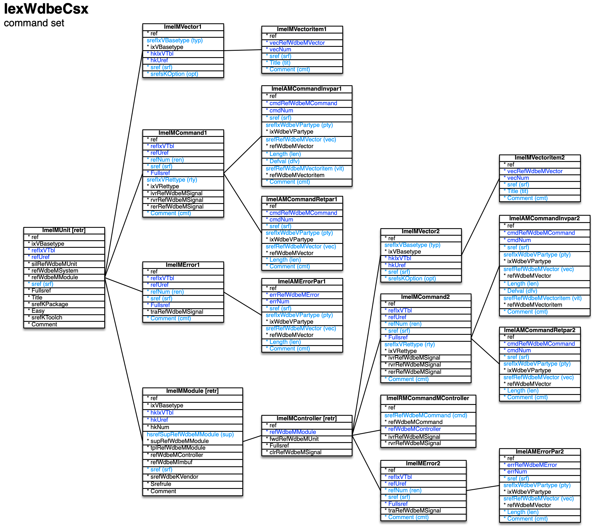

[back](../dbemdl.md)

Command set ``IexWdbeCsx``
===

Schema
---

<em>Figure 1: Command set schema - table columns in light blue are part of the input file, table columns in dark blue are inferred</em>

Structure
---

[//]: # (IP structure - BEGIN)

&nbsp;&nbsp;&nbsp;&nbsp;\+ Unit [``[ImeIMUnit]``](#1-unit-imeimunit)
 &nbsp;&nbsp;&nbsp;&nbsp;&nbsp;&nbsp;&nbsp;&nbsp;\+ Command [``[ImeIMCommand1]``](#11-command-imeimcommand1)
 &nbsp;&nbsp;&nbsp;&nbsp;&nbsp;&nbsp;&nbsp;&nbsp;&nbsp;&nbsp;&nbsp;&nbsp;\- Invocation parameters [``[ImeIAMCommandInvpar1]``](#111-invocation-parameters-imeiamcommandinvpar1)
 &nbsp;&nbsp;&nbsp;&nbsp;&nbsp;&nbsp;&nbsp;&nbsp;&nbsp;&nbsp;&nbsp;&nbsp;\- Return parameters [``[ImeIAMCommandRetpar1]``](#112-return-parameters-imeiamcommandretpar1)
 &nbsp;&nbsp;&nbsp;&nbsp;&nbsp;&nbsp;&nbsp;&nbsp;\+ Error [``[ImeIMError1]``](#12-error-imeimerror1)
 &nbsp;&nbsp;&nbsp;&nbsp;&nbsp;&nbsp;&nbsp;&nbsp;&nbsp;&nbsp;&nbsp;&nbsp;\- Parameters [``[ImeIAMErrorPar1]``](#121-parameters-imeiamerrorpar1)
 &nbsp;&nbsp;&nbsp;&nbsp;&nbsp;&nbsp;&nbsp;&nbsp;\+ Module [``[ImeIMModule]``](#13-module-imeimmodule)
 &nbsp;&nbsp;&nbsp;&nbsp;&nbsp;&nbsp;&nbsp;&nbsp;&nbsp;&nbsp;&nbsp;&nbsp;\+ Controller [``[ImeIMController]``](#131-controller-imeimcontroller)
 &nbsp;&nbsp;&nbsp;&nbsp;&nbsp;&nbsp;&nbsp;&nbsp;&nbsp;&nbsp;&nbsp;&nbsp;&nbsp;&nbsp;&nbsp;&nbsp;\+ Command [``[ImeIMCommand2]``](#1311-command-imeimcommand2)
 &nbsp;&nbsp;&nbsp;&nbsp;&nbsp;&nbsp;&nbsp;&nbsp;&nbsp;&nbsp;&nbsp;&nbsp;&nbsp;&nbsp;&nbsp;&nbsp;&nbsp;&nbsp;&nbsp;&nbsp;\- Invocation parameters [``[ImeIAMCommandInvpar2]``](#13111-invocation-parameters-imeiamcommandinvpar2)
 &nbsp;&nbsp;&nbsp;&nbsp;&nbsp;&nbsp;&nbsp;&nbsp;&nbsp;&nbsp;&nbsp;&nbsp;&nbsp;&nbsp;&nbsp;&nbsp;&nbsp;&nbsp;&nbsp;&nbsp;\- Return parameters [``[ImeIAMCommandRetpar2]``](#13112-return-parameters-imeiamcommandretpar2)
 &nbsp;&nbsp;&nbsp;&nbsp;&nbsp;&nbsp;&nbsp;&nbsp;&nbsp;&nbsp;&nbsp;&nbsp;&nbsp;&nbsp;&nbsp;&nbsp;\+ Error [``[ImeIMError2]``](#13142-error-imeimerror2)
 &nbsp;&nbsp;&nbsp;&nbsp;&nbsp;&nbsp;&nbsp;&nbsp;&nbsp;&nbsp;&nbsp;&nbsp;&nbsp;&nbsp;&nbsp;&nbsp;&nbsp;&nbsp;&nbsp;&nbsp;\- Parameters [``[ImeIAMErrorPar2]``](#13121-parameters-imeiamerrorpar2)
 &nbsp;&nbsp;&nbsp;&nbsp;&nbsp;&nbsp;&nbsp;&nbsp;&nbsp;&nbsp;&nbsp;&nbsp;&nbsp;&nbsp;&nbsp;&nbsp;\+ Vector [``[ImeIMVector2]``](#1313-vector-imeimvector2)
 &nbsp;&nbsp;&nbsp;&nbsp;&nbsp;&nbsp;&nbsp;&nbsp;&nbsp;&nbsp;&nbsp;&nbsp;&nbsp;&nbsp;&nbsp;&nbsp;&nbsp;&nbsp;&nbsp;&nbsp;\- Vector item [``[ImeIMVectoritem2]``](#13131-vector-item-imeimvectoritem2)
 &nbsp;&nbsp;&nbsp;&nbsp;&nbsp;&nbsp;&nbsp;&nbsp;&nbsp;&nbsp;&nbsp;&nbsp;&nbsp;&nbsp;&nbsp;&nbsp;\- External commands [``[ImeIRMCommandMController]``](#1314-external-commands-imeirmcommandmcontroller)
 &nbsp;&nbsp;&nbsp;&nbsp;&nbsp;&nbsp;&nbsp;&nbsp;\+ Vector [``[ImeIMVector1]``](#14-vector-imeimvector1)
 &nbsp;&nbsp;&nbsp;&nbsp;&nbsp;&nbsp;&nbsp;&nbsp;&nbsp;&nbsp;&nbsp;&nbsp;\- Vector item [``[ImeIMVectoritem1]``](#141-vector-item-imeimvectoritem1)

[//]: # (IP structure - END)

Details
---

### 1 Unit ``[ImeIMUnit]``

[//]: # (IP ImeIMUnit.superUse - BEGIN)

Use: retrieve unit defined in modular structure.

[//]: # (IP ImeIMUnit.superUse - END)

[//]: # (IP ImeIMUnit.columns - BEGIN)

Column|Content|
-|-|
sref (string)|identifier|

[//]: # (IP ImeIMUnit.columns - END)

### 1.1 Command ``[ImeIMCommand1]``

[//]: # (IP ImeIMCommand1.superUse - BEGIN)

Super import: unit (1:N)

Use: externally defined units only - self-explanatory.

[//]: # (IP ImeIMCommand1.superUse - END)

[//]: # (IP ImeIMCommand1.columns - BEGIN)

Column|Content|
-|-|
refNum (uint)|op-code, else 0|
sref (string)|identifier|
srefIxVRettype (string)|return type void: none statsng: static single immsng: immediate single dfrsng: deferred single mult: multiple|
Comment (string)|comment|

[//]: # (IP ImeIMCommand1.columns - END)

### 1.1.1 Invocation parameters ``[ImeIAMCommandInvpar1]``

[//]: # (IP ImeIAMCommandInvpar1.superUse - BEGIN)

Super import: command (1:N)

Use: self-explanatory.

[//]: # (IP ImeIAMCommandInvpar1.superUse - END)

[//]: # (IP ImeIAMCommandInvpar1.columns - BEGIN)

Column|Content|
-|-|
sref (string)|identifier|
srefIxWdbeVPartype (string)|parameter data type tix: vector item index _bool: boolean int8: integer / byte (8bit) uint8: unsigned integer / byte (8bit) int16: integer (16bit) uint16: unsigned integer (16bit) int32: integer (32bit) uint32: unsigned integer (32bit) blob: fixed length binary large object vblob: variable length bin. large. obj.|
srefRefWdbeMVector (string)|tix par. type - vector|
Length (utinyint)|blob/vblob partype - (max.) length|
Defval (string)|default value|
srefRefWdbeMVectoritem (string)|tix par. type - default vector item|
Comment (string)|comment|

[//]: # (IP ImeIAMCommandInvpar1.columns - END)

### 1.1.2 Return parameters ``[ImeIAMCommandRetpar1]``

[//]: # (IP ImeIAMCommandRetpar1.superUse - BEGIN)

Super import: command (1:N)

Use: self-explanatory.

[//]: # (IP ImeIAMCommandRetpar1.superUse - END)

[//]: # (IP ImeIAMCommandRetpar1.columns - BEGIN)

Column|Content|
-|-|
sref (string)|identifier|
srefIxWdbeVPartype (string)|parameter data type tix: vector item index _bool: boolean int8: integer / byte (8bit) uint8: unsigned integer / byte (8bit) int16: integer (16bit) uint16: unsigned integer (16bit) int32: integer (32bit) uint32: unsigned integer (32bit) blob: fixed length binary large object vblob: variable length bin. large. obj.|
srefRefWdbeMVector (string)|tix par. type - vector|
Length (utinyint)|blob/vblob par. type - (max.) length|
Comment (string)|comment|

[//]: # (IP ImeIAMCommandRetpar1.columns - END)

### 1.2 Error ``[ImeIMError1]``

[//]: # (IP ImeIMError1.superUse - BEGIN)

Super import: unit (1:N)

Use: externally defined units only - error analogous to "abnormal return" of command.

[//]: # (IP ImeIMError1.superUse - END)

[//]: # (IP ImeIMError1.columns - BEGIN)

Column|Content|
-|-|
refNum (uint)|error code, else 0|
sref (string)|identifier|
Comment (string)|comment|

[//]: # (IP ImeIMError1.columns - END)

### 1.2.1 Parameters ``[ImeIAMErrorPar1]``

[//]: # (IP ImeIAMErrorPar1.superUse - BEGIN)

Super import: error (1:N)

Use: self-explanatory.

[//]: # (IP ImeIAMErrorPar1.superUse - END)

[//]: # (IP ImeIAMErrorPar1.columns - BEGIN)

Column|Content|
-|-|
sref (string)|identifier|
srefIxWdbeVPartype (string)|parameter data type tix: vector item index _bool: boolean int8: integer / byte (8bit) uint8: unsigned integer / byte (8bit) int16: integer (16bit) uint16: unsigned integer (16bit) int32: integer (32bit) uint32: unsigned integer (32bit) blob: fixed length binary large object vblob: variable length bin. large. obj.|
srefRefWdbeMVector (string)|tix par. type - vector|
Length (utinyint)|blob/vblob par. type - (max.) length|
Comment (string)|comment|

[//]: # (IP ImeIAMErrorPar1.columns - END)

### 1.3 Module ``[ImeIMModule]``

[//]: # (IP ImeIMModule.superUse - BEGIN)

Super import: unit (1:N)

Use: retrieve module defined in basic device description.

[//]: # (IP ImeIMModule.superUse - END)

[//]: # (IP ImeIMModule.columns - BEGIN)

Column|Content|
-|-|
hsrefSupRefWdbeMModule (string)|super module|
sref (string)|identifier|

[//]: # (IP ImeIMModule.columns - END)

### 1.3.1 Controller ``[ImeIMController]``

[//]: # (IP ImeIMController.superUse - BEGIN)

Super import: module (1:1)

Use: retrieve controller defined in modular structure.

[//]: # (IP ImeIMController.superUse - END)

(no content)

### 1.3.1.1 Command ``[ImeIMCommand2]``

[//]: # (IP ImeIMCommand2.superUse - BEGIN)

Super import: controller (1:N)

Use: self-explanatory.

[//]: # (IP ImeIMCommand2.superUse - END)

[//]: # (IP ImeIMCommand2.columns - BEGIN)

Column|Content|
-|-|
refNum (uint)|op-code, else 0|
sref (string)|identifier|
srefIxVRettype (string)|return type void: none statsng: static single immsng: immediate single dfrsng: deferred single mult: multiple|
Comment (string)|comment|

[//]: # (IP ImeIMCommand2.columns - END)

### 1.3.1.1.1 Invocation parameters ``[ImeIAMCommandInvpar2]``

[//]: # (IP ImeIAMCommandInvpar2.superUse - BEGIN)

Super import: command (1:N)

Use: self-explanatory.

[//]: # (IP ImeIAMCommandInvpar2.superUse - END)

[//]: # (IP ImeIAMCommandInvpar2.columns - BEGIN)

Column|Content|
-|-|
sref (string)|identifier|
srefIxWdbeVPartype (string)|parameter data type tix: vector item index _bool: boolean int8: integer / byte (8bit) uint8: unsigned integer / byte (8bit) int16: integer (16bit) uint16: unsigned integer (16bit) int32: integer (32bit) uint32: unsigned integer (32bit) blob: fixed length binary large object vblob: variable length bin. large. obj.|
srefRefWdbeMVector (string)|tix par. type - vector|
Length (utinyint)|blob/vblob partype - (max.) length|
Defval (string)|default value|
srefRefWdbeMVectoritem (string)|tix par. type - default vector item|
Comment (string)|comment|

[//]: # (IP ImeIAMCommandInvpar2.columns - END)

### 1.3.1.1.2 Return parameters ``[ImeIAMCommandRetpar2]``

[//]: # (IP ImeIAMCommandRetpar2.superUse - BEGIN)

Super import: command (1:N)

Use: self-explanatory.

[//]: # (IP ImeIAMCommandRetpar2.superUse - END)

[//]: # (IP ImeIAMCommandRetpar2.columns - BEGIN)

Column|Content|
-|-|
sref (string)|identifier|
srefIxWdbeVPartype (string)|parameter data type tix: vector item index _bool: boolean int8: integer / byte (8bit) uint8: unsigned integer / byte (8bit) int16: integer (16bit) uint16: unsigned integer (16bit) int32: integer (32bit) uint32: unsigned integer (32bit) blob: fixed length binary large object vblob: variable length bin. large. obj.|
srefRefWdbeMVector (string)|tix par. type - vector|
Length (utinyint)|blob/vblob partype - (max.) length|
Comment (string)|comment|

[//]: # (IP ImeIAMCommandRetpar2.columns - END)

### 1.3.1.2 Error ``[ImeIMError2]``

[//]: # (IP ImeIMError2.superUse - BEGIN)

Super import: controller (1:N)

Use: error analogous to "abnormal return" of command.

[//]: # (IP ImeIMError2.superUse - END)

[//]: # (IP ImeIMError2.columns - BEGIN)

Column|Content|
-|-|
refNum (uint)|error code, else 0|
sref (string)|identifier|
Comment (string)|comment|

[//]: # (IP ImeIMError2.columns - END)

### 1.3.1.2.1 Parameters ``[ImeIAMErrorPar2]``

[//]: # (IP ImeIAMErrorPar2.superUse - BEGIN)

Super import: error (1:N)

Use: self-explanatory.

[//]: # (IP ImeIAMErrorPar2.superUse - END)

[//]: # (IP ImeIAMErrorPar2.columns - BEGIN)

Column|Content|
-|-|
sref (string)|identifier|
srefIxWdbeVPartype (string)|parameter data type tix: vector item index _bool: boolean int8: integer / byte (8bit) uint8: unsigned integer / byte (8bit) int16: integer (16bit) uint16: unsigned integer (16bit) int32: integer (32bit) uint32: unsigned integer (32bit) blob: fixed length binary large object vblob: variable length bin. large. obj.|
srefRefWdbeMVector (string)|tix par. type - vector|
Length (utinyint)|blob/vblob partype - (max.) length|
Comment (string)|comment|

[//]: # (IP ImeIAMErrorPar2.columns - END)

### 1.3.1.3 Vector ``[ImeIMVector2]``

[//]: # (IP ImeIMVector2.superUse - BEGIN)

Super import: controller (1:N)

Use: uint8_t index vector specific to controller. Vector items can be used as arguments for the controller's commands and errors.

[//]: # (IP ImeIMVector2.superUse - END)

[//]: # (IP ImeIMVector2.columns - BEGIN)

Column|Content|
-|-|
srefIxVBasetype (string)|type tixlin: utinyint index linear tixor: utinyint index multi-choice|
sref (string)|identifier|
srefsKOption (string)|options notit: no titles cmt: comments apdfed: append to feed filfed: fill feed|

[//]: # (IP ImeIMVector2.columns - END)

### 1.3.1.3.1 Vector item ``[ImeIMVectoritem2]``

[//]: # (IP ImeIMVectoritem2.superUse - BEGIN)

Super import: vector (1:N)

Use: self-explanatory.

[//]: # (IP ImeIMVectoritem2.superUse - END)

[//]: # (IP ImeIMVectoritem2.columns - BEGIN)

Column|Content|
-|-|
sref (string)|identifier|
Title (string)|name|
Comment (string)|comment|

[//]: # (IP ImeIMVectoritem2.columns - END)

### 1.3.1.4 External commands ``[ImeIRMCommandMController]``

[//]: # (IP ImeIRMCommandMController.superUse - BEGIN)

Super import: controller (1:N)

Use: commands invoked in other controllers.

[//]: # (IP ImeIRMCommandMController.superUse - END)

[//]: # (IP ImeIRMCommandMController.columns - BEGIN)

Column|Content|
-|-|
srefRefWdbeMCommand (string)|command with controller prepended|

[//]: # (IP ImeIRMCommandMController.columns - END)

### 1.4 Vector ``[ImeIMVector1]``

[//]: # (IP ImeIMVector1.superUse - BEGIN)

Super import: unit (1:N)

Use: vector attached to unit.

[//]: # (IP ImeIMVector1.superUse - END)

[//]: # (IP ImeIMVector1.columns - BEGIN)

Column|Content|
-|-|
srefIxVBasetype (string)|type ixlin: uint index linear tixlin: utinyint index linear tixor: utinyint index multi-choice|
sref (string)|identifier|
srefsKOption (string)|options notit: no titles cmt: comments apdfed: append to feed filfed: fill feed|

[//]: # (IP ImeIMVector1.columns - END)

### 1.4.1 Vector item ``[ImeIMVectoritem1]``

[//]: # (IP ImeIMVectoritem1.superUse - BEGIN)

Super import: vector (1:N)

Use: self-explanatory.

[//]: # (IP ImeIMVectoritem1.superUse - END)

[//]: # (IP ImeIMVectoritem1.columns - BEGIN)

Column|Content|
-|-|
sref (string)|identifier|
Title (string)|name|
Comment (string)|comment|

[//]: # (IP ImeIMVectoritem1.columns - END)

<small>Markdown for WhizniumDBE v1.1.17 auto-generated (what else ;-) ) by WhizniumSBE on 14 Nov 2021</small>
