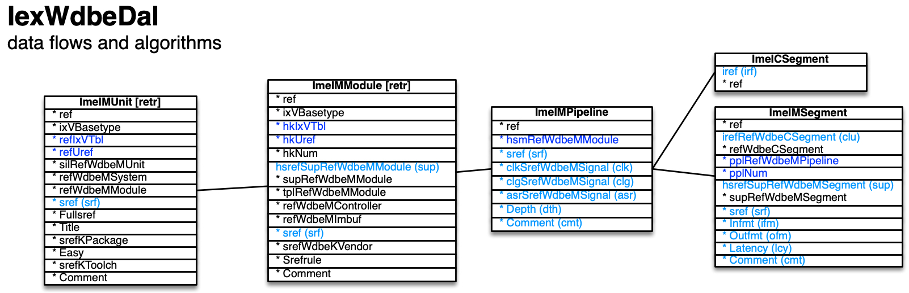

[back](../dbemdl.md)

Data flows and algorithms ``IexWdbeDal``
===

Schema
---

<em>Figure 1: Data flows and algorithms schema - table columns in light blue are part of the input file, table columns in dark blue are inferred</em>

Structure
---

[//]: # (IP structure - BEGIN)

&nbsp;&nbsp;&nbsp;&nbsp;\+ Unit [``[ImeIMUnit]``](#1-unit-imeimunit)
 &nbsp;&nbsp;&nbsp;&nbsp;&nbsp;&nbsp;&nbsp;&nbsp;\+ Module [``[ImeIMModule]``](#11-module-imeimmodule)
 &nbsp;&nbsp;&nbsp;&nbsp;&nbsp;&nbsp;&nbsp;&nbsp;&nbsp;&nbsp;&nbsp;&nbsp;\+ Pipeline [``[ImeIMPipeline]``](#111-pipeline-imeimpipeline)
 &nbsp;&nbsp;&nbsp;&nbsp;&nbsp;&nbsp;&nbsp;&nbsp;&nbsp;&nbsp;&nbsp;&nbsp;&nbsp;&nbsp;&nbsp;&nbsp;\- Segments cluster [``[ImeICSegment]``](#1111-segments-cluster-imeicsegment)
 &nbsp;&nbsp;&nbsp;&nbsp;&nbsp;&nbsp;&nbsp;&nbsp;&nbsp;&nbsp;&nbsp;&nbsp;&nbsp;&nbsp;&nbsp;&nbsp;\- Segment [``[ImeIMSegment]``](#1112-segment-imeimsegment)

[//]: # (IP structure - END)

Details
---

### 1 Unit ``[ImeIMUnit]``

[//]: # (IP ImeIMUnit.superUse - BEGIN)

Use: retrieve unit specified in modular structure.

[//]: # (IP ImeIMUnit.superUse - END)

[//]: # (IP ImeIMUnit.columns - BEGIN)

Column|Content|
-|-|
sref (string)|identifier|

[//]: # (IP ImeIMUnit.columns - END)

### 1.1 Module ``[ImeIMModule]``

[//]: # (IP ImeIMModule.superUse - BEGIN)

Super import: unit (1:N)

Use: retrieve module specified in modular structure.

[//]: # (IP ImeIMModule.superUse - END)

[//]: # (IP ImeIMModule.columns - BEGIN)

Column|Content|
-|-|
hsrefSupRefWdbeMModule (string)|super module|
sref (string)|identifier|

[//]: # (IP ImeIMModule.columns - END)

### 1.1.1 Pipeline ``[ImeIMPipeline]``

[//]: # (IP ImeIMPipeline.superUse - BEGIN)

Super import: module (1:N)

Use: define pipeline for streamed data to pass through.

[//]: # (IP ImeIMPipeline.superUse - END)

[//]: # (IP ImeIMPipeline.columns - BEGIN)

Column|Content|
-|-|
sref (string)|identifier|
clkSrefWdbeMSignal (string)|clock signal|
clgSrefWdbeMSignal (string)|clock gating signal|
asrSrefWdbeMSignal (string)|asynchronous reset signal|
Depth (usmallint)|depth|
Comment (string)|comment|

[//]: # (IP ImeIMPipeline.columns - END)

### 1.1.1.1 Segments cluster ``[ImeICSegment]``

[//]: # (IP ImeICSegment.superUse - BEGIN)

Super import: pipeline (1:N)

Use: group segments.

[//]: # (IP ImeICSegment.superUse - END)

[//]: # (IP ImeICSegment.columns - BEGIN)

Column|Content|
-|-|
iref (ubigint)|integer reference|

[//]: # (IP ImeICSegment.columns - END)

### 1.1.1.2 Segment ``[ImeIMSegment]``

[//]: # (IP ImeIMSegment.superUse - BEGIN)

Super import: pipeline (1:N)

Use: specify hierarchical structure of segments / stages within pipeline.

[//]: # (IP ImeIMSegment.superUse - END)

[//]: # (IP ImeIMSegment.columns - BEGIN)

Column|Content|
-|-|
irefRefWdbeCSegment (ubigint)|integer reference to segments cluster|
hsrefSupRefWdbeMSegment (string)|super segment|
sref (string)|identifier|
Infmt (string)|input format|
Outfmt (string)|output format|
Latency (usmallint)|latency|
Comment (string)|comment|

[//]: # (IP ImeIMSegment.columns - END)

<small>Markdown for WhizniumDBE v1.1.17 auto-generated (what else ;-) ) by WhizniumSBE on 14 Nov 2021</small>
