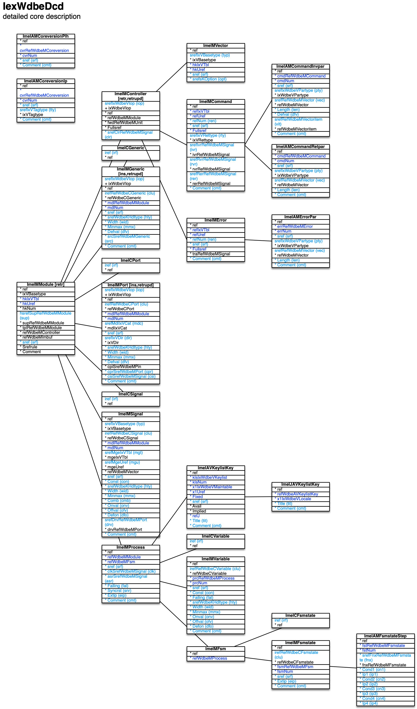

[back](../dbemdl.md)

Detailed core description ``IexWdbeDcd``
===

**NOTE: The basic/detailed core description feature is intended for future use. Modelling roughly follows the basic/detailed device description counterparts.**

Schema
---

<em>Figure 1: Detailed core description schema - table columns in light blue are part of the input file, table columns in dark blue are inferred</em>

Structure
---

[//]: # (IP structure - BEGIN)

&nbsp;&nbsp;&nbsp;&nbsp;\- Insertion points [``[ImeIAMCoreversionIp]``](#1-Insertion-points-ImeIAMCoreversionIp)
 &nbsp;&nbsp;&nbsp;&nbsp;\- Placeholders [``[ImeIAMCoreversionPlh]``](#2-Placeholders-ImeIAMCoreversionPlh)
 &nbsp;&nbsp;&nbsp;&nbsp;\+ Module [``[ImeIMModule]``](#3-Module-ImeIMModule)
 &nbsp;&nbsp;&nbsp;&nbsp;&nbsp;&nbsp;&nbsp;&nbsp;\- Generics cluster [``[ImeICGeneric]``](#31-Generics-cluster-ImeICGeneric)
 &nbsp;&nbsp;&nbsp;&nbsp;&nbsp;&nbsp;&nbsp;&nbsp;\- Ports cluster [``[ImeICPort]``](#32-Ports-cluster-ImeICPort)
 &nbsp;&nbsp;&nbsp;&nbsp;&nbsp;&nbsp;&nbsp;&nbsp;\- Signals cluster [``[ImeICSignal]``](#33-Signals-cluster-ImeICSignal)
 &nbsp;&nbsp;&nbsp;&nbsp;&nbsp;&nbsp;&nbsp;&nbsp;\+ Controller [``[ImeIMController]``](#34-Controller-ImeIMController)
 &nbsp;&nbsp;&nbsp;&nbsp;&nbsp;&nbsp;&nbsp;&nbsp;&nbsp;&nbsp;&nbsp;&nbsp;\+ Command [``[ImeIMCommand]``](#341-Command-ImeIMCommand)
 &nbsp;&nbsp;&nbsp;&nbsp;&nbsp;&nbsp;&nbsp;&nbsp;&nbsp;&nbsp;&nbsp;&nbsp;&nbsp;&nbsp;&nbsp;&nbsp;\- Invocation parameters [``[ImeIAMCommandInvpar]``](#3411-Invocation-parameters-ImeIAMCommandInvpar)
 &nbsp;&nbsp;&nbsp;&nbsp;&nbsp;&nbsp;&nbsp;&nbsp;&nbsp;&nbsp;&nbsp;&nbsp;&nbsp;&nbsp;&nbsp;&nbsp;\- Return parameters [``[ImeIAMCommandRetpar]``](#3412-Return-parameters-ImeIAMCommandRetpar)
 &nbsp;&nbsp;&nbsp;&nbsp;&nbsp;&nbsp;&nbsp;&nbsp;&nbsp;&nbsp;&nbsp;&nbsp;\+ Error [``[ImeIMError]``](#342-Error-ImeIMError)
 &nbsp;&nbsp;&nbsp;&nbsp;&nbsp;&nbsp;&nbsp;&nbsp;&nbsp;&nbsp;&nbsp;&nbsp;&nbsp;&nbsp;&nbsp;&nbsp;\- Parameters [``[ImeIAMErrorPar]``](#3421-Parameters-ImeIAMErrorPar)
 &nbsp;&nbsp;&nbsp;&nbsp;&nbsp;&nbsp;&nbsp;&nbsp;&nbsp;&nbsp;&nbsp;&nbsp;\- Vector [``[ImeIMVector]``](#343-Vector-ImeIMVector)
 &nbsp;&nbsp;&nbsp;&nbsp;&nbsp;&nbsp;&nbsp;&nbsp;\- Generic [``[ImeIMGeneric]``](#35-Generic-ImeIMGeneric)
 &nbsp;&nbsp;&nbsp;&nbsp;&nbsp;&nbsp;&nbsp;&nbsp;\- Port [``[ImeIMPort]``](#36-Port-ImeIMPort)
 &nbsp;&nbsp;&nbsp;&nbsp;&nbsp;&nbsp;&nbsp;&nbsp;\+ Process [``[ImeIMProcess]``](#37-Process-ImeIMProcess)
 &nbsp;&nbsp;&nbsp;&nbsp;&nbsp;&nbsp;&nbsp;&nbsp;&nbsp;&nbsp;&nbsp;&nbsp;\+ Keys [``[ImeIAVKeylistKey]``](#371-Keys-ImeIAVKeylistKey)
 &nbsp;&nbsp;&nbsp;&nbsp;&nbsp;&nbsp;&nbsp;&nbsp;&nbsp;&nbsp;&nbsp;&nbsp;&nbsp;&nbsp;&nbsp;&nbsp;\- Name and comment by locale [``[ImeIJAVKeylistKey]``](#3711-Name-and-comment-by-locale-ImeIJAVKeylistKey)
 &nbsp;&nbsp;&nbsp;&nbsp;&nbsp;&nbsp;&nbsp;&nbsp;&nbsp;&nbsp;&nbsp;&nbsp;\- Variables cluster [``[ImeICVariable]``](#372-Variables-cluster-ImeICVariable)
 &nbsp;&nbsp;&nbsp;&nbsp;&nbsp;&nbsp;&nbsp;&nbsp;&nbsp;&nbsp;&nbsp;&nbsp;\+ Finite state machine [``[ImeIMFsm]``](#373-Finite-state-machine-ImeIMFsm)
 &nbsp;&nbsp;&nbsp;&nbsp;&nbsp;&nbsp;&nbsp;&nbsp;&nbsp;&nbsp;&nbsp;&nbsp;&nbsp;&nbsp;&nbsp;&nbsp;\- FSM states cluster [``[ImeICFsmstate]``](#3731-FSM-states-cluster-ImeICFsmstate)
 &nbsp;&nbsp;&nbsp;&nbsp;&nbsp;&nbsp;&nbsp;&nbsp;&nbsp;&nbsp;&nbsp;&nbsp;&nbsp;&nbsp;&nbsp;&nbsp;\+ FSM state [``[ImeIMFsmstate]``](#3732-FSM-state-ImeIMFsmstate)
 &nbsp;&nbsp;&nbsp;&nbsp;&nbsp;&nbsp;&nbsp;&nbsp;&nbsp;&nbsp;&nbsp;&nbsp;&nbsp;&nbsp;&nbsp;&nbsp;&nbsp;&nbsp;&nbsp;&nbsp;\- Steppings [``[ImeIAMFsmstateStep]``](#37321-Steppings-ImeIAMFsmstateStep)
 &nbsp;&nbsp;&nbsp;&nbsp;&nbsp;&nbsp;&nbsp;&nbsp;&nbsp;&nbsp;&nbsp;&nbsp;\- Variable [``[ImeIMVariable]``](#374-Variable-ImeIMVariable)
 &nbsp;&nbsp;&nbsp;&nbsp;&nbsp;&nbsp;&nbsp;&nbsp;\- Signal [``[ImeIMSignal]``](#38-Signal-ImeIMSignal)

[//]: # (IP structure - END)

Details
---

### 1 Insertion points ``[ImeIAMCoreversionIp]``

[//]: # (IP ImeIAMCoreversionIp.superUse - BEGIN)

Use:

[//]: # (IP ImeIAMCoreversionIp.superUse - END)

[//]: # (IP ImeIAMCoreversionIp.columns - BEGIN)

Column|Content|
-|-|
sref (string)|identifier|
srefIxVTagtype (string)|tag type ins: ibegin/iend rmv: remove repl: rbegin/rend|
Comment (string)|comment|

[//]: # (IP ImeIAMCoreversionIp.columns - END)

### 2 Placeholders ``[ImeIAMCoreversionPlh]``

[//]: # (IP ImeIAMCoreversionPlh.superUse - BEGIN)

Use:

[//]: # (IP ImeIAMCoreversionPlh.superUse - END)

[//]: # (IP ImeIAMCoreversionPlh.columns - BEGIN)

Column|Content|
-|-|
sref (string)|identifier|
Comment (string)|comment|

[//]: # (IP ImeIAMCoreversionPlh.columns - END)

### 3 Module ``[ImeIMModule]``

[//]: # (IP ImeIMModule.superUse - BEGIN)

Use:

[//]: # (IP ImeIMModule.superUse - END)

[//]: # (IP ImeIMModule.columns - BEGIN)

Column|Content|
-|-|
hsrefSupRefWdbeMModule (string)|super module|
sref (string)|identifier|

[//]: # (IP ImeIMModule.columns - END)

### 3.1 Generics cluster ``[ImeICGeneric]``

[//]: # (IP ImeICGeneric.superUse - BEGIN)

Super import: module (1:N)

Use:

[//]: # (IP ImeICGeneric.superUse - END)

[//]: # (IP ImeICGeneric.columns - BEGIN)

Column|Content|
-|-|
iref (ubigint)|integer reference|

[//]: # (IP ImeICGeneric.columns - END)

### 3.2 Ports cluster ``[ImeICPort]``

[//]: # (IP ImeICPort.superUse - BEGIN)

Super import: module (1:N)

Use:

[//]: # (IP ImeICPort.superUse - END)

[//]: # (IP ImeICPort.columns - BEGIN)

Column|Content|
-|-|
iref (ubigint)|integer reference|

[//]: # (IP ImeICPort.columns - END)

### 3.3 Signals cluster ``[ImeICSignal]``

[//]: # (IP ImeICSignal.superUse - BEGIN)

Super import: module (1:N)

Use:

[//]: # (IP ImeICSignal.superUse - END)

[//]: # (IP ImeICSignal.columns - BEGIN)

Column|Content|
-|-|
iref (ubigint)|integer reference|

[//]: # (IP ImeICSignal.columns - END)

### 3.4 Controller ``[ImeIMController]``

[//]: # (IP ImeIMController.superUse - BEGIN)

Super import: module (1:1)

Use:

[//]: # (IP ImeIMController.superUse - END)

[//]: # (IP ImeIMController.columns - BEGIN)

Column|Content|
-|-|
srefIxWdbeVIop (string)|import operation retr: retrieve retrupd: retrieve and update|
srefClrRefWdbeMSignal (string)|command lock request signal|

[//]: # (IP ImeIMController.columns - END)

### 3.4.1 Command ``[ImeIMCommand]``

[//]: # (IP ImeIMCommand.superUse - BEGIN)

Super import: controller (1:N)

Use:

[//]: # (IP ImeIMCommand.superUse - END)

[//]: # (IP ImeIMCommand.columns - BEGIN)

Column|Content|
-|-|
refNum (uint)|reference|
sref (string)|identifier|
srefIxVRettype (string)|return type void: none statsng: static single immsng: immediate single dfrsng: deferred single mult: multiple|
srefIvrRefWdbeMSignal (string)|invocation request signal|
srefRvrRefWdbeMSignal (string)|revocation request signal|
srefRerRefWdbeMSignal (string)|(new) return request signal|
Comment (string)|comment|

[//]: # (IP ImeIMCommand.columns - END)

### 3.4.1.1 Invocation parameters ``[ImeIAMCommandInvpar]``

[//]: # (IP ImeIAMCommandInvpar.superUse - BEGIN)

Super import: command (1:N)

Use:

[//]: # (IP ImeIAMCommandInvpar.superUse - END)

[//]: # (IP ImeIAMCommandInvpar.columns - BEGIN)

Column|Content|
-|-|
sref (string)|identifier|
srefIxWdbeVPartype (string)|parameter data type tix: vector item index _bool: boolean tinyint: integer / byte (8bit) utinyint: unsigned integer / byte (8bit) smallint: integer (16bit) usmallint: unsigned integer (16bit) int: integer (32bit) uint: unsigned integer (32bit) blob: fixed length binary large object vblob: variable length bin. large. obj.|
srefRefWdbeMVector (string)|vector|
Length (utinyint)|length|
Defval (string)|default value|
srefRefWdbeMVectoritem (string)|vector item|
Comment (string)|comment|

[//]: # (IP ImeIAMCommandInvpar.columns - END)

### 3.4.1.2 Return parameters ``[ImeIAMCommandRetpar]``

[//]: # (IP ImeIAMCommandRetpar.superUse - BEGIN)

Super import: command (1:N)

Use:

[//]: # (IP ImeIAMCommandRetpar.superUse - END)

[//]: # (IP ImeIAMCommandRetpar.columns - BEGIN)

Column|Content|
-|-|
sref (string)|identifier|
srefIxWdbeVPartype (string)|parameter data type tix: vector item index _bool: boolean tinyint: integer / byte (8bit) utinyint: unsigned integer / byte (8bit) smallint: integer (16bit) usmallint: unsigned integer (16bit) int: integer (32bit) uint: unsigned integer (32bit) blob: fixed length binary large object vblob: variable length bin. large. obj.|
srefRefWdbeMVector (string)|vector|
Length (utinyint)|length|
Comment (string)|comment|

[//]: # (IP ImeIAMCommandRetpar.columns - END)

### 3.4.2 Error ``[ImeIMError]``

[//]: # (IP ImeIMError.superUse - BEGIN)

Super import: controller (1:N)

Use:

[//]: # (IP ImeIMError.superUse - END)

[//]: # (IP ImeIMError.columns - BEGIN)

Column|Content|
-|-|
refNum (uint)|reference|
sref (string)|identifier|
Comment (string)|comment|

[//]: # (IP ImeIMError.columns - END)

### 3.4.2.1 Parameters ``[ImeIAMErrorPar]``

[//]: # (IP ImeIAMErrorPar.superUse - BEGIN)

Super import: error (1:N)

Use:

[//]: # (IP ImeIAMErrorPar.superUse - END)

[//]: # (IP ImeIAMErrorPar.columns - BEGIN)

Column|Content|
-|-|
sref (string)|identifier|
srefIxWdbeVPartype (string)|parameter data type tix: vector item index _bool: boolean tinyint: integer / byte (8bit) utinyint: unsigned integer / byte (8bit) smallint: integer (16bit) usmallint: unsigned integer (16bit) int: integer (32bit) uint: unsigned integer (32bit) blob: fixed length binary large object vblob: variable length bin. large. obj.|
srefRefWdbeMVector (string)|vector|
Length (utinyint)|length|
Comment (string)|comment|

[//]: # (IP ImeIAMErrorPar.columns - END)

### 3.4.3 Vector ``[ImeIMVector]``

[//]: # (IP ImeIMVector.superUse - BEGIN)

Super import: controller (1:N)

Use:

[//]: # (IP ImeIMVector.superUse - END)

[//]: # (IP ImeIMVector.columns - BEGIN)

Column|Content|
-|-|
srefIxVBasetype (string)|type ixlin: uint index linear tixlin: utinyint index linear tixor: utinyint index multi-choice|
sref (string)|identifier|
srefsKOption (string)|options notit: no titles cmt: comments apdfed: append to feed filfed: fill feed|

[//]: # (IP ImeIMVector.columns - END)

### 3.5 Generic ``[ImeIMGeneric]``

[//]: # (IP ImeIMGeneric.superUse - BEGIN)

Super import: module (1:N)

Use:

[//]: # (IP ImeIMGeneric.superUse - END)

[//]: # (IP ImeIMGeneric.columns - BEGIN)

Column|Content|
-|-|
srefIxWdbeVIop (string)|import operation ins: insert retrupd: retrieve and update|
irefRefWdbeCGeneric (ubigint)|TblWdbeCGeneric|
sref (string)|identifier|
srefWdbeKHdltype (string)|HDL data type char: character int: integer nat: natural sl: standard logic slvup: standard logic vector up slvdn: standard logic vector down str: string|
Width (usmallint)|width|
Minmax (string)|range|
Defval (string)|default value|
srcSrefWdbeMGeneric (string)|source generic|
Comment (string)|comment|

[//]: # (IP ImeIMGeneric.columns - END)

### 3.6 Port ``[ImeIMPort]``

[//]: # (IP ImeIMPort.superUse - BEGIN)

Super import: module (1:N)

Use:

[//]: # (IP ImeIMPort.superUse - END)

[//]: # (IP ImeIMPort.columns - BEGIN)

Column|Content|
-|-|
srefIxWdbeVIop (string)|import operation ins: insert retrupd: retrieve and update|
irefRefWdbeCPort (ubigint)|TblWdbeCPort|
srefMdlIxVCat (string)|module reset: global reset clk: clock rtewrp: route to wrapper signal rtetop: route to top module signal cmdbus: command bus imb: inter-module buffer rtesup: route to super module rtepin: route to pin dbg: debug|
sref (string)|identifier|
srefIxVDir (string)|direction in: input inout: input/output out: output|
srefWdbeKHdltype (string)|HDL data type char: character int: integer nat: natural sl: standard logic slvup: standard logic vector up slvdn: standard logic vector down str: string|
Width (usmallint)|width|
Minmax (string)|range|
Defval (string)|default value|
cprSrefWdbeMPort (string)|port connected to|
csiSrefWdbeMSignal (string)|signal connected to|
Comment (string)|comment|

[//]: # (IP ImeIMPort.columns - END)

### 3.7 Process ``[ImeIMProcess]``

[//]: # (IP ImeIMProcess.superUse - BEGIN)

Super import: module (1:N)

Use:

[//]: # (IP ImeIMProcess.superUse - END)

[//]: # (IP ImeIMProcess.columns - BEGIN)

Column|Content|
-|-|
sref (string)|identifier|
clkSrefWdbeMSignal (string)|clock signal|
asrSrefWdbeMSignal (string)|asynchronous reset signal|
Falling (bool)|falling edge sub-process|
Syncrst (string)|synchronized reset condition|
Extip (bool)|external insertion point|
Comment (string)|comment|

[//]: # (IP ImeIMProcess.columns - END)

### 3.7.1 Keys ``[ImeIAVKeylistKey]``

[//]: # (IP ImeIAVKeylistKey.superUse - BEGIN)

Super import: process (1:N)

Use:

[//]: # (IP ImeIAVKeylistKey.superUse - END)

[//]: # (IP ImeIAVKeylistKey.columns - BEGIN)

Column|Content|
-|-|
sref (string)|identifier|
Title (string)|name|
Comment (string)|comment|

[//]: # (IP ImeIAVKeylistKey.columns - END)

### 3.7.1.1 Name and comment by locale ``[ImeIJAVKeylistKey]``

[//]: # (IP ImeIJAVKeylistKey.superUse - BEGIN)

Super import: keys (1:N)

Use:

[//]: # (IP ImeIJAVKeylistKey.superUse - END)

[//]: # (IP ImeIJAVKeylistKey.columns - BEGIN)

Column|Content|
-|-|
Title (string)|Title|
Comment (string)|Comment|

[//]: # (IP ImeIJAVKeylistKey.columns - END)

### 3.7.2 Variables cluster ``[ImeICVariable]``

[//]: # (IP ImeICVariable.superUse - BEGIN)

Super import: process (1:N)

Use:

[//]: # (IP ImeICVariable.superUse - END)

[//]: # (IP ImeICVariable.columns - BEGIN)

Column|Content|
-|-|
iref (ubigint)|integer reference|

[//]: # (IP ImeICVariable.columns - END)

### 3.7.3 Finite state machine ``[ImeIMFsm]``

[//]: # (IP ImeIMFsm.superUse - BEGIN)

Super import: process (1:1)

Use:

[//]: # (IP ImeIMFsm.superUse - END)

[//]: # (IP ImeIMFsm.columns - BEGIN)

Column|Content|
-|-|

[//]: # (IP ImeIMFsm.columns - END)

### 3.7.3.1 FSM states cluster ``[ImeICFsmstate]``

[//]: # (IP ImeICFsmstate.superUse - BEGIN)

Super import: finite state machine (1:N)

Use:

[//]: # (IP ImeICFsmstate.superUse - END)

[//]: # (IP ImeICFsmstate.columns - BEGIN)

Column|Content|
-|-|
iref (ubigint)|integer reference|

[//]: # (IP ImeICFsmstate.columns - END)

### 3.7.3.2 FSM state ``[ImeIMFsmstate]``

[//]: # (IP ImeIMFsmstate.superUse - BEGIN)

Super import: finite state machine (1:N)

Use:

[//]: # (IP ImeIMFsmstate.superUse - END)

[//]: # (IP ImeIMFsmstate.columns - BEGIN)

Column|Content|
-|-|
irefRefWdbeCFsmstate (ubigint)|TblWdbeCFsmstate|
sref (string)|identifier|
Extip (bool)|external insertion point|
Comment (string)|comment|

[//]: # (IP ImeIMFsmstate.columns - END)

### 3.7.3.2.1 Steppings ``[ImeIAMFsmstateStep]``

[//]: # (IP ImeIAMFsmstateStep.superUse - BEGIN)

Super import: FSM state (1:N)

Use:

[//]: # (IP ImeIAMFsmstateStep.superUse - END)

[//]: # (IP ImeIAMFsmstateStep.columns - BEGIN)

Column|Content|
-|-|
srefFnxRefWdbeMFsmstate (string)|FSM state|
Cond1 (string)|condition 1|
Ip1 (string)|insertion point 1|
Cond2 (string)|condition 2|
Ip2 (string)|insertion point 2|
Cond3 (string)|condition 3|
Ip3 (string)|insertion point 3|
Cond4 (string)|condition 4|
Ip4 (string)|insertion point 4|

[//]: # (IP ImeIAMFsmstateStep.columns - END)

### 3.7.4 Variable ``[ImeIMVariable]``

[//]: # (IP ImeIMVariable.superUse - BEGIN)

Super import: process (1:N)

Use:

[//]: # (IP ImeIMVariable.superUse - END)

[//]: # (IP ImeIMVariable.columns - BEGIN)

Column|Content|
-|-|
irefRefWdbeCVariable (ubigint)|TblWdbeCVariable|
sref (string)|identifier|
Const (bool)|constant|
Falling (bool)|falling edge sub-process|
srefWdbeKHdltype (string)|HDL data type char: character int: integer nat: natural sl: standard logic slvup: standard logic vector up slvdn: standard logic vector down str: string|
Width (usmallint)|width|
Minmax (string)|range|
Onval (string)|'on' value|
Offval (string)|'off' value|
Defon (bool)|'on' by default|
Comment (string)|comment|

[//]: # (IP ImeIMVariable.columns - END)

### 3.8 Signal ``[ImeIMSignal]``

[//]: # (IP ImeIMSignal.superUse - BEGIN)

Super import: module (1:N)

Use:

[//]: # (IP ImeIMSignal.superUse - END)

[//]: # (IP ImeIMSignal.columns - BEGIN)

Column|Content|
-|-|
srefIxVBasetype (string)|type clk: clock hshk: handshake oprt: output port driver ioprt: input/output port driver psb: pin substitute strb: strobe oth: other|
irefRefWdbeCSignal (ubigint)|TblWdbeCSignal|
srefMgeIxVTbl (string)|managing entity void: none mdl: sub-module prc: process|
srefMgeUref (string)|managing entity|
sref (string)|identifier|
Const (bool)|constant|
srefWdbeKHdltype (string)|HDL data type char: character int: integer nat: natural sl: standard logic slvup: standard logic vector up slvdn: standard logic vector down str: string|
Width (usmallint)|width|
Minmax (string)|width|
Comb (string)|combinatorial expression|
Onval (string)|'on' value|
Offval (string)|'off' value|
Defon (bool)|'on' by default|
srefDrvRefWdbeMPort (string)|port driven|
Comment (string)|comment|

[//]: # (IP ImeIMSignal.columns - END)

<small>Markdown for WhizniumDBE v1.1.3 auto-generated (what else ;-) ) by WhizniumSBE on 1 Jan 2021</small>
