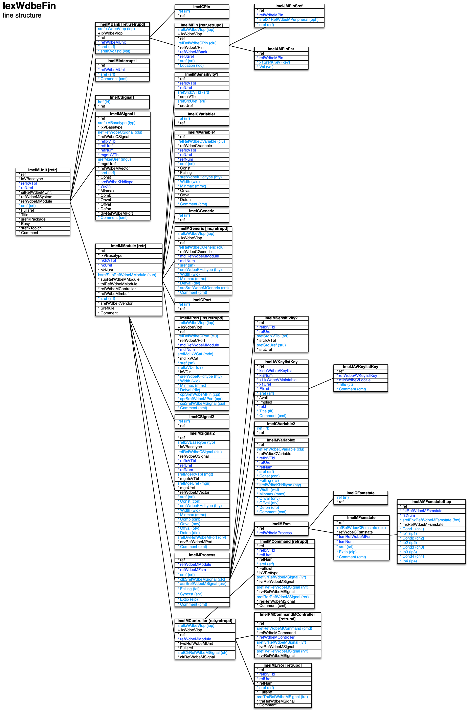

[back](../dbemdl.md)

Fine structure ``IexWdbeFin``
===

Schema
---

<em>Figure 1: Fine structure schema - table columns in light blue are part of the input file, table columns in dark blue are inferred</em>

Structure
---

[//]: # (IP structure - BEGIN)

&nbsp;&nbsp;&nbsp;&nbsp;\+ Unit [``[ImeIMUnit]``](#1-Unit-ImeIMUnit)
 &nbsp;&nbsp;&nbsp;&nbsp;&nbsp;&nbsp;&nbsp;&nbsp;\- Signals cluster [``[ImeICSignal1]``](#11-signals-cluster-imeicsignal1)
 &nbsp;&nbsp;&nbsp;&nbsp;&nbsp;&nbsp;&nbsp;&nbsp;\+ I/O bank [``[ImeIMBank]``](#12-io-bank-imeimbank)
 &nbsp;&nbsp;&nbsp;&nbsp;&nbsp;&nbsp;&nbsp;&nbsp;&nbsp;&nbsp;&nbsp;&nbsp;\- Pins cluster [``[ImeICPin]``](#121-pins-cluster-imeicpin)
 &nbsp;&nbsp;&nbsp;&nbsp;&nbsp;&nbsp;&nbsp;&nbsp;&nbsp;&nbsp;&nbsp;&nbsp;\+ Pin [``[ImeIMPin]``](#122-pin-imeimpin)
 &nbsp;&nbsp;&nbsp;&nbsp;&nbsp;&nbsp;&nbsp;&nbsp;&nbsp;&nbsp;&nbsp;&nbsp;&nbsp;&nbsp;&nbsp;&nbsp;\- Parameters [``[ImeIAMPinPar]``](#1221-parameters-imeiampinpar)
 &nbsp;&nbsp;&nbsp;&nbsp;&nbsp;&nbsp;&nbsp;&nbsp;&nbsp;&nbsp;&nbsp;&nbsp;&nbsp;&nbsp;&nbsp;&nbsp;\- Synonyms [``[ImeIJMPinSref]``](#1222-synonyms-imeijmpinsref)
 &nbsp;&nbsp;&nbsp;&nbsp;&nbsp;&nbsp;&nbsp;&nbsp;\- Interrupt [``[ImeIMInterrupt1]``](#13-imeiminterrupt1)
 &nbsp;&nbsp;&nbsp;&nbsp;&nbsp;&nbsp;&nbsp;&nbsp;\+ Module [``[ImeIMModule]``](#14-module-imeimmodule)
 &nbsp;&nbsp;&nbsp;&nbsp;&nbsp;&nbsp;&nbsp;&nbsp;&nbsp;&nbsp;&nbsp;&nbsp;\- Generics cluster [``[ImeICGeneric]``](#141-generics-cluster-imeicgeneric)
 &nbsp;&nbsp;&nbsp;&nbsp;&nbsp;&nbsp;&nbsp;&nbsp;&nbsp;&nbsp;&nbsp;&nbsp;\- Ports cluster [``[ImeICPort]``](#142-ports-cluster-imeicport)
 &nbsp;&nbsp;&nbsp;&nbsp;&nbsp;&nbsp;&nbsp;&nbsp;&nbsp;&nbsp;&nbsp;&nbsp;\- Signals cluster [``[ImeICSignal2]``](#143-signals-cluster-imeicsignal2)
 &nbsp;&nbsp;&nbsp;&nbsp;&nbsp;&nbsp;&nbsp;&nbsp;&nbsp;&nbsp;&nbsp;&nbsp;\- Variables cluster [``[ImeICVariable1]``](#144-variables-cluster-imeicvariable1)
 &nbsp;&nbsp;&nbsp;&nbsp;&nbsp;&nbsp;&nbsp;&nbsp;&nbsp;&nbsp;&nbsp;&nbsp;\+ Controller [``[ImeIMController]``](#145-controller-imeimcontroller)
 &nbsp;&nbsp;&nbsp;&nbsp;&nbsp;&nbsp;&nbsp;&nbsp;&nbsp;&nbsp;&nbsp;&nbsp;&nbsp;&nbsp;&nbsp;&nbsp;\+ Command [``[ImeIMCommand]``](#1451-command-imeimcommand)
 &nbsp;&nbsp;&nbsp;&nbsp;&nbsp;&nbsp;&nbsp;&nbsp;&nbsp;&nbsp;&nbsp;&nbsp;&nbsp;&nbsp;&nbsp;&nbsp;\+ Error [``[ImeIMError]``](#1452-error-imeimerror)
 &nbsp;&nbsp;&nbsp;&nbsp;&nbsp;&nbsp;&nbsp;&nbsp;&nbsp;&nbsp;&nbsp;&nbsp;&nbsp;&nbsp;&nbsp;&nbsp;\- External commands [``[ImeIRMCommandMController]``](#1453-external-commands-imeirmcommandmcontroller)
 &nbsp;&nbsp;&nbsp;&nbsp;&nbsp;&nbsp;&nbsp;&nbsp;&nbsp;&nbsp;&nbsp;&nbsp;\- Generic [``[ImeIMGeneric]``](#146-generic-imeimgeneric)
 &nbsp;&nbsp;&nbsp;&nbsp;&nbsp;&nbsp;&nbsp;&nbsp;&nbsp;&nbsp;&nbsp;&nbsp;\- Port [``[ImeIMPort]``](#147-port-imeimport)
 &nbsp;&nbsp;&nbsp;&nbsp;&nbsp;&nbsp;&nbsp;&nbsp;&nbsp;&nbsp;&nbsp;&nbsp;\+ Process [``[ImeIMProcess]``](#148-process-imeimprocess)
 &nbsp;&nbsp;&nbsp;&nbsp;&nbsp;&nbsp;&nbsp;&nbsp;&nbsp;&nbsp;&nbsp;&nbsp;&nbsp;&nbsp;&nbsp;&nbsp;\+ Keys [``[ImeIAVKeylistKey]``](#1481-keys-imeiavkeylistkey)
 &nbsp;&nbsp;&nbsp;&nbsp;&nbsp;&nbsp;&nbsp;&nbsp;&nbsp;&nbsp;&nbsp;&nbsp;&nbsp;&nbsp;&nbsp;&nbsp;&nbsp;&nbsp;&nbsp;&nbsp;\- Name and comment by locale [``[ImeIJAVKeylistKey]``](#14811-name-and-comment-by-locale-imeijavkeylistkey)
 &nbsp;&nbsp;&nbsp;&nbsp;&nbsp;&nbsp;&nbsp;&nbsp;&nbsp;&nbsp;&nbsp;&nbsp;&nbsp;&nbsp;&nbsp;&nbsp;\- Variables cluster [``[ImeICVariable2]``](#1482-variables-cluster-imeicvariable2)
 &nbsp;&nbsp;&nbsp;&nbsp;&nbsp;&nbsp;&nbsp;&nbsp;&nbsp;&nbsp;&nbsp;&nbsp;&nbsp;&nbsp;&nbsp;&nbsp;\+ Finite state machine [``[ImeIMFsm]``](#1483-finite-state-machine-imeimfsm)
 &nbsp;&nbsp;&nbsp;&nbsp;&nbsp;&nbsp;&nbsp;&nbsp;&nbsp;&nbsp;&nbsp;&nbsp;&nbsp;&nbsp;&nbsp;&nbsp;&nbsp;&nbsp;&nbsp;&nbsp;\- FSM states cluster [``[ImeICFsmstate]``](#14831-fsm-states-cluster-imeicfsmstate)
 &nbsp;&nbsp;&nbsp;&nbsp;&nbsp;&nbsp;&nbsp;&nbsp;&nbsp;&nbsp;&nbsp;&nbsp;&nbsp;&nbsp;&nbsp;&nbsp;&nbsp;&nbsp;&nbsp;&nbsp;\+ FSM state [``[ImeIMFsmstate]``](#14832-fsm-state-imeimfsmstate)
 &nbsp;&nbsp;&nbsp;&nbsp;&nbsp;&nbsp;&nbsp;&nbsp;&nbsp;&nbsp;&nbsp;&nbsp;&nbsp;&nbsp;&nbsp;&nbsp;&nbsp;&nbsp;&nbsp;&nbsp;&nbsp;&nbsp;&nbsp;&nbsp;\- Steppings [``[ImeIAMFsmstateStep]``](#148321-steppings-imeiamfsmstatestep)
 &nbsp;&nbsp;&nbsp;&nbsp;&nbsp;&nbsp;&nbsp;&nbsp;&nbsp;&nbsp;&nbsp;&nbsp;&nbsp;&nbsp;&nbsp;&nbsp;\- Sensitivity [``[ImeIMSensitivity2]``](#1484-sensitivity-imeimsensitivity2)
 &nbsp;&nbsp;&nbsp;&nbsp;&nbsp;&nbsp;&nbsp;&nbsp;&nbsp;&nbsp;&nbsp;&nbsp;&nbsp;&nbsp;&nbsp;&nbsp;\- Variable [``[ImeIMVariable2]``](#1485-variable-imeimvariable2)
 &nbsp;&nbsp;&nbsp;&nbsp;&nbsp;&nbsp;&nbsp;&nbsp;&nbsp;&nbsp;&nbsp;&nbsp;\- Sensitivity [``[ImeIMSensitivity1]``](#149-sensitivity-imeimsensitivity1)
 &nbsp;&nbsp;&nbsp;&nbsp;&nbsp;&nbsp;&nbsp;&nbsp;&nbsp;&nbsp;&nbsp;&nbsp;\- Signal [``[ImeIMSignal2]``](#1410-signal-imeimsignal2)
 &nbsp;&nbsp;&nbsp;&nbsp;&nbsp;&nbsp;&nbsp;&nbsp;&nbsp;&nbsp;&nbsp;&nbsp;\- Variable [``[ImeIMVariable1]``](#1411-variable-imeimvariable1)
 &nbsp;&nbsp;&nbsp;&nbsp;&nbsp;&nbsp;&nbsp;&nbsp;\- Signal [``[ImeIMSignal1]``](#15-signal-imeimsignal1)

[//]: # (IP structure - END)

Details
---

### 1 Unit ``[ImeIMUnit]``

[//]: # (IP ImeIMUnit.superUse - BEGIN)

Use: retrieve unit defined in modular structure.

[//]: # (IP ImeIMUnit.superUse - END)

[//]: # (IP ImeIMUnit.columns - BEGIN)

Column|Content|
-|-|
sref (string)|identifier|

[//]: # (IP ImeIMUnit.columns - END)

### 1.1 Signals cluster ``[ImeICSignal1]``

[//]: # (IP ImeICSignal1.superUse - BEGIN)

Super import: unit (1:N)

Use: group MCU signals. Mandatory e.g. for handshake signals.

[//]: # (IP ImeICSignal1.superUse - END)

[//]: # (IP ImeICSignal1.columns - BEGIN)

Column|Content|
-|-|
iref (ubigint)|integer reference|

[//]: # (IP ImeICSignal1.columns - END)

### 1.2 I/O bank ``[ImeIMBank]``

[//]: # (IP ImeIMBank.superUse - BEGIN)

Super import: unit (1:N)

Use: grouping entity for pins.

[//]: # (IP ImeIMBank.superUse - END)

[//]: # (IP ImeIMBank.columns - BEGIN)

Column|Content|
-|-|
srefIxWdbeVIop (string)|import operation retr: retrieve retrupd: retrieve and update|
sref (string)|identifier|
srefKVoltstd (string)|voltage standard _1v2: 1.2V _1v8: 1.8V _2v5: 2.5V _3v3: 3.3V|

[//]: # (IP ImeIMBank.columns - END)

### 1.2.1 Pins cluster ``[ImeICPin]``

[//]: # (IP ImeICPin.superUse - BEGIN)

Super import: I/O bank (1:N)

Use: group pins of the same bus.

[//]: # (IP ImeICPin.superUse - END)

[//]: # (IP ImeICPin.columns - BEGIN)

Column|Content|
-|-|
iref (ubigint)|integer reference|

[//]: # (IP ImeICPin.columns - END)

### 1.2.2 Pin ``[ImeIMPin]``

[//]: # (IP ImeIMPin.superUse - BEGIN)

Super import: I/O bank (1:N)

Use: self-explanatory.

[//]: # (IP ImeIMPin.superUse - END)

[//]: # (IP ImeIMPin.columns - BEGIN)

Column|Content|
-|-|
srefIxWdbeVIop (string)|import operation retr: retrieve retrupd: retrieve and update|
irefRefWdbeCPin (ubigint)|integer reference to pins cluster|
sref (string)|identifier|
Location (string)|physical location / package pin name|

[//]: # (IP ImeIMPin.columns - END)

### 1.2.2.1 Parameters ``[ImeIAMPinPar]``

[//]: # (IP ImeIAMPinPar.superUse - BEGIN)

Super import: pin (1:N)

Use: special FPGA user constraints (key/value pairs).

[//]: # (IP ImeIAMPinPar.superUse - END)

[//]: # (IP ImeIAMPinPar.columns - BEGIN)

Column|Content|
-|-|
x1SrefKKey (string)|key fclk: clock frequency [kHz] lvds: low-voltage differential signal noclkdr: no clock dedicated route|
Val (string)|value|

[//]: # (IP ImeIAMPinPar.columns - END)

### 1.2.2.2 Synonyms ``[ImeIJMPinSref]``

[//]: # (IP ImeIJMPinSref.superUse - BEGIN)

Super import: pin (1:N)

Use: provide alternative names to pins, e.g. for MCU's with multiplexed peripheral I/O's.

[//]: # (IP ImeIJMPinSref.superUse - END)

[//]: # (IP ImeIJMPinSref.columns - BEGIN)

Column|Content|
-|-|
srefX1RefWdbeMPeripheral (string)|peripheral|
sref (string)|identifier|

[//]: # (IP ImeIJMPinSref.columns - END)

### 1.3 Interrupt ``[ImeIMInterrupt1]``

[//]: # (IP ImeIMInterrupt1.superUse - BEGIN)

Super import: unit (1:N)

Use: specify MCU interrupts to be handled.

[//]: # (IP ImeIMInterrupt1.superUse - END)

[//]: # (IP ImeIMInterrupt1.columns - BEGIN)

Column|Content|
-|-|
sref (string)|identifier|
Comment (string)|comment|

[//]: # (IP ImeIMInterrupt1.columns - END)

### 1.4 Module ``[ImeIMModule]``

[//]: # (IP ImeIMModule.superUse - BEGIN)

Super import: unit (1:N)

Use: retrieve module defined in modular structure.

[//]: # (IP ImeIMModule.superUse - END)

[//]: # (IP ImeIMModule.columns - BEGIN)

Column|Content|
-|-|
hsrefSupRefWdbeMModule (string)|super module|
sref (string)|identifier|

[//]: # (IP ImeIMModule.columns - END)

### 1.4.1 Generics cluster ``[ImeICGeneric]``

[//]: # (IP ImeICGeneric.superUse - BEGIN)

Super import: module (1:N)

Use: group generics.

[//]: # (IP ImeICGeneric.superUse - END)

[//]: # (IP ImeICGeneric.columns - BEGIN)

Column|Content|
-|-|
iref (ubigint)|integer reference|

[//]: # (IP ImeICGeneric.columns - END)

### 1.4.2 Ports cluster ``[ImeICPort]``

[//]: # (IP ImeICPort.superUse - BEGIN)

Super import: module (1:N)

Use: group ports.

[//]: # (IP ImeICPort.superUse - END)

[//]: # (IP ImeICPort.columns - BEGIN)

Column|Content|
-|-|
iref (ubigint)|integer reference|

[//]: # (IP ImeICPort.columns - END)

### 1.4.3 Signals cluster ``[ImeICSignal2]``

[//]: # (IP ImeICSignal2.superUse - BEGIN)

Super import: module (1:N)

Use: group signals. Mandatory e.g. for handshake signals.

[//]: # (IP ImeICSignal2.superUse - END)

[//]: # (IP ImeICSignal2.columns - BEGIN)

Column|Content|
-|-|
iref (ubigint)|integer reference|

[//]: # (IP ImeICSignal2.columns - END)

### 1.4.4 Variables cluster ``[ImeICVariable1]``

[//]: # (IP ImeICVariable1.superUse - BEGIN)

Super import: module (1:N)

Use: group variables.

[//]: # (IP ImeICVariable1.superUse - END)

[//]: # (IP ImeICVariable1.columns - BEGIN)

Column|Content|
-|-|
iref (ubigint)|integer reference|

[//]: # (IP ImeICVariable1.columns - END)

### 1.4.5 Controller ``[ImeIMController]``

[//]: # (IP ImeIMController.superUse - BEGIN)

Super import: module (1:1)

Use: retrieve controller defined in modular structure.

[//]: # (IP ImeIMController.superUse - END)

[//]: # (IP ImeIMController.columns - BEGIN)

Column|Content|
-|-|
srefIxWdbeVIop (string)|import operation retr: retrieve retrupd: retrieve and update|
srefClrRefWdbeMSignal (string)|full model only - command lock request signal|

[//]: # (IP ImeIMController.columns - END)

### 1.4.5.1 Command ``[ImeIMCommand]``

[//]: # (IP ImeIMCommand.superUse - BEGIN)

Super import: controller (1:N)

Use: retrieve command defined in command set then update signals.

[//]: # (IP ImeIMCommand.superUse - END)

[//]: # (IP ImeIMCommand.columns - BEGIN)

Column|Content|
-|-|
sref (string)|identifier|
srefIvrRefWdbeMSignal (string)|invocation request signal|
srefRvrRefWdbeMSignal (string)|revocation request signal|
srefRerRefWdbeMSignal (string)|(new) return request signal|

[//]: # (IP ImeIMCommand.columns - END)

### 1.4.5.2 Error ``[ImeIMError]``

[//]: # (IP ImeIMError.superUse - BEGIN)

Super import: controller (1:N)

Use: retrieve error defined in command set then update signal.

[//]: # (IP ImeIMError.superUse - END)

[//]: # (IP ImeIMError.columns - BEGIN)

Column|Content|
-|-|
sref (string)|identifier|
srefTraRefWdbeMSignal (string)|trigger acknowledgement signal|

[//]: # (IP ImeIMError.columns - END)

### 1.4.5.3 External commands ``[ImeIRMCommandMController]``

[//]: # (IP ImeIRMCommandMController.superUse - BEGIN)

Super import: controller (1:N)

Use: retrieve command invoked in other controller then update signals.

[//]: # (IP ImeIRMCommandMController.superUse - END)

[//]: # (IP ImeIRMCommandMController.columns - BEGIN)

Column|Content|
-|-|
srefRefWdbeMCommand (string)|command with controller prepended|
srefIvrRefWdbeMSignal (string)|full model only - invocation request signal|
srefRvrRefWdbeMSignal (string)|full model only - revocation request signal|

[//]: # (IP ImeIRMCommandMController.columns - END)

### 1.4.6 Generic ``[ImeIMGeneric]``

[//]: # (IP ImeIMGeneric.superUse - BEGIN)

Super import: module (1:N)

Use: equivalent to VHDL generic.

[//]: # (IP ImeIMGeneric.superUse - END)

[//]: # (IP ImeIMGeneric.columns - BEGIN)

Column|Content|
-|-|
srefIxWdbeVIop (string)|import operation ins: insert retrupd: retrieve and update|
irefRefWdbeCGeneric (ubigint)|integer reference to generics cluster|
sref (string)|identifier|
srefWdbeKHdltype (string)|HDL data type bit: bit _bool: boolean int: integer nat: natural sgn: signed sl: standard logic slvup: standard logic vector up slvdn: standard logic vector down str: string usgn: unsigned|
Width (usmallint)|sgn, slvup, slvdn, usgn HDL data types - width|
Minmax (string)|nat HDL data type - range|
Defval (string)|default value|
srcSrefWdbeMGeneric (string)|source generic|
Comment (string)|comment|

[//]: # (IP ImeIMGeneric.columns - END)

### 1.4.7 Port ``[ImeIMPort]``

[//]: # (IP ImeIMPort.superUse - BEGIN)

Super import: module (1:N)

Use: equivalent to VHDL port. Pin correspondence in MCU-based units.

[//]: # (IP ImeIMPort.superUse - END)

[//]: # (IP ImeIMPort.columns - BEGIN)

Column|Content|
-|-|
srefIxWdbeVIop (string)|import operation ins: insert retrupd: retrieve and update|
irefRefWdbeCPort (ubigint)|integer reference to ports cluster|
srefMdlIxVCat (string)|category reset: global reset clk: clock rtewrp: route to wrapper signal rtetop: route to top module signal cmdbus: command bus imb: inter-module buffer rtesup: route to super module rtepin: route to pin dbg: debug|
sref (string)|identifier|
srefIxVDir (string)|direction in: input inout: input/output out: output|
srefWdbeKHdltype (string)|HDL data type int: integer nat: natural sgn: signed sl: standard logic slvup: standard logic vector up slvdn: standard logic vector down usgn: unsigned|
Width (usmallint)|sgn, slvup, slvdn, usgn HDL data types - width|
Minmax (string)|nat HDL data type - range|
Defval (string)|default value|
cpiSrefWdbeMPin (string)|pin connected to|
cprSrefWdbeMPort (string)|port connected to|
csiSrefWdbeMSignal (string)|signal connected to|
Comment (string)|comment|

[//]: # (IP ImeIMPort.columns - END)

### 1.4.8 Process ``[ImeIMProcess]``

[//]: # (IP ImeIMProcess.superUse - BEGIN)

Super import: module (1:N)

Use: equivalent to VHDL process.

[//]: # (IP ImeIMProcess.superUse - END)

[//]: # (IP ImeIMProcess.columns - BEGIN)

Column|Content|
-|-|
sref (string)|identifier|
clkSrefWdbeMSignal (string)|clock signal|
asrSrefWdbeMSignal (string)|asynchronous reset signal|
Falling (bool)|falling edge sub-process|
Syncrst (string)|synchronized reset condition|
Extip (bool)|external insertion point|
Comment (string)|comment|

[//]: # (IP ImeIMProcess.columns - END)

### 1.4.8.1 Keys ``[ImeIAVKeylistKey]``

[//]: # (IP ImeIAVKeylistKey.superUse - BEGIN)

Super import: process (1:N)

Use: definition of custom data types.

[//]: # (IP ImeIAVKeylistKey.superUse - END)

[//]: # (IP ImeIAVKeylistKey.columns - BEGIN)

Column|Content|
-|-|
sref (string)|identifier|
Title (string)|name|
Comment (string)|comment|

[//]: # (IP ImeIAVKeylistKey.columns - END)

### 1.4.8.1.1 Name and comment by locale ``[ImeIJAVKeylistKey]``

[//]: # (IP ImeIJAVKeylistKey.superUse - BEGIN)

Super import: keys (1:N)

Use: single entry, name defines the VHDL data type.

[//]: # (IP ImeIJAVKeylistKey.superUse - END)

[//]: # (IP ImeIJAVKeylistKey.columns - BEGIN)

Column|Content|
-|-|
Title (string)|name|
Comment (string)|comment|

[//]: # (IP ImeIJAVKeylistKey.columns - END)

### 1.4.8.2 Variables cluster ``[ImeICVariable2]``

[//]: # (IP ImeICVariable2.superUse - BEGIN)

Super import: process (1:N)

Use: group variables.

[//]: # (IP ImeICVariable2.superUse - END)

[//]: # (IP ImeICVariable2.columns - BEGIN)

Column|Content|
-|-|
iref (ubigint)|integer reference|

[//]: # (IP ImeICVariable2.columns - END)

### 1.4.8.3 Finite state machine ``[ImeIMFsm]``

[//]: # (IP ImeIMFsm.superUse - BEGIN)

Super import: process (1:1)

Use: indicate a process is a finite state machine (no content).

[//]: # (IP ImeIMFsm.superUse - END)

### 1.4.8.3.1 FSM states cluster ``[ImeICFsmstate]``

[//]: # (IP ImeICFsmstate.superUse - BEGIN)

Super import: finite state machine (1:N)

Use: group FSM states. States within a group must only differ in their last character.

[//]: # (IP ImeICFsmstate.superUse - END)

[//]: # (IP ImeICFsmstate.columns - BEGIN)

Column|Content|
-|-|
iref (ubigint)|integer reference|

[//]: # (IP ImeICFsmstate.columns - END)

### 1.4.8.3.2 FSM state ``[ImeIMFsmstate]``

[//]: # (IP ImeIMFsmstate.superUse - BEGIN)

Super import: finite state machine (1:N)

Use: self-explanatory.

[//]: # (IP ImeIMFsmstate.superUse - END)

[//]: # (IP ImeIMFsmstate.columns - BEGIN)

Column|Content|
-|-|
irefRefWdbeCFsmstate (ubigint)|integer reference to FSM states cluster|
sref (string)|identifier|
Extip (bool)|external insertion point|
Comment (string)|comment|

[//]: # (IP ImeIMFsmstate.columns - END)

### 1.4.8.3.2.1 Steppings ``[ImeIAMFsmstateStep]``

[//]: # (IP ImeIAMFsmstateStep.superUse - BEGIN)

Super import: FSM state (1:N)

Use: define condition sets in VHDL which result in the stepping to other states. Results in nested if/elsif/else statements, up to four levels.

[//]: # (IP ImeIAMFsmstateStep.superUse - END)

[//]: # (IP ImeIAMFsmstateStep.columns - BEGIN)

Column|Content|
-|-|
srefFnxRefWdbeMFsmstate (string)|FSM state|
Cond1 (string)|condition 1|
Ip1 (string)|insertion point 1|
Cond2 (string)|condition 2|
Ip2 (string)|insertion point 2|
Cond3 (string)|condition 3|
Ip3 (string)|insertion point 3|
Cond4 (string)|condition 4|
Ip4 (string)|insertion point 4|

[//]: # (IP ImeIAMFsmstateStep.columns - END)

### 1.4.8.4 Sensitivity ``[ImeIMSensitivity2]``

[//]: # (IP ImeIMSensitivity2.superUse - BEGIN)

Super import: process (1:N)

Use: equivalent to VHDL process sensitivity.

[//]: # (IP ImeIMSensitivity2.superUse - END)

[//]: # (IP ImeIMSensitivity2.columns - BEGIN)

Column|Content|
-|-|
srefSrcIxVTbl (string)|source int: interrupt prt: port sig: signal|
srefSrcUref (string)|source|

[//]: # (IP ImeIMSensitivity2.columns - END)

### 1.4.8.5 Variable ``[ImeIMVariable2]``

[//]: # (IP ImeIMVariable2.superUse - BEGIN)

Super import: process (1:N)

Use: equivalent to VHDL variable.

[//]: # (IP ImeIMVariable2.superUse - END)

[//]: # (IP ImeIMVariable2.columns - BEGIN)

Column|Content|
-|-|
irefRefWdbeCVariable (ubigint)|integer reference to variables cluster|
sref (string)|identifier|
Const (bool)|constant|
Falling (bool)|falling edge sub-process|
srefWdbeKHdltype (string)|HDL data type _bool: boolean int: integer nat: natural sgn: signed sl: standard logic slvup: standard logic vector up slvdn: standard logic vector down str: string usgn: unsigned|
Width (utinyint)|sgn, slvup, slvdn, usgn HDL data types - width|
Minmax (string)|nat HDL data type - range|
Onval (string)|'on' value|
Offval (string)|'off' value|
Defon (bool)|'on' by default|
Comment (string)|comment|

[//]: # (IP ImeIMVariable2.columns - END)

### 1.4.9 Sensitivity ``[ImeIMSensitivity1]``

[//]: # (IP ImeIMSensitivity1.superUse - BEGIN)

Super import: module (1:N)

Use: specify module sensitivities for MCU-based units.

[//]: # (IP ImeIMSensitivity1.superUse - END)

[//]: # (IP ImeIMSensitivity1.columns - BEGIN)

Column|Content|
-|-|
srefSrcIxVTbl (string)|source int: interrupt prt: port sig: signal|
srefSrcUref (string)|source|

[//]: # (IP ImeIMSensitivity1.columns - END)

### 1.4.10 Signal ``[ImeIMSignal2]``

[//]: # (IP ImeIMSignal2.superUse - BEGIN)

Super import: module (1:N)

Use: equivalent to VHDL signal.

[//]: # (IP ImeIMSignal2.superUse - END)

[//]: # (IP ImeIMSignal2.columns - BEGIN)

Column|Content|
-|-|
srefIxVBasetype (string)|type clk: clock hshk: handshake oprt: output port driver ioprt: input/output port driver psb: pin substitute strb: strobe oth: other|
irefRefWdbeCSignal (ubigint)|integer reference to signals cluster|
srefMgeIxVTbl (string)|managing entity void: none mdl: sub-module prc: process|
srefMgeUref (string)|managing entity|
sref (string)|identifier|
Const (bool)|constant|
srefWdbeKHdltype (string)|HDL data type _bool: boolean int: integer nat: natural sgn: signed sl: standard logic slvup: standard logic vector up slvdn: standard logic vector down str: string usgn: unsigned|
Width (usmallint)|sgn, slvup, slvdn, usgn HDL data types - width|
Minmax (string)|nat HDL data type - range|
Comb (string)|combinatorial expression|
Onval (string)|'on' value|
Offval (string)|'off' value|
Defon (bool)|'on' by default|
srefDrvRefWdbeMPort (string)|port driven|
Comment (string)|comment|

[//]: # (IP ImeIMSignal2.columns - END)

### 1.4.11 Variable ``[ImeIMVariable1]``

[//]: # (IP ImeIMVariable1.superUse - BEGIN)

Super import: module (1:N)

Use: equivalent to C shared data entry.

[//]: # (IP ImeIMVariable1.superUse - END)

[//]: # (IP ImeIMVariable1.columns - BEGIN)

Column|Content|
-|-|
irefRefWdbeCVariable (ubigint)|integer reference to variables cluster|
sref (string)|identifier|
srefWdbeKHdltype (string)|HDL data type bit: bit _bool: boolean btarr: byte array char: character ptr: pointer sgn: signed usgn: unsigned|
Width (usmallint)|sgn, usgn HDL data types - width|
Minmax (string)|btarr HDL data type - range|
Comment (string)|comment|

[//]: # (IP ImeIMVariable1.columns - END)

### 1.5 Signal ``[ImeIMSignal1]``

[//]: # (IP ImeIMSignal1.superUse - BEGIN)

Super import: unit (1:N)

Use: signals/flags for MCU-based units.

[//]: # (IP ImeIMSignal1.superUse - END)

[//]: # (IP ImeIMSignal1.columns - BEGIN)

Column|Content|
-|-|
srefIxVBasetype (string)|type hshk: handshake strb: strobe|
irefRefWdbeCSignal (ubigint)|integer reference to signals cluster|
srefMgeUref (string)|managing module|
sref (string)|identifier|
Comment (string)|comment|

[//]: # (IP ImeIMSignal1.columns - END)

<small>Markdown for WhizniumDBE v1.1.17 auto-generated (what else ;-) ) by WhizniumSBE on 14 Nov 2021</small>
