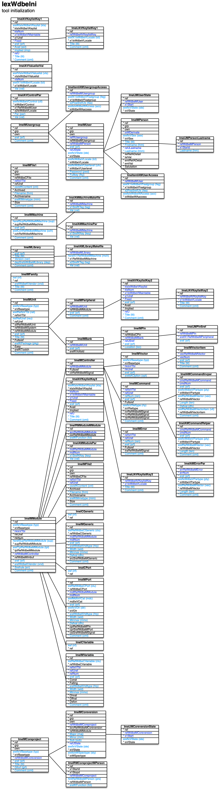

[back](../dbemdl.md)

Initialization data ``IexWdbeIni``
===

Schema
---

<em>Figure 1: Initialization data schema - table columns in light blue are part of the input file, table columns in dark blue are inferred</em>

Structure
---

[//]: # (IP structure - BEGIN)

&nbsp;&nbsp;&nbsp;&nbsp;\- Control parameters [``[ImeIAVControlPar]``](#1-control-parameters-imeiavcontrolpar)
 &nbsp;&nbsp;&nbsp;&nbsp;\+ Keys [``[ImeIAVKeylistKey1]``](#2-keys-imeiavkeylistkey1)
 &nbsp;&nbsp;&nbsp;&nbsp;&nbsp;&nbsp;&nbsp;&nbsp;\- Name and comment by locale [``[ImeIJAVKeylistKey1]``](#21-name-and-comment-by-locale-imeijavkeylistkey1)
 &nbsp;&nbsp;&nbsp;&nbsp;\- Values [``[ImeIAVValuelistVal]``](#3-values-imeiavvaluelistval)
 &nbsp;&nbsp;&nbsp;&nbsp;\+ Core project [``[ImeIMCoreproject]``](#4-core-project-imeimcoreproject)
 &nbsp;&nbsp;&nbsp;&nbsp;&nbsp;&nbsp;&nbsp;&nbsp;\+ Core version [``[ImeIMCoreversion]``](#41-core-version-imeimcoreversion)
 &nbsp;&nbsp;&nbsp;&nbsp;&nbsp;&nbsp;&nbsp;&nbsp;&nbsp;&nbsp;&nbsp;&nbsp;\- State history [``[ImeIJMCoreversionState]``](#411-state-history-imeijmcoreversionstate)
 &nbsp;&nbsp;&nbsp;&nbsp;&nbsp;&nbsp;&nbsp;&nbsp;\- TblWdbeRMCoreprojectMPerson [``[ImeIRMCoreprojectMPerson]``](#42-tblwdbermcoreprojectmperson-imeirmcoreprojectmperson)
 &nbsp;&nbsp;&nbsp;&nbsp;\- Product family [``[ImeIMFamily]``](#5-product-family-imeimfamily)
 &nbsp;&nbsp;&nbsp;&nbsp;\- File [``[ImeIMFile1]``](#6-file-imeimfile1)
 &nbsp;&nbsp;&nbsp;&nbsp;\+ Library [``[ImeIMLibrary]``](#7-library-imeimlibrary)
 &nbsp;&nbsp;&nbsp;&nbsp;&nbsp;&nbsp;&nbsp;&nbsp;\- Makefile entries [``[ImeIAMLibraryMakefile]``](#71-makefile-entries-imeiamlibrarymakefile)
 &nbsp;&nbsp;&nbsp;&nbsp;\+ Machine [``[ImeIMMachine]``](#8-machine-imeimmachine)
 &nbsp;&nbsp;&nbsp;&nbsp;&nbsp;&nbsp;&nbsp;&nbsp;\- Makefile entries [``[ImeIAMMachineMakefile]``](#81-makefile-entries-imeiammachinemakefile)
 &nbsp;&nbsp;&nbsp;&nbsp;&nbsp;&nbsp;&nbsp;&nbsp;\- Parameters [``[ImeIAMMachinePar]``](#82-parameters-imeiammachinepar)
 &nbsp;&nbsp;&nbsp;&nbsp;\+ Module [``[ImeIMModule]``](#9-module-imeimmodule)
 &nbsp;&nbsp;&nbsp;&nbsp;&nbsp;&nbsp;&nbsp;&nbsp;\- Parameters [``[ImeIAMModulePar]``](#91-parameters-imeiammodulepar)
 &nbsp;&nbsp;&nbsp;&nbsp;&nbsp;&nbsp;&nbsp;&nbsp;\+ Keys [``[ImeIAVKeylistKey3]``](#92-keys-imeiavkeylistkey3)
 &nbsp;&nbsp;&nbsp;&nbsp;&nbsp;&nbsp;&nbsp;&nbsp;&nbsp;&nbsp;&nbsp;&nbsp;\- Name and comment by locale [``[ImeIJAVKeylistKey3]``](#921-name-and-comment-by-locale-imeijavkeylistkey3)
 &nbsp;&nbsp;&nbsp;&nbsp;&nbsp;&nbsp;&nbsp;&nbsp;\- Generics cluster [``[ImeICGeneric]``](#93-generics-cluster-imeicgeneric)
 &nbsp;&nbsp;&nbsp;&nbsp;&nbsp;&nbsp;&nbsp;&nbsp;\- Ports cluster [``[ImeICPort]``](#94-ports-cluster-imeicport)
 &nbsp;&nbsp;&nbsp;&nbsp;&nbsp;&nbsp;&nbsp;&nbsp;\- Variables cluster [``[ImeICVariable]``](#95-variables-cluster-imeicvariable)
 &nbsp;&nbsp;&nbsp;&nbsp;&nbsp;&nbsp;&nbsp;&nbsp;\+ Controller [``[ImeIMController]``](#96-controller-imeimcontroller)
 &nbsp;&nbsp;&nbsp;&nbsp;&nbsp;&nbsp;&nbsp;&nbsp;&nbsp;&nbsp;&nbsp;&nbsp;\+ Command [``[ImeIMCommand]``](#961-command-imeimcommand)
 &nbsp;&nbsp;&nbsp;&nbsp;&nbsp;&nbsp;&nbsp;&nbsp;&nbsp;&nbsp;&nbsp;&nbsp;&nbsp;&nbsp;&nbsp;&nbsp;\- Invocation parameters [``[ImeIAMCommandInvpar]``](#9611-invocation-parameters-imeiamcommandinvpar)
 &nbsp;&nbsp;&nbsp;&nbsp;&nbsp;&nbsp;&nbsp;&nbsp;&nbsp;&nbsp;&nbsp;&nbsp;&nbsp;&nbsp;&nbsp;&nbsp;\- Return parameters [``[ImeIAMCommandRetpar]``](#9612-return-parameters-imeiamcommandretpar)
 &nbsp;&nbsp;&nbsp;&nbsp;&nbsp;&nbsp;&nbsp;&nbsp;&nbsp;&nbsp;&nbsp;&nbsp;\+ Error [``[ImeIMError]``](#962-error-imeimerror)
 &nbsp;&nbsp;&nbsp;&nbsp;&nbsp;&nbsp;&nbsp;&nbsp;&nbsp;&nbsp;&nbsp;&nbsp;&nbsp;&nbsp;&nbsp;&nbsp;\- Parameters [``[ImeIAMErrorPar]``](#9621-parameters-imeiamerrorpar)
 &nbsp;&nbsp;&nbsp;&nbsp;&nbsp;&nbsp;&nbsp;&nbsp;&nbsp;&nbsp;&nbsp;&nbsp;\+ Vector [``[ImeIMVector]``](#963-vector-imeimvector)
 &nbsp;&nbsp;&nbsp;&nbsp;&nbsp;&nbsp;&nbsp;&nbsp;&nbsp;&nbsp;&nbsp;&nbsp;&nbsp;&nbsp;&nbsp;&nbsp;\- Vector item [``[ImeIMVectoritem]``](#9631-vector-item-imeimvectoritem)
 &nbsp;&nbsp;&nbsp;&nbsp;&nbsp;&nbsp;&nbsp;&nbsp;\- File [``[ImeIMFile2]``](#97-file-imeimfile2)
 &nbsp;&nbsp;&nbsp;&nbsp;&nbsp;&nbsp;&nbsp;&nbsp;\- Generic [``[ImeIMGeneric]``](#98-generic-imeimgeneric)
 &nbsp;&nbsp;&nbsp;&nbsp;&nbsp;&nbsp;&nbsp;&nbsp;\- Port [``[ImeIMPort]``](#99-port-imeimport)
 &nbsp;&nbsp;&nbsp;&nbsp;&nbsp;&nbsp;&nbsp;&nbsp;\- Variable [``[ImeIMVariable]``](#910-variable-imeimvariable)
 &nbsp;&nbsp;&nbsp;&nbsp;&nbsp;&nbsp;&nbsp;&nbsp;\- Corresponding modules [``[ImeIRMModuleMModule]``](#911-corresponding-modules-imeirmmodulemmodule)
 &nbsp;&nbsp;&nbsp;&nbsp;\+ Unit [``[ImeIMUnit]``](#10-unit-imeimunit)
 &nbsp;&nbsp;&nbsp;&nbsp;&nbsp;&nbsp;&nbsp;&nbsp;\+ I/O bank [``[ImeIMBank]``](#101-io-bank-imeimbank)
 &nbsp;&nbsp;&nbsp;&nbsp;&nbsp;&nbsp;&nbsp;&nbsp;&nbsp;&nbsp;&nbsp;&nbsp;\+ Pin [``[ImeIMPin]``](#1011-pin-imeimpin)
 &nbsp;&nbsp;&nbsp;&nbsp;&nbsp;&nbsp;&nbsp;&nbsp;&nbsp;&nbsp;&nbsp;&nbsp;&nbsp;&nbsp;&nbsp;&nbsp;\- Synonyms [``[ImeIJMPinSref]``](#10111-synonyms-imeijmpinsref)
 &nbsp;&nbsp;&nbsp;&nbsp;&nbsp;&nbsp;&nbsp;&nbsp;\+ Peripheral [``[ImeIMPeripheral]``](#102-peripheral-imeimperipheral)
 &nbsp;&nbsp;&nbsp;&nbsp;&nbsp;&nbsp;&nbsp;&nbsp;&nbsp;&nbsp;&nbsp;&nbsp;\+ Keys [``[ImeIAVKeylistKey2]``](#1021-keys-imeiavkeylistkey2)
 &nbsp;&nbsp;&nbsp;&nbsp;&nbsp;&nbsp;&nbsp;&nbsp;&nbsp;&nbsp;&nbsp;&nbsp;&nbsp;&nbsp;&nbsp;&nbsp;\- Name and comment by locale [``[ImeIJAVKeylistKey2]``](#10211-name-and-comment-by-locale-imeijavkeylistkey2)
 &nbsp;&nbsp;&nbsp;&nbsp;\+ User group [``[ImeIMUsergroup]``](#11-user-group-imeimusergroup)
 &nbsp;&nbsp;&nbsp;&nbsp;&nbsp;&nbsp;&nbsp;&nbsp;\- Feature access rights [``[ImeIAMUsergroupAccess]``](#111-feature-access-rights-imeiamusergroupaccess)
 &nbsp;&nbsp;&nbsp;&nbsp;&nbsp;&nbsp;&nbsp;&nbsp;\+ User [``[ImeIMUser]``](#112-user-imeimuser)
 &nbsp;&nbsp;&nbsp;&nbsp;&nbsp;&nbsp;&nbsp;&nbsp;&nbsp;&nbsp;&nbsp;&nbsp;\- Feature access rights [``[ImeIAMUserAccess]``](#1121-feature-access-rights-imeiamuseraccess)
 &nbsp;&nbsp;&nbsp;&nbsp;&nbsp;&nbsp;&nbsp;&nbsp;&nbsp;&nbsp;&nbsp;&nbsp;\- State history [``[ImeIJMUserState]``](#1122-state-history-imeijmuserstate)
 &nbsp;&nbsp;&nbsp;&nbsp;&nbsp;&nbsp;&nbsp;&nbsp;&nbsp;&nbsp;&nbsp;&nbsp;\+ Person [``[ImeIMPerson]``](#1123-person-imeimperson)
 &nbsp;&nbsp;&nbsp;&nbsp;&nbsp;&nbsp;&nbsp;&nbsp;&nbsp;&nbsp;&nbsp;&nbsp;&nbsp;&nbsp;&nbsp;&nbsp;\- Last name history [``[ImeIJMPersonLastname]``](#11231-last-name-history-imeijmpersonlastname)

[//]: # (IP structure - END)

Details
---

### 1 Control parameters ``[ImeIAVControlPar]``

[//]: # (IP ImeIAVControlPar.superUse - BEGIN)

Use: manual customization e.g. of UI table column widths. Typically trained in a dedicated user session.

[//]: # (IP ImeIAVControlPar.superUse - END)

[//]: # (IP ImeIAVControlPar.columns - BEGIN)

Column|Content|
-|-|
srefIxWdbeVControl (string)|control PnlWdbeUsgList.TcoGrp ... PnlWdbeVarList.TcoMmx|
Par (string)|parameter|
Val (string)|value|

[//]: # (IP ImeIAVControlPar.columns - END)

### 2 Keys ``[ImeIAVKeylistKey1]``

[//]: # (IP ImeIAVKeylistKey1.superUse - BEGIN)

Use: populate non-record specific key lists.

[//]: # (IP ImeIAVKeylistKey1.superUse - END)

[//]: # (IP ImeIAVKeylistKey1.columns - BEGIN)

Column|Content|
-|-|
srefKlsIxWdbeVKeylist (string)|key list KlstWdbeKAMLibraryMakefileTag: tag KlstWdbeKAMMachineMakefileTag: tag KlstWdbeKAMMachineParKey: key KlstWdbeKAMModuleParKey: key KlstWdbeKAMPeripheralParKey: key KlstWdbeKAMPersonDetailType: type KlstWdbeKAMPinParKey: key KlstWdbeKHdltype: HDL data type KlstWdbeKMBankVoltstd: voltage standard KlstWdbeKMFileContent: content KlstWdbeKMFileMimetype: MIME type KlstWdbeKMReleaseOption: options KlstWdbeKMUnitPackage: package KlstWdbeKMUnitToolch: tool chain KlstWdbeKMVectorOption: options KlstWdbeKRMCoreprojectMPersonFunction: function KlstWdbeKRMModuleMModuleFunction: function KlstWdbeKRMPersonMProjectFunction: function KlstWdbeKVendor: vendor KlstKWdbeMtpCplmstbuCustop: WdbeMtpCplmstbu custom operations KlstKWdbeMtpCplmsttdCustop: WdbeMtpCplmsttd custom operations KlstKWdbeMtpGenfstCustop: WdbeMtpGenfst custom operations KlstKWdbeMtpPlhfpgaCustop: WdbeMtpPlhfpga custom operations KlstKWdbeMtpPlhmcuCustop: WdbeMtpPlhmcu custom operations KlstKWdbeMtpWrfpgaCustop: WdbeMtpWrfpga custom operations KlstKWdbeMtpWrmcuCustop: WdbeMtpWrmcu custom operations|
sref (string)|identifier|
Avail (string)|availability rule|
Implied (string)|rule for implied|
Title (string)|name|
Comment (string)|comment|

[//]: # (IP ImeIAVKeylistKey1.columns - END)

### 2.1 Name and comment by locale ``[ImeIJAVKeylistKey1]``

[//]: # (IP ImeIJAVKeylistKey1.superUse - BEGIN)

Super import: keys (1:N)

Use: self-explanatory.

[//]: # (IP ImeIJAVKeylistKey1.superUse - END)

[//]: # (IP ImeIJAVKeylistKey1.columns - BEGIN)

Column|Content|
-|-|
srefX1IxWdbeVLocale (string)|locale enus: English (United States)|
Title (string)|name|
Comment (string)|comment|

[//]: # (IP ImeIJAVKeylistKey1.columns - END)

### 3 Values ``[ImeIAVValuelistVal]``

[//]: # (IP ImeIAVValuelistVal.superUse - BEGIN)

Use: populate value lists.

[//]: # (IP ImeIAVValuelistVal.superUse - END)

[//]: # (IP ImeIAVValuelistVal.columns - BEGIN)

Column|Content|
-|-|
srefVlsIxWdbeVValuelist (string)|value list VlstWdbeUMPersonTitle: title|
srefX1IxWdbeVLocale (string)|locale enus: English (United States)|
Val (string)|value|

[//]: # (IP ImeIAVValuelistVal.columns - END)

### 4 Core project ``[ImeIMCoreproject]``

[//]: # (IP ImeIMCoreproject.superUse - BEGIN)

Use: define core projects.

[//]: # (IP ImeIMCoreproject.superUse - END)

[//]: # (IP ImeIMCoreproject.columns - BEGIN)

Column|Content|
-|-|
srefIxVBasetype (string)|type custip: custom IP mnfip: manufacturer IP|
sref (string)|identifier|
Title (string)|name|
Giturl (string)|Git repository URL|
Comment (string)|comment|

[//]: # (IP ImeIMCoreproject.columns - END)

### 4.1 Core version ``[ImeIMCoreversion]``

[//]: # (IP ImeIMCoreversion.superUse - BEGIN)

Super import: core project (1:N)

Use: define versions of a core project.

[//]: # (IP ImeIMCoreversion.superUse - END)

[//]: # (IP ImeIMCoreversion.columns - BEGIN)

Column|Content|
-|-|
Major (usmallint)|major version number|
Minor (usmallint)|minor version number|
Sub (usmallint)|sub version number|
srefIxVState (string)|state dev: development prod: production abandon: abandonned|
srefsIxWSpectype (string)|specifics types mbsctd: mod. of basic descr. on top-down mbscbu: mod. of basic descr. on bottom-up mdet: mod. of detailed descr. tplfil: template file plh: placeholders ip: insertion points|

[//]: # (IP ImeIMCoreversion.columns - END)

### 4.1.1 State history ``[ImeIJMCoreversionState]``

[//]: # (IP ImeIJMCoreversionState.superUse - BEGIN)

Super import: core version (1:N)

Use: self-explanatory.

[//]: # (IP ImeIJMCoreversionState.superUse - END)

[//]: # (IP ImeIJMCoreversionState.columns - BEGIN)

Column|Content|
-|-|
srefIxVState (string)|state dev: development prod: production abandon: abandonned|

[//]: # (IP ImeIJMCoreversionState.columns - END)

### 4.2 TblWdbeRMCoreprojectMPerson ``[ImeIRMCoreprojectMPerson]``

[//]: # (IP ImeIRMCoreprojectMPerson.superUse - BEGIN)

Super import: core project (1:N)

Use: assign persons responsible for the core project.

[//]: # (IP ImeIRMCoreprojectMPerson.superUse - END)

[//]: # (IP ImeIRMCoreprojectMPerson.columns - BEGIN)

Column|Content|
-|-|
hintRefWdbeMPerson (string)|person|
srefKFunction (string)|function mgr: manager cur: curator heng: hardware engineer seng: software engineer|

[//]: # (IP ImeIRMCoreprojectMPerson.columns - END)

### 5 Product family ``[ImeIMFamily]``

[//]: # (IP ImeIMFamily.superUse - BEGIN)

Use: group silicon devices into product families.

[//]: # (IP ImeIMFamily.superUse - END)

[//]: # (IP ImeIMFamily.columns - BEGIN)

Column|Content|
-|-|
iref (ubigint)|integer reference|
srefWdbeKVendor (string)|vendor ipsg: Intel mchp: Microchip slbs: Silicon Laboratories st: ST Microelectronics xlnx: Xilinx|
Title (string)|name|
Comment (string)|comment|

[//]: # (IP ImeIMFamily.columns - END)

### 6 File ``[ImeIMFile1]``

[//]: # (IP ImeIMFile1.superUse - BEGIN)

Use: specify file meta-data for the files to be uploaded in the subsequent initialization step.

[//]: # (IP ImeIMFile1.superUse - END)

[//]: # (IP ImeIMFile1.columns - BEGIN)

Column|Content|
-|-|
osrefKContent (string)|content cftpl: code file template custip: custom insertion points mod: model data|
Filename (string)|file name|
srefKMimetype (string)|MIME type bmp: image/bmp ... zip: application/zip|
Comment (string)|comment|

[//]: # (IP ImeIMFile1.columns - END)

### 7 Library ``[ImeIMLibrary]``

[//]: # (IP ImeIMLibrary.superUse - BEGIN)

Use: for Makefile generation, specify libraries and their dependencies.

[//]: # (IP ImeIMLibrary.superUse - END)

[//]: # (IP ImeIMLibrary.columns - BEGIN)

Column|Content|
-|-|
sref (string)|identifier|
Title (string)|name|
Version (string)|version|
depSrefsWdbeMLibrary (string)|libraries dependent on|
Comment (string)|comment|

[//]: # (IP ImeIMLibrary.columns - END)

### 7.1 Makefile entries ``[ImeIAMLibraryMakefile]``

[//]: # (IP ImeIAMLibraryMakefile.superUse - BEGIN)

Super import: library (1:N)

Use: specify library-specific Makefile entries.

[//]: # (IP ImeIAMLibraryMakefile.superUse - END)

[//]: # (IP ImeIAMLibraryMakefile.columns - BEGIN)

Column|Content|
-|-|
hsrefX1RefWdbeMMachine (string)|machine|
x2SrefKTag (string)|tag incpath: include path|
Val (string)|value|

[//]: # (IP ImeIAMLibraryMakefile.columns - END)

### 8 Machine ``[ImeIMMachine]``

[//]: # (IP ImeIMMachine.superUse - BEGIN)

Use: define (cross-)compilation and deploy targets with hierarchical attribute inheritance.

[//]: # (IP ImeIMMachine.superUse - END)

[//]: # (IP ImeIMMachine.columns - BEGIN)

Column|Content|
-|-|
hsrefSupRefWdbeMMachine (string)|base machine|
sref (string)|identifier|
hsrefCchRefWdbeMMachine (string)|cross-compile host|
Comment (string)|comment|

[//]: # (IP ImeIMMachine.columns - END)

### 8.1 Makefile entries ``[ImeIAMMachineMakefile]``

[//]: # (IP ImeIAMMachineMakefile.superUse - BEGIN)

Super import: machine (1:N)

Use: specify machine-specific Makefile entries.

[//]: # (IP ImeIAMMachineMakefile.superUse - END)

[//]: # (IP ImeIAMMachineMakefile.columns - BEGIN)

Column|Content|
-|-|
x1SrefKTag (string)|tag cpp: C++ compiler cppflags: C++ compiler flags statlib: static library tool statlibflags: static library tool flags dynlib: dynamic link library tool dynlibflags: dynamic link library tool flags dynlibext: dynamic link library file extension incpath: include path|
Val (string)|value|

[//]: # (IP ImeIAMMachineMakefile.columns - END)

### 8.2 Parameters ``[ImeIAMMachinePar]``

[//]: # (IP ImeIAMMachinePar.superUse - BEGIN)

Super import: machine (1:N)

Use: specify machine-specific parameters, mostly paths.

[//]: # (IP ImeIAMMachinePar.superUse - END)

[//]: # (IP ImeIAMMachinePar.columns - BEGIN)

Column|Content|
-|-|
x1SrefKKey (string)|key whizsdkroot: SDK root directory ncore: number of cores buildroot: build root directory libroot: library root directory sysroot: root file system path tchroot: tool chain executable directory whizdevroot: development root directory reproot: repository root directory|
Val (string)|value|

[//]: # (IP ImeIAMMachinePar.columns - END)

### 9 Module ``[ImeIMModule]``

[//]: # (IP ImeIMModule.superUse - BEGIN)

Use: define module templates.

[//]: # (IP ImeIMModule.superUse - END)

[//]: # (IP ImeIMModule.columns - BEGIN)

Column|Content|
-|-|
srefIxVBasetype (string)|type top: top hostif: host interface ehostif: easy model host interface cmdbus: command bus controller cmdinv: command invocation buffer cmdret: command return buffer imbuf: inter-module buffer mnfcore: manufacturer core mnfprim: manufacturer primitive ctr: controller fwdctr: forwarding controller ectr: easy model controller wrp: wrapper oth: other|
hsrefSupRefWdbeMModule (string)|super module|
srefTplRefWdbeMModule (string)|template|
sref (string)|identifier|
srefWdbeKVendor (string)|mnfprim type - vendor ipsg: Intel mchp: Microchip slbs: Silicon Laboratories st: ST Microelectronics xlnx: Xilinx|
Srefrule (string)|identifier rule for instance naming - can include any of the module's parmeters in the form \&par\;|
Comment (string)|comment|

[//]: # (IP ImeIMModule.columns - END)

### 9.1 Parameters ``[ImeIAMModulePar]``

[//]: # (IP ImeIAMModulePar.superUse - BEGIN)

Super import: module (1:N)

Use: specify customization parameter default values.

[//]: # (IP ImeIAMModulePar.superUse - END)

[//]: # (IP ImeIAMModulePar.columns - BEGIN)

Column|Content|
-|-|
x1SrefKKey (string)|key|
Val (string)|value|

[//]: # (IP ImeIAMModulePar.columns - END)

### 9.2 Keys ``[ImeIAVKeylistKey3]``

[//]: # (IP ImeIAVKeylistKey3.superUse - BEGIN)

Super import: module (1:N)

Use: specify customization parameter keys and special HDL data types.

[//]: # (IP ImeIAVKeylistKey3.superUse - END)

[//]: # (IP ImeIAVKeylistKey3.columns - BEGIN)

Column|Content|
-|-|
srefKlsIxWdbeVKeylist (string)|key list KlstWdbeKAMModuleParKey: key KlstWdbeKHdltype: HDL data type|
sref (string)|identifier|
Title (string)|name|
Comment (string)|comment|

[//]: # (IP ImeIAVKeylistKey3.columns - END)

### 9.2.1 Name and comment by locale ``[ImeIJAVKeylistKey3]``

[//]: # (IP ImeIJAVKeylistKey3.superUse - BEGIN)

Super import: keys (1:N)

Use: single entry, name defines the VHDL data type.

[//]: # (IP ImeIJAVKeylistKey3.superUse - END)

[//]: # (IP ImeIJAVKeylistKey3.columns - BEGIN)

Column|Content|
-|-|
Title (string)|name|
Comment (string)|comment|

[//]: # (IP ImeIJAVKeylistKey3.columns - END)

### 9.3 Generics cluster ``[ImeICGeneric]``

[//]: # (IP ImeICGeneric.superUse - BEGIN)

Super import: module (1:N)

Use: group generics.

[//]: # (IP ImeICGeneric.superUse - END)

[//]: # (IP ImeICGeneric.columns - BEGIN)

Column|Content|
-|-|
iref (ubigint)|integer reference|

[//]: # (IP ImeICGeneric.columns - END)

### 9.4 Ports cluster ``[ImeICPort]``

[//]: # (IP ImeICPort.superUse - BEGIN)

Super import: module (1:N)

Use: group ports.

[//]: # (IP ImeICPort.superUse - END)

[//]: # (IP ImeICPort.columns - BEGIN)

Column|Content|
-|-|
iref (ubigint)|integer reference|

[//]: # (IP ImeICPort.columns - END)

### 9.5 Variables cluster ``[ImeICVariable]``

[//]: # (IP ImeICVariable.superUse - BEGIN)

Super import: module (1:N)

Use: group variables.

[//]: # (IP ImeICVariable.superUse - END)

[//]: # (IP ImeICVariable.columns - BEGIN)

Column|Content|
-|-|
iref (ubigint)|integer reference|

[//]: # (IP ImeICVariable.columns - END)

### 9.6 Controller ``[ImeIMController]``

[//]: # (IP ImeIMController.superUse - BEGIN)

Super import: module (1:1)

Use: indicate a module is a controller (no content).

[//]: # (IP ImeIMController.columns - END)

### 9.6.1 Command ``[ImeIMCommand]``

[//]: # (IP ImeIMCommand.superUse - BEGIN)

Super import: controller (1:N)

Use: self-explanatory.

[//]: # (IP ImeIMCommand.superUse - END)

[//]: # (IP ImeIMCommand.columns - BEGIN)

Column|Content|
-|-|
refNum (uint)|reference|
sref (string)|identifier|
srefIxVRettype (string)|return type void: none statsng: static single immsng: immediate single dfrsng: deferred single mult: multiple|
Comment (string)|comment|

[//]: # (IP ImeIMCommand.columns - END)

### 9.6.1.1 Invocation parameters ``[ImeIAMCommandInvpar]``

[//]: # (IP ImeIAMCommandInvpar.superUse - BEGIN)

Super import: command (1:N)

Use: self-explanatory.

[//]: # (IP ImeIAMCommandInvpar.superUse - END)

[//]: # (IP ImeIAMCommandInvpar.columns - BEGIN)

Column|Content|
-|-|
sref (string)|identifier|
srefIxWdbeVPartype (string)|parameter data type tix: vector item index _bool: boolean int8: integer / byte (8bit) uint8: unsigned integer / byte (8bit) int16: integer (16bit) uint16: unsigned integer (16bit) int32: integer (32bit) uint32: unsigned integer (32bit) blob: fixed length binary large object vblob: variable length bin. large. obj.|
srefRefWdbeMVector (string)|tix par. type - vector|
Length (utinyint)|blob/vblob partype - (max.) length|
Defval (string)|default value|
srefRefWdbeMVectoritem (string)|tix par. type - default vector item|
Comment (string)|comment|

[//]: # (IP ImeIAMCommandInvpar.columns - END)

### 9.6.1.2 Return parameters ``[ImeIAMCommandRetpar]``

[//]: # (IP ImeIAMCommandRetpar.superUse - BEGIN)

Super import: command (1:N)

Use: self-explanatory.

[//]: # (IP ImeIAMCommandRetpar.superUse - END)

[//]: # (IP ImeIAMCommandRetpar.columns - BEGIN)

Column|Content|
-|-|
sref (string)|identifier|
srefIxWdbeVPartype (string)|parameter data type tix: vector item index _bool: boolean int8: integer / byte (8bit) uint8: unsigned integer / byte (8bit) int16: integer (16bit) uint16: unsigned integer (16bit) int32: integer (32bit) uint32: unsigned integer (32bit) blob: fixed length binary large object vblob: variable length bin. large. obj.|
srefRefWdbeMVector (string)|tix par. type - vector|
Length (utinyint)|blob/vblob partype - (max.) length|
Comment (string)|comment|

[//]: # (IP ImeIAMCommandRetpar.columns - END)

### 9.6.2 Error ``[ImeIMError]``

[//]: # (IP ImeIMError.superUse - BEGIN)

Super import: controller (1:N)

Use: error analogous to "abnormal return" of command.

[//]: # (IP ImeIMError.superUse - END)

[//]: # (IP ImeIMError.columns - BEGIN)

Column|Content|
-|-|
refNum (uint)|error code, else 0|
sref (string)|identifier|
Comment (string)|comment|

[//]: # (IP ImeIMError.columns - END)

### 9.6.2.1 Parameters ``[ImeIAMErrorPar]``

[//]: # (IP ImeIAMErrorPar.superUse - BEGIN)

Super import: error (1:N)

Use: self-explanatory.

[//]: # (IP ImeIAMErrorPar.superUse - END)

[//]: # (IP ImeIAMErrorPar.columns - BEGIN)

Column|Content|
-|-|
sref (string)|identifier|
srefIxWdbeVPartype (string)|parameter data type tix: vector item index _bool: boolean int8: integer / byte (8bit) uint8: unsigned integer / byte (8bit) int16: integer (16bit) uint16: unsigned integer (16bit) int32: integer (32bit) uint32: unsigned integer (32bit) blob: fixed length binary large object vblob: variable length bin. large. obj.|
srefRefWdbeMVector (string)|tix par. type - vector|
Length (utinyint)|length|
Comment (string)|comment|

[//]: # (IP ImeIAMErrorPar.columns - END)

### 9.6.3 Vector ``[ImeIMVector]``

[//]: # (IP ImeIMVector.superUse - BEGIN)

Super import: controller (1:N)

Use: uint8_t index vector specific to controller. Vector items can be used as arguments for the controller's commands and errors.

[//]: # (IP ImeIMVector.superUse - END)

[//]: # (IP ImeIMVector.columns - BEGIN)

Column|Content|
-|-|
srefIxVBasetype (string)|type ixlin: uint index linear tixlin: utinyint index linear tixor: utinyint index multi-choice|
sref (string)|identifier|
srefsKOption (string)|options notit: no titles cmt: comments apdfed: append to feed filfed: fill feed|

[//]: # (IP ImeIMVector.columns - END)

### 9.6.3.1 Vector item ``[ImeIMVectoritem]``

[//]: # (IP ImeIMVectoritem.superUse - BEGIN)

Super import: vector (1:N)

Use: self-explanatory.

[//]: # (IP ImeIMVectoritem.superUse - END)

[//]: # (IP ImeIMVectoritem.columns - BEGIN)

Column|Content|
-|-|
sref (string)|identifier|
Title (string)|name|
Comment (string)|comment|

[//]: # (IP ImeIMVectoritem.columns - END)

### 9.7 File ``[ImeIMFile2]``

[//]: # (IP ImeIMFile2.superUse - BEGIN)

Super import: module (1:N)

Use: specify file meta-data, typ. for the module template specific code file template - to be uploaded in the subsequent initialization step.

[//]: # (IP ImeIMFile2.superUse - END)

[//]: # (IP ImeIMFile2.columns - BEGIN)

Column|Content|
-|-|
osrefKContent (string)|content cftpl: code file template|
Filename (string)|file name|
srefKMimetype (string)|MIME type bmp: image/bmp ... zip: application/zip|
Comment (string)|comment|

[//]: # (IP ImeIMFile2.columns - END)

### 9.8 Generic ``[ImeIMGeneric]``

[//]: # (IP ImeIMGeneric.superUse - BEGIN)

Super import: module (1:N)

Use: equivalent to VHDL generic.

[//]: # (IP ImeIMGeneric.superUse - END)

[//]: # (IP ImeIMGeneric.columns - BEGIN)

Column|Content|
-|-|
irefRefWdbeCGeneric (ubigint)|integer reference to generics cluster|
sref (string)|identifier|
srefWdbeKHdltype (string)|HDL data type _bool: boolean int: integer nat: natural sgn: signed sl: standard logic slvup: standard logic vector up slvdn: standard logic vector down str: string usgn: unsigned|
Width (usmallint)|sgn, slvup, slvdn, usgn HDL data types - width|
Minmax (string)|nat HDL data type - range|
Defval (string)|default value|
Comment (string)|comment|

[//]: # (IP ImeIMGeneric.columns - END)

### 9.9 Port ``[ImeIMPort]``

[//]: # (IP ImeIMPort.superUse - BEGIN)

Super import: module (1:N)

Use: equivalent to VHDL port.

[//]: # (IP ImeIMPort.superUse - END)

[//]: # (IP ImeIMPort.columns - BEGIN)

Column|Content|
-|-|
irefRefWdbeCPort (ubigint)|integer reference to ports cluster|
srefMdlIxVCat (string)|module reset: global reset clk: clock rtewrp: route to wrapper signal rtetop: route to top module signal cmdbus: command bus imb: inter-module buffer rtesup: route to super module rtepin: route to pin dbg: debug|
sref (string)|identifier|
srefIxVDir (string)|direction in: input inout: input/output out: output|
srefWdbeKHdltype (string)|HDL data type _bool: boolean int: integer nat: natural sgn: signed sl: standard logic slvup: standard logic vector up slvdn: standard logic vector down str: string usgn: unsigned|
Width (usmallint)|sgn, slvup, slvdn, usgn HDL data types - width|
Minmax (string)|nat HDL data type - range|
Defval (string)|default value|
Comment (string)|comment|

[//]: # (IP ImeIMPort.columns - END)

### 9.10 Variable ``[ImeIMVariable]``

[//]: # (IP ImeIMVariable.superUse - BEGIN)

Super import: module (1:N)

Use: equivalent to C shared data entry.

[//]: # (IP ImeIMVariable.superUse - END)

[//]: # (IP ImeIMVariable.columns - BEGIN)

Column|Content|
-|-|
irefRefWdbeCVariable (ubigint)|integer reference to variables cluster|
sref (string)|identifier|
srefWdbeKHdltype (string)|HDL data type bit: bit _bool: boolean btarr: byte array char: character ptr: pointer sgn: signed usgn: unsigned|
Width (usmallint)|sgn, usgn HDL data types - width|
Minmax (string)|btarr HDL data type - range|
Comment (string)|comment|

[//]: # (IP ImeIMVariable.columns - END)

### 9.11 Corresponding modules ``[ImeIRMModuleMModule]``

[//]: # (IP ImeIRMModuleMModule.superUse - BEGIN)

Super import: module (1:N)

Use: specify required corresponding module functions.

[//]: # (IP ImeIRMModuleMModule.superUse - END)

[//]: # (IP ImeIRMModuleMModule.columns - BEGIN)

Column|Content|
-|-|
srefKFunction (string)|function mgmt: management snk: sink src: source|

[//]: # (IP ImeIRMModuleMModule.columns - END)

### 10 Unit ``[ImeIMUnit]``

[//]: # (IP ImeIMUnit.superUse - BEGIN)

Use: specify silicon devices along with their peripherals and pinouts.

[//]: # (IP ImeIMUnit.superUse - END)

[//]: # (IP ImeIMUnit.columns - BEGIN)

Column|Content|
-|-|
srefIxVBasetype (string)|type extdef: externally defined fpga: FPGA-based mcu: microcontroller-based|
srefRefIxVTbl (string)|reference void: none fam: product family|
irefRefUref (ubigint)|product family reference - integer reference to product family|
sref (string)|identifier|
Title (string)|name|
srefKPackage (string)|package bga132 bga236 bga320 bga484 bga672 lqfp48 qfn20 qfn28 qfp100 ssop20 ssop28|
Comment (string)|comment|

[//]: # (IP ImeIMUnit.columns - END)

### 10.1 I/O bank ``[ImeIMBank]``

[//]: # (IP ImeIMBank.superUse - BEGIN)

Super import: unit (1:N)

Use: grouping entity for pins.

[//]: # (IP ImeIMBank.superUse - END)

[//]: # (IP ImeIMBank.columns - BEGIN)

Column|Content|
-|-|
sref (string)|identifier|

[//]: # (IP ImeIMBank.columns - END)

### 10.1.1 Pin ``[ImeIMPin]``

[//]: # (IP ImeIMPin.superUse - BEGIN)

Super import: I/O bank (1:N)

Use: self-explanatory.

[//]: # (IP ImeIMPin.superUse - END)

[//]: # (IP ImeIMPin.columns - BEGIN)

Column|Content|
-|-|
sref (string)|identifier|
Location (string)|physical location / package pin name|

[//]: # (IP ImeIMPin.columns - END)

### 10.1.1.1 Synonyms ``[ImeIJMPinSref]``

[//]: # (IP ImeIJMPinSref.superUse - BEGIN)

Super import: pin (1:N)

Use: provide alternative names to pins, e.g. for MCU's with multiplexed peripheral I/O's.

[//]: # (IP ImeIJMPinSref.superUse - END)

[//]: # (IP ImeIJMPinSref.columns - BEGIN)

Column|Content|
-|-|
srefX1RefWdbeMPeripheral (string)|peripheral|
sref (string)|identifier|

[//]: # (IP ImeIJMPinSref.columns - END)

### 10.2 Peripheral ``[ImeIMPeripheral]``

[//]: # (IP ImeIMPeripheral.superUse - BEGIN)

Super import: unit (1:N)

Use: specify on-chip peripherals for MCU-type units.

[//]: # (IP ImeIMPeripheral.superUse - END)

[//]: # (IP ImeIMPeripheral.columns - BEGIN)

Column|Content|
-|-|
sref (string)|identifier|
Comment (string)|comment|

[//]: # (IP ImeIMPeripheral.columns - END)

### 10.2.1 Keys ``[ImeIAVKeylistKey2]``

[//]: # (IP ImeIAVKeylistKey2.superUse - BEGIN)

Super import: peripheral (1:N)

Use: define peripheral-specific keys.

[//]: # (IP ImeIAVKeylistKey2.superUse - END)

[//]: # (IP ImeIAVKeylistKey2.columns - BEGIN)

Column|Content|
-|-|
sref (string)|identifier|
Title (string)|name|
Comment (string)|comment|

[//]: # (IP ImeIAVKeylistKey2.columns - END)

### 10.2.1.1 Name and comment by locale ``[ImeIJAVKeylistKey2]``

[//]: # (IP ImeIJAVKeylistKey2.superUse - BEGIN)

Super import: keys (1:N)

Use: self-explanatory.

[//]: # (IP ImeIJAVKeylistKey2.superUse - END)

[//]: # (IP ImeIJAVKeylistKey2.columns - BEGIN)

Column|Content|
-|-|
Title (string)|name|
Comment (string)|comment|

[//]: # (IP ImeIJAVKeylistKey2.columns - END)

### 11 User group ``[ImeIMUsergroup]``

[//]: # (IP ImeIMUsergroup.superUse - BEGIN)

Use: self-explanatory.

[//]: # (IP ImeIMUsergroup.superUse - END)

[//]: # (IP ImeIMUsergroup.columns - BEGIN)

Column|Content|
-|-|
sref (string)|identifier|
Comment (string)|comment|

[//]: # (IP ImeIMUsergroup.columns - END)

### 11.1 Feature access rights ``[ImeIAMUsergroupAccess]``

[//]: # (IP ImeIAMUsergroupAccess.superUse - BEGIN)

Super import: user group (1:N)

Use: define access rights to individual parts of the WhizniumDBE UI.

[//]: # (IP ImeIAMUsergroupAccess.superUse - END)

[//]: # (IP ImeIAMUsergroupAccess.columns - BEGIN)

Column|Content|
-|-|
srefX1IxWdbeVFeatgroup (string)|feature group VecWdbeVCard: card|
x2FeaSrefUix (string)|feature|
srefsIxWdbeWAccess (string)|feature access rights edit: edit exec: execute view: view|

[//]: # (IP ImeIAMUsergroupAccess.columns - END)

### 11.2 User ``[ImeIMUser]``

[//]: # (IP ImeIMUser.superUse - BEGIN)

Super import: user group (1:N)

Use: specify users with login and password.

[//]: # (IP ImeIMUser.superUse - END)

[//]: # (IP ImeIMUser.columns - BEGIN)

Column|Content|
-|-|
sref (string)|login|
srefIxVState (string)|state act: active dsg: designated due: due for expiration exp: expired|
srefIxWdbeVLocale (string)|locale enus: English (United States)|
srefIxWdbeVUserlevel (string)|user level adm: administrator gadm: user group administrator reg: regular user vtor: visitor|
Password (string)|password|
Fullkey (string)|full key (X.509)|
Comment (string)|comment|

[//]: # (IP ImeIMUser.columns - END)

### 11.2.1 Feature access rights ``[ImeIAMUserAccess]``

[//]: # (IP ImeIAMUserAccess.superUse - BEGIN)

Super import: user (1:N)

Use: define WhizniumDBE UI access rights, potentially overriding those of the user's user group.

[//]: # (IP ImeIAMUserAccess.superUse - END)

[//]: # (IP ImeIAMUserAccess.columns - BEGIN)

Column|Content|
-|-|
srefX1IxWdbeVFeatgroup (string)|feature group VecWdbeVCard: card|
x2FeaSrefUix (string)|feature|
srefsIxWdbeWAccess (string)|feature access rights edit: edit exec: execute view: view|

[//]: # (IP ImeIAMUserAccess.columns - END)

### 11.2.2 State history ``[ImeIJMUserState]``

[//]: # (IP ImeIJMUserState.superUse - BEGIN)

Super import: user (1:N)

Use: manage time-dependency of user access permission.

[//]: # (IP ImeIJMUserState.superUse - END)

[//]: # (IP ImeIJMUserState.columns - BEGIN)

Column|Content|
-|-|
srefIxVState (string)|state act: active dsg: designated due: due for expiration exp: expired|

[//]: # (IP ImeIJMUserState.columns - END)

### 11.2.3 Person ``[ImeIMPerson]``

[//]: # (IP ImeIMPerson.superUse - BEGIN)

Super import: user (1:N)

Use: exclusively used as 1:1 with user. Provide user clear name information.

[//]: # (IP ImeIMPerson.superUse - END)

[//]: # (IP ImeIMPerson.columns - BEGIN)

Column|Content|
-|-|
srefIxVSex (string)|sex f: female m: male|
Title (string)|title dr: Dr. drlong: Doctor fam: Fam. famlong: Family mr: Mr. mrlong: Mister mrs: Mrs. mrslong: Mistress ms: Ms. mslong: Miss prof: Prof. proflong: Professor|
Firstname (string)|first name|
Lastname (string)|last name|

[//]: # (IP ImeIMPerson.columns - END)

### 11.2.3.1 Last name history ``[ImeIJMPersonLastname]``

[//]: # (IP ImeIJMPersonLastname.superUse - BEGIN)

Super import: person (1:N)

Use: allow a person's last name to change with time.

[//]: # (IP ImeIJMPersonLastname.superUse - END)

[//]: # (IP ImeIJMPersonLastname.columns - BEGIN)

Column|Content|
-|-|
Lastname (string)|last name|

[//]: # (IP ImeIJMPersonLastname.columns - END)

<small>Markdown for WhizniumDBE v1.1.17 auto-generated (what else ;-) ) by WhizniumSBE on 14 Nov 2021</small>
