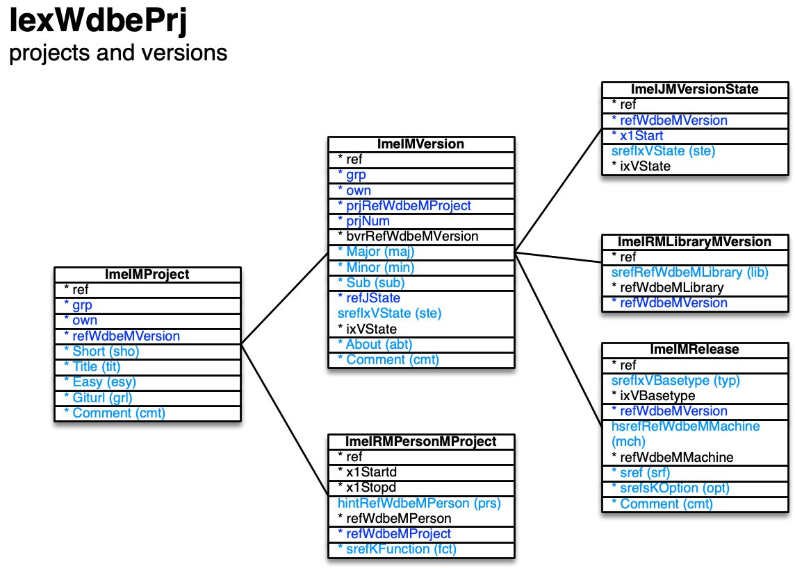

[back](../dbemdl.md)

Projects and versions ``IexWdbePrj``
===

Schema
---

<em>Figure 1: Projects and versions schema - table columns in light blue are part of the input file, table columns in dark blue are inferred</em>

Structure
---

[//]: # (IP structure - BEGIN)

&nbsp;&nbsp;&nbsp;&nbsp;\+ Project [``[ImeIMProject]``](#1-project-imeimproject)
 &nbsp;&nbsp;&nbsp;&nbsp;&nbsp;&nbsp;&nbsp;&nbsp;\+ Version [``[ImeIMVersion]``](#11-version-imeimversion)
 &nbsp;&nbsp;&nbsp;&nbsp;&nbsp;&nbsp;&nbsp;&nbsp;&nbsp;&nbsp;&nbsp;&nbsp;\- State history [``[ImeIJMVersionState]``](#111-state-history-imeijmversionstate)
 &nbsp;&nbsp;&nbsp;&nbsp;&nbsp;&nbsp;&nbsp;&nbsp;&nbsp;&nbsp;&nbsp;&nbsp;\- Release [``[ImeIMRelease]``](#112-release-imeimrelease)
 &nbsp;&nbsp;&nbsp;&nbsp;&nbsp;&nbsp;&nbsp;&nbsp;&nbsp;&nbsp;&nbsp;&nbsp;\- TblWdbeRMLibraryMVersion [``[ImeIRMLibraryMVersion]``](#113-Libraries-imeirmlibrarymversion)
 &nbsp;&nbsp;&nbsp;&nbsp;&nbsp;&nbsp;&nbsp;&nbsp;\- TblWdbeRMPersonMProject [``[ImeIRMPersonMProject]``](#12-Contributing-persons-imeirmpersonmproject)

[//]: # (IP structure - END)

Details
---

### 1 Project ``[ImeIMProject]``

[//]: # (IP ImeIMProject.superUse - BEGIN)

Use: one WhizniumDBE project corresponds to one repository which is iterated through versions.

[//]: # (IP ImeIMProject.superUse - END)

[//]: # (IP ImeIMProject.columns - BEGIN)

Column|Content|
-|-|
Short (string)|four-letter acronym|
Title (string)|name|
Easy (bool)|easy model (vs. full model)|
Giturl (string)|Git repository URL|
Comment (string)|comment|

[//]: # (IP ImeIMProject.columns - END)

### 1.1 Version ``[ImeIMVersion]``

[//]: # (IP ImeIMVersion.superUse - BEGIN)

Super import: project (1:N)

Use: each version holds full information for writing the code correponding to its respective model description.

[//]: # (IP ImeIMVersion.superUse - END)

[//]: # (IP ImeIMVersion.columns - BEGIN)

Column|Content|
-|-|
Major (usmallint)|major version number|
Minor (usmallint)|minor version number|
Sub (usmallint)|sub version number|
srefIxVState (string)|state newcre: newly created newimp: newly imported dsnbscdd: design phase, basic device description imported ready: build-ready abandon: abandonned|
About (string)|about text|
Comment (string)|comment|

[//]: # (IP ImeIMVersion.columns - END)

### 1.1.1 State history ``[ImeIJMVersionState]``

[//]: # (IP ImeIJMVersionState.superUse - BEGIN)

Super import: version (1:N)

Use: detail the time-dependent state of the version.

[//]: # (IP ImeIJMVersionState.superUse - END)

[//]: # (IP ImeIJMVersionState.columns - BEGIN)

Column|Content|
-|-|
srefIxVState (string)|state newcre: newly created newimp: newly imported dsnbscdd: design phase, basic device description imported ready: build-ready abandon: abandonned|

[//]: # (IP ImeIJMVersionState.columns - END)

### 1.1.2 Release ``[ImeIMRelease]``

[//]: # (IP ImeIMRelease.superUse - BEGIN)

Super import: version (1:N)

Use: specify the code artefacts to be generated.

[//]: # (IP ImeIMRelease.superUse - END)

[//]: # (IP ImeIMRelease.columns - BEGIN)

Column|Content|
-|-|
srefIxVBasetype (string)|type dev: device access library ezdev: easy model device access library fpga: FPGA code mcu: MCU code|
hsrefRefWdbeMMachine (string)|machine|
sref (string)|identifier|
srefsKOption (string)|options dev and ezdev types - dynlib: generate dynamic link library|
Comment (string)|comment|

[//]: # (IP ImeIMRelease.columns - END)

### 1.1.3 Libraries ``[ImeIRMLibraryMVersion]``

[//]: # (IP ImeIRMLibraryMVersion.superUse - BEGIN)

Super import: version (1:N)

Use: specify libraries to be considered for Makefile generation.

[//]: # (IP ImeIRMLibraryMVersion.superUse - END)

[//]: # (IP ImeIRMLibraryMVersion.columns - BEGIN)

Column|Content|
-|-|
srefRefWdbeMLibrary (string)|library|

[//]: # (IP ImeIRMLibraryMVersion.columns - END)

### 1.2 Contributing persons ``[ImeIRMPersonMProject]``

[//]: # (IP ImeIRMPersonMProject.superUse - BEGIN)

Super import: project (1:N)

Use: specify persons involved in the project with their respective roles.

[//]: # (IP ImeIRMPersonMProject.superUse - END)

[//]: # (IP ImeIRMPersonMProject.columns - BEGIN)

Column|Content|
-|-|
hintRefWdbeMPerson (string)|person|
srefKFunction (string)|function mgr: manager heng: hardware engineer seng: software engineer|

[//]: # (IP ImeIRMPersonMProject.columns - END)

<small>Markdown for WhizniumDBE v1.1.3 auto-generated (what else ;-) ) by WhizniumSBE on 1 Jan 2021</small>
