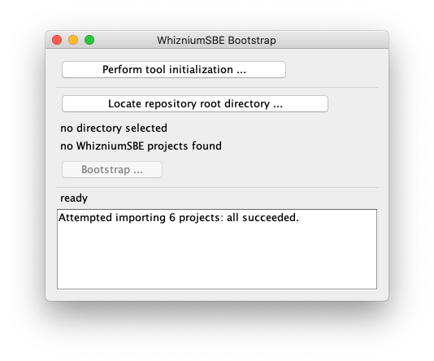
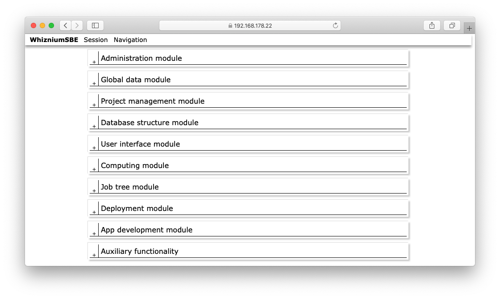
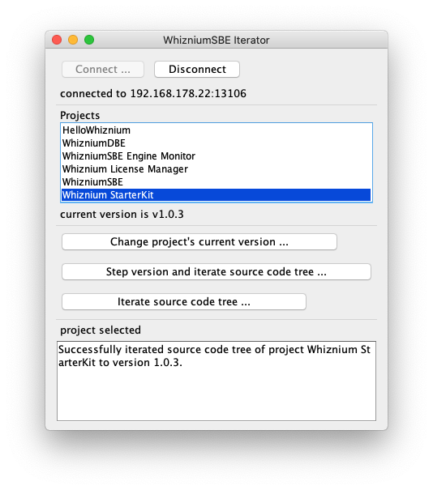
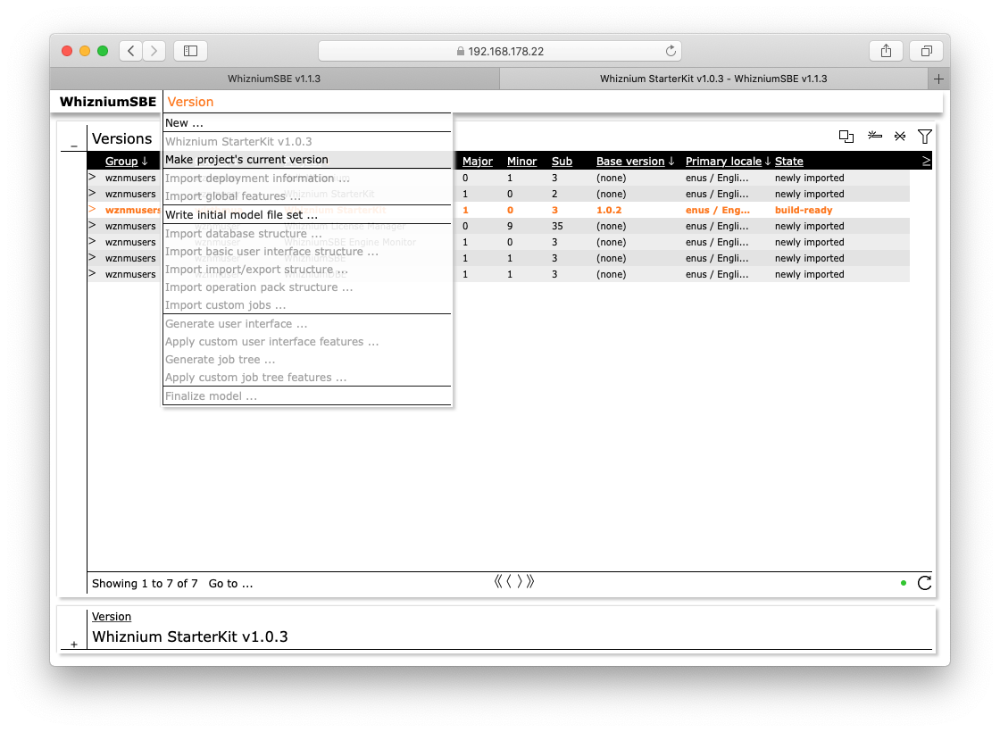

[back](./README.md)

# WhizniumSBE Development Workflow

## Bootstrapping WhizniumSBE (to be performed once)

As described in [Setting Up WhizniumSBE and WhizniumDBE On Your Workstation](./setup_sbedbe.md), section "Test-running WhizniumSBE", WhizniumSBE consists of three executables which need to be launched.

Initial fill of the WhizniumSBE master database is facilitated by the cross-platform Java tool _WhizniumSBE Bootstrap_. It can be found at ``${WHIZDEVROOT}/tools/wzbp`` and is launched from the command-line like this:
```
cd ${WHIZDEVROOT}/tools/wzbp
java -jar Wzbp.jar
```

The following UI is presented:



The __Perform tool initialization ...__ action will ask for an initialization file (containing e.g. users, multi-locale tags and machine/library paths), by default located at ``${WHIZDEVROOT}/projects/wznm/ini/IexWznmIni.txt``. In addition, the archive of code file templates needs to be specified, it can be found at ``${WHIZDEVROOT}/projects/wznm/ini/files.tgz``.

If the corresponding section in the initialization file has been left unaltered, credentials for the default user are wznmuser/asdf1234; they can be employed to log into WhizniumSBE via web-UI at https://127.0.0.1:13106.

The WhizniumSBE navigation screen should look like this:



The second section of _WhizniumSBE Bootstrap_ revolves around synchronization of the local project repository directory, by default at ``${WHIZDEVROOT}/rep`` with the WhizniumSBE master database. In a first step, initiated by __Locate repository root directory ...__, a local scan of the selected directory identifies WhizniumSBE projects by their characteristic folder structure. Actual synchronization takes place in the second step, triggered by __Bootstrap ...__.  After successful execution, WhizniumSBE is ready to iterate source code trees of the local projects.

## Iterating source code trees with WhizniumSBE (to be performed regularily while developing)

Source code tree iteration using WhizniumSBE is - besides, obviously, model file editing - the only step which is added to the typical embedded software development workflow when using Whiznium. The cross-platform Java tool _WhizniumSBE Iterator_ allows to do this in just a few clicks. It can be found at ``${WHIZDEVROOT}/tools/wzit`` and is launched from the command-line like this:
```
cd ${WHIZDEVROOT}/tools/wzit
java -jar Wzit.jar
```

The following UI is presented:



After connecting to WhizniumSBE (__Connect ...__), the list of projects is populated. Upon selection of a specific project, it is possible to step to a next version (based on updated model information) by choosing the __Step version and iterate source code tree ...__ action. Some workflow options, such as how to increment the version number, Git/non-Git options, can be selected, before the actual iteration is performed. If no error is found, _WhizniumSBE Iterator_ proceeds with uploading the existing source code tree and progressing existing manual code into the newly generated source code tree. The sequence is finalized by committing/downloading the new version of the source code tree.

Should errors be present in the existing source code tree's _insertion points_ (e.g. of type ``// IP xyz --- IBEGIN/IEND``), it is required to fix these errors. In that case, only the __Iterate source code tree ...__ action needs to be executed, as version stepping has already completed at this stage.

For a behind the scenes look of _WhizniumSBE Iterator_'s basic functionality, it is worth looking at the __Version__ card menu of WhizniumSBE:



All the listed import/generate actions are performed before actual source code is written.

---

In case of problems, please do not hesitate to contact MPSI Technologles at [support@mpsitech.com](mailto:support@mpsitech.com).
