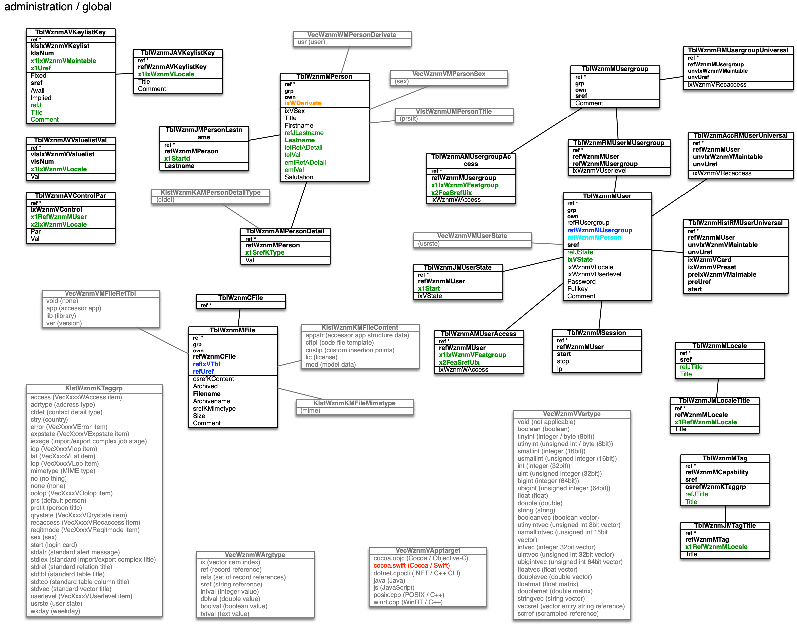
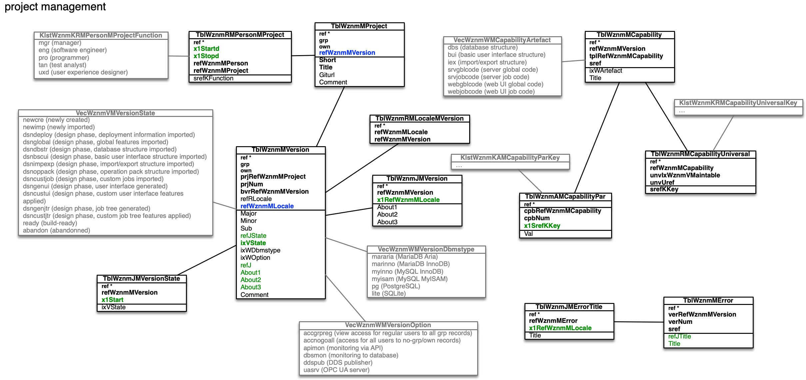
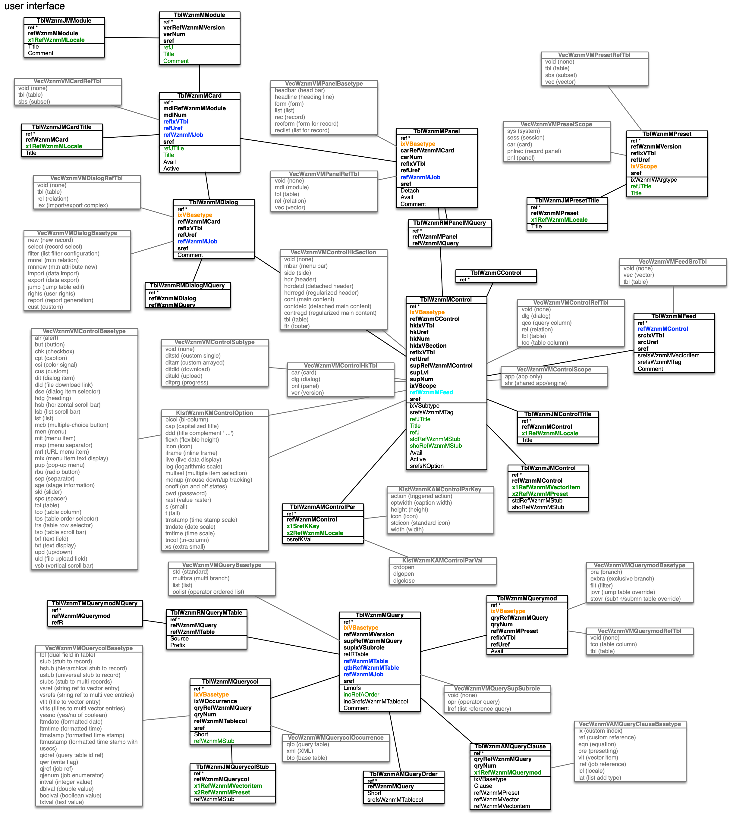

[back](./README.md)

# WhizniumSBE Master Database

Below, the structure of the WhizniumSBE relational master database can be found, grouped into the various aspects covered by the tool. 

## Administration / global

## Project management

## Database structure

## User interface

## Job tree

## Computing

## Deployment

## App development

