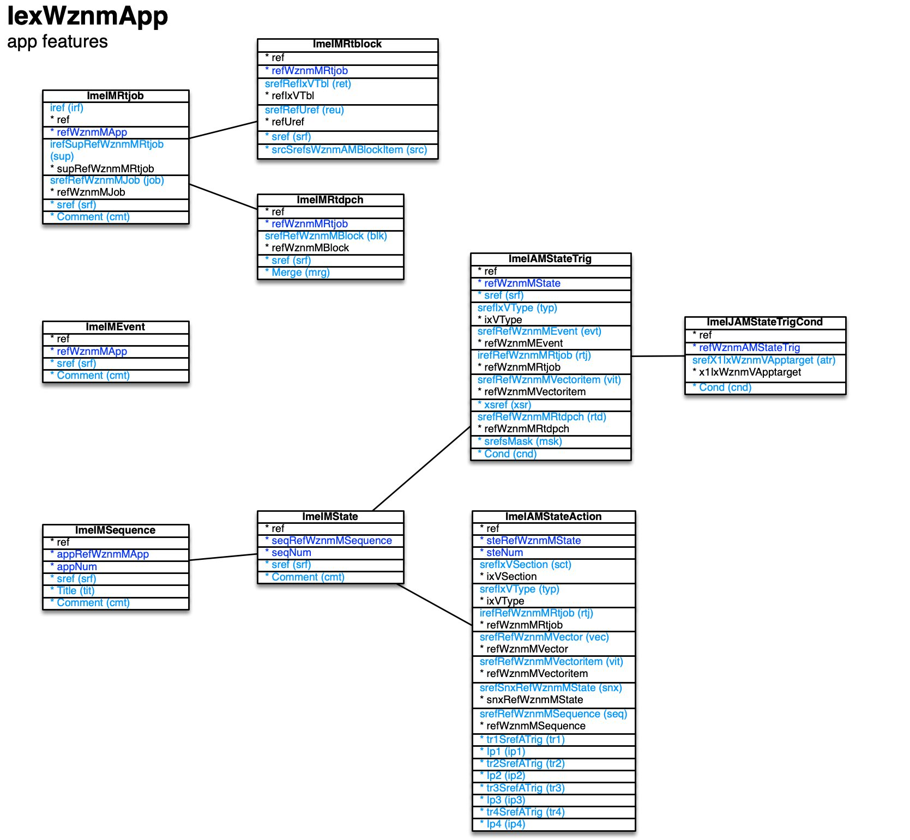

[back](../sbemdl.md)

App features ``IexWznmApp``
===

Schema
---

<em>Figure 1: App features schema - table columns in light blue are part of the input file, table columns in dark blue are inferred</em>

Structure
---

[//]: # (IP structure - BEGIN)

&nbsp;&nbsp;&nbsp;&nbsp;\- Event [``[ImeIMEvent]``](#1-event-imeimevent)
 &nbsp;&nbsp;&nbsp;&nbsp;\+ Run-time job [``[ImeIMRtjob]``](#2-run-time-job-imeimrtjob)
 &nbsp;&nbsp;&nbsp;&nbsp;&nbsp;&nbsp;&nbsp;&nbsp;\- Run-time data block [``[ImeIMRtblock]``](#21-run-time-data-block-imeimrtblock)
 &nbsp;&nbsp;&nbsp;&nbsp;&nbsp;&nbsp;&nbsp;&nbsp;\- Run-time dispatch [``[ImeIMRtdpch]``](#22-run-time-dispatch-imeimrtdpch)
 &nbsp;&nbsp;&nbsp;&nbsp;\+ Sequence [``[ImeIMSequence]``](#3-sequence-imeimsequence)
 &nbsp;&nbsp;&nbsp;&nbsp;&nbsp;&nbsp;&nbsp;&nbsp;\+ State [``[ImeIMState]``](#31-state-imeimstate)
 &nbsp;&nbsp;&nbsp;&nbsp;&nbsp;&nbsp;&nbsp;&nbsp;&nbsp;&nbsp;&nbsp;&nbsp;\- Actions [``[ImeIAMStateAction]``](#311-actions-imeiamstateaction)
 &nbsp;&nbsp;&nbsp;&nbsp;&nbsp;&nbsp;&nbsp;&nbsp;&nbsp;&nbsp;&nbsp;&nbsp;\+ Triggers [``[ImeIAMStateTrig]``](#312-triggers-imeiamstatetrig)
 &nbsp;&nbsp;&nbsp;&nbsp;&nbsp;&nbsp;&nbsp;&nbsp;&nbsp;&nbsp;&nbsp;&nbsp;&nbsp;&nbsp;&nbsp;&nbsp;\- Condition by app target [``[ImeIJAMStateTrigCond]``](#3121-condition-by-app-target-imeijamstatetrigcond)

[//]: # (IP structure - END)

Details
---

### 1 Event ``[ImeIMEvent]``

[//]: # (IP ImeIMEvent.superUse - BEGIN)

Use: define app-local (e.g. UI) events which can be used as triggers for state machine changes.

[//]: # (IP ImeIMEvent.superUse - END)

[//]: # (IP ImeIMEvent.columns - BEGIN)

Column|Content|
-|-|
sref (string)|identifier|
Comment (string)|comment|

[//]: # (IP ImeIMEvent.columns - END)

### 2 Run-time job ``[ImeIMRtjob]``

[//]: # (IP ImeIMRtjob.superUse - BEGIN)

Use: specify the part of the job tree which is relevant for the app. Used to establish a hierarchical DOM.

[//]: # (IP ImeIMRtjob.superUse - END)

[//]: # (IP ImeIMRtjob.columns - BEGIN)

Column|Content|
-|-|
iref (ubigint)|integer reference|
irefSupRefWznmMRtjob (ubigint)|integer reference to super run-time job|
srefRefWznmMJob (string)|job|
sref (string)|identifier|
Comment (string)|comment|

[//]: # (IP ImeIMRtjob.columns - END)

### 2.1 Run-time data block ``[ImeIMRtblock]``

[//]: # (IP ImeIMRtblock.superUse - BEGIN)

Super import: run-time job (1:N)

Use: specify XML data blocks relevant for the app, to be incorporated into the DOM.

[//]: # (IP ImeIMRtblock.superUse - END)

[//]: # (IP ImeIMRtblock.columns - BEGIN)

Column|Content|
-|-|
srefRefIxVTbl (string)|reference blk: block fed: feed tbl: table|
srefRefUref (string)|blk reference - block, fed reference - feed, tbl reference - table|
sref (string)|identifier|
srcSrefsWznmAMBlockItem (string)|dispatch sources|

[//]: # (IP ImeIMRtblock.columns - END)

### 2.2 Run-time dispatch ``[ImeIMRtdpch]``

[//]: # (IP ImeIMRtdpch.superUse - BEGIN)

Super import: run-time job (1:N)

Use: engine dispatches to be processed in the app, e.g. to update the local DOM.

[//]: # (IP ImeIMRtdpch.superUse - END)

[//]: # (IP ImeIMRtdpch.columns - BEGIN)

Column|Content|
-|-|
srefRefWznmMBlock (string)|dispatch|
sref (string)|identifier|
Merge (bool)|merge content|

[//]: # (IP ImeIMRtdpch.columns - END)

### 3 Sequence ``[ImeIMSequence]``

[//]: # (IP ImeIMSequence.superUse - BEGIN)

Use: grouping entity for states.

[//]: # (IP ImeIMSequence.superUse - END)

[//]: # (IP ImeIMSequence.columns - BEGIN)

Column|Content|
-|-|
sref (string)|identifier|
Title (string)|name|
Comment (string)|comment|

[//]: # (IP ImeIMSequence.columns - END)

### 3.1 State ``[ImeIMState]``

[//]: # (IP ImeIMState.superUse - BEGIN)

Super import: sequence (1:N)

Use: state machine definition, allowing for event-driven app operation.

[//]: # (IP ImeIMState.superUse - END)

[//]: # (IP ImeIMState.columns - BEGIN)

Column|Content|
-|-|
sref (string)|identifier|
Comment (string)|comment|

[//]: # (IP ImeIMState.columns - END)

### 3.1.1 Actions ``[ImeIAMStateAction]``

[//]: # (IP ImeIAMStateAction.superUse - BEGIN)

Super import: state (1:N)

Use: define a hierarchical decision tree (up to four levels) for actions to be performed in a specific state. Code generation for the most common types, manual code insertion points for everything else.

[//]: # (IP ImeIAMStateAction.superUse - END)

[//]: # (IP ImeIAMStateAction.columns - BEGIN)

Column|Content|
-|-|
srefIxVSection (string)|section ent: enter for the first time reent: re-enter lve: leave|
srefIxVType (string)|type login: start session init: initialize UI job do: trigger UI action step: step to next state csjstep: copy scr. job ref. then step to next state csjntfstep: copy sess. scr. job ref., start notify, step to next state stepseq: step to next sequence subseq: perform sub-sequence retseq: return from sequence break: interrupt state update loop cust: custom code|
irefRefWznmMRtjob (ubigint)|login, init, do, csjstep, csjntfstep types - run-time job|
srefRefWznmMVector (string)|do type - UI action vector|
srefRefWznmMVectoritem (string)|do type - UI action vector item|
srefSnxRefWznmMState (string)|csjstep, csjntfstep, step types - next state|
srefRefWznmMSequence (string)|stepseq, subseq types - sequence|
tr1SrefATrig (string)|trigger level 1|
Ip1 (string)|manual insertion point level 1|
tr2SrefATrig (string)|trigger level 2|
Ip2 (string)|manual insertion point level 2|
tr3SrefATrig (string)|trigger level 3|
Ip3 (string)|manual insertion point level 3|
tr4SrefATrig (string)|trigger level 4|
Ip4 (string)|manual insertion point level 4|

[//]: # (IP ImeIAMStateAction.columns - END)

### 3.1.2 Triggers ``[ImeIAMStateTrig]``

[//]: # (IP ImeIAMStateTrig.superUse - BEGIN)

Super import: state (1:N)

Use: specify triggers for actions to be performed in a specific state.

[//]: # (IP ImeIAMStateTrig.superUse - END)

[//]: # (IP ImeIAMStateTrig.columns - BEGIN)

Column|Content|
-|-|
sref (string)|identifier|
srefIxVType (string)|type evt: local event sgeeq: stage equals jobex: job exists jobnex: job doesn't exist confacc: confirmation received confdny: denial received dpchrcv: dispatch received cust: custom condition|
srefRefWznmMEvent (string)|evt type - triggering event|
irefRefWznmMRtjob (ubigint)|sgeeq, jobex, jobnex, confacc, confdny, dpchrcv types - run-time job concerned|
srefRefWznmMVectoritem (string)|sgeeq - vector item of job concerned|
xsref (string)|confacc type - sref (identifier) content filter|
srefRefWznmMRtdpch (string)|dpchrcv type - triggering run-time dispatch|
srefsMask (string)|dpchrcv type - mandatory content of dispatch received|
Cond (string)|cust type - condition (C++/Objective-C/C#/Java if-statement)|

[//]: # (IP ImeIAMStateTrig.columns - END)

### 3.1.2.1 Condition by app target ``[ImeIJAMStateTrigCond]``

[//]: # (IP ImeIJAMStateTrigCond.superUse - BEGIN)

Super import: triggers (1:N)

Use: specify if-statements related to custom trigger conditions for alternative app targets.

[//]: # (IP ImeIJAMStateTrigCond.superUse - END)

[//]: # (IP ImeIJAMStateTrigCond.columns - BEGIN)

Column|Content|
-|-|
srefX1IxWznmVApptarget (string)|accessor app target cocoa.objc: Cocoa / Objective-C dotnet.cppcli: .NET / C++ CLI java: Java js: JavaScript posix.cpp: POSIX / C++ winrt.cpp: WinRT / C++|
Cond (string)|condition|

[//]: # (IP ImeIJAMStateTrigCond.columns - END)

<small>Markdown for WhizniumSBE v1.1.3 auto-generated (what else ;-) ) by WhizniumSBE on 1 Jan 2021</small>
