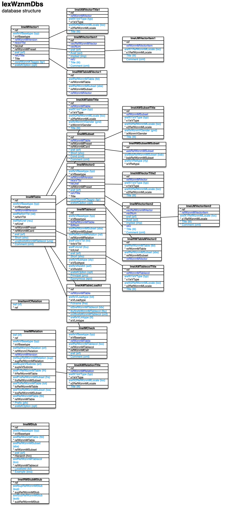

[back](../sbemdl.md)

Database structure ``IexWznmDbs``
===

Schema
---

<em>Figure 1: Database structure schema - table columns in light blue are part of the input file, table columns in dark blue are inferred</em>

Structure
---

[//]: # (IP structure - BEGIN)

&nbsp;&nbsp;&nbsp;&nbsp;\- Relations cluster [``[ImeICRelation]``](#1-relations-cluster-imeicrelation)
 &nbsp;&nbsp;&nbsp;&nbsp;\+ Relation [``[ImeIMRelation]``](#2-relation-imeimrelation)
 &nbsp;&nbsp;&nbsp;&nbsp;&nbsp;&nbsp;&nbsp;&nbsp;\- Names [``[ImeIAMRelationTitle]``](#21-names-imeiamrelationtitle)
 &nbsp;&nbsp;&nbsp;&nbsp;\- Stub [``[ImeIMStub]``](#3-stub-imeimstub)
 &nbsp;&nbsp;&nbsp;&nbsp;\+ Table [``[ImeIMTable]``](#4-table-imeimtable)
 &nbsp;&nbsp;&nbsp;&nbsp;&nbsp;&nbsp;&nbsp;&nbsp;\- Load functions [``[ImeIAMTableLoadfct]``](#41-load-functions-imeiamtableloadfct)
 &nbsp;&nbsp;&nbsp;&nbsp;&nbsp;&nbsp;&nbsp;&nbsp;\- Names [``[ImeIAMTableTitle]``](#42-names-imeiamtabletitle)
 &nbsp;&nbsp;&nbsp;&nbsp;&nbsp;&nbsp;&nbsp;&nbsp;\- Feature check [``[ImeIMCheck]``](#43-feature-check-imeimcheck)
 &nbsp;&nbsp;&nbsp;&nbsp;&nbsp;&nbsp;&nbsp;&nbsp;\+ Subset [``[ImeIMSubset]``](#44-subset-imeimsubset)
 &nbsp;&nbsp;&nbsp;&nbsp;&nbsp;&nbsp;&nbsp;&nbsp;&nbsp;&nbsp;&nbsp;&nbsp;\- Names [``[ImeIAMSubsetTitle]``](#441-names-imeiamsubsettitle)
 &nbsp;&nbsp;&nbsp;&nbsp;&nbsp;&nbsp;&nbsp;&nbsp;&nbsp;&nbsp;&nbsp;&nbsp;\- Relations to other subsets [``[ImeIRMSubsetMSubset]``](#442-relations-to-other-subsets-imeirmsubsetmsubset)
 &nbsp;&nbsp;&nbsp;&nbsp;&nbsp;&nbsp;&nbsp;&nbsp;\+ Table column [``[ImeIMTablecol]``](#45-table-column-imeimtablecol)
 &nbsp;&nbsp;&nbsp;&nbsp;&nbsp;&nbsp;&nbsp;&nbsp;&nbsp;&nbsp;&nbsp;&nbsp;\- Names [``[ImeIAMTablecolTitle]``](#451-names-imeiamtablecoltitle)
 &nbsp;&nbsp;&nbsp;&nbsp;&nbsp;&nbsp;&nbsp;&nbsp;\+ Vector [``[ImeIMVector2]``](#46-vector-imeimvector2)
 &nbsp;&nbsp;&nbsp;&nbsp;&nbsp;&nbsp;&nbsp;&nbsp;&nbsp;&nbsp;&nbsp;&nbsp;\- Names [``[ImeIAMVectorTitle2]``](#461-names-imeiamvectortitle2)
 &nbsp;&nbsp;&nbsp;&nbsp;&nbsp;&nbsp;&nbsp;&nbsp;&nbsp;&nbsp;&nbsp;&nbsp;\+ Vector item [``[ImeIMVectoritem2]``](#462-vector-item-imeimvectoritem2)
 &nbsp;&nbsp;&nbsp;&nbsp;&nbsp;&nbsp;&nbsp;&nbsp;&nbsp;&nbsp;&nbsp;&nbsp;&nbsp;&nbsp;&nbsp;&nbsp;\- Name and comment by locale [``[ImeIJMVectoritem2]``](#4621-name-and-comment-by-locale-imeijmvectoritem2)
 &nbsp;&nbsp;&nbsp;&nbsp;&nbsp;&nbsp;&nbsp;&nbsp;&nbsp;&nbsp;&nbsp;&nbsp;\- Main table filters [``[ImeIRMTableMVector2]``](#463-main-table-filters-imeirmtablemvector2)
 &nbsp;&nbsp;&nbsp;&nbsp;\+ Vector [``[ImeIMVector1]``](#5-vector-imeimvector1)
 &nbsp;&nbsp;&nbsp;&nbsp;&nbsp;&nbsp;&nbsp;&nbsp;\- Names [``[ImeIAMVectorTitle1]``](#51-names-imeiamvectortitle1)
 &nbsp;&nbsp;&nbsp;&nbsp;&nbsp;&nbsp;&nbsp;&nbsp;\+ Vector item [``[ImeIMVectoritem1]``](#52-vector-item-imeimvectoritem1)
 &nbsp;&nbsp;&nbsp;&nbsp;&nbsp;&nbsp;&nbsp;&nbsp;&nbsp;&nbsp;&nbsp;&nbsp;\- Name and comment by locale [``[ImeIJMVectoritem1]``](#521-name-and-comment-by-locale-imeijmvectoritem1)
 &nbsp;&nbsp;&nbsp;&nbsp;&nbsp;&nbsp;&nbsp;&nbsp;\- Defining tables [``[ImeIRMTableMVector1]``](#53-defining-tables-imeirmtablemvector1)
 &nbsp;&nbsp;&nbsp;&nbsp;\- Inter-stub dependencies [``[ImeIRMStubMStub]``](#6-inter-stub-dependencies-imeirmstubmstub)

[//]: # (IP structure - END)

Details
---

### 1 Relations cluster ``[ImeICRelation]``

[//]: # (IP ImeICRelation.superUse - BEGIN)

Use: group relations (currently not in use).

[//]: # (IP ImeICRelation.superUse - END)

[//]: # (IP ImeICRelation.columns - BEGIN)

Column|Content|
-|-|
iref (ubigint)|integer reference|

[//]: # (IP ImeICRelation.columns - END)

### 2 Relation ``[ImeIMRelation]``

[//]: # (IP ImeIMRelation.superUse - BEGIN)

Use: establish relations between database tables.

[//]: # (IP ImeIMRelation.superUse - END)

[//]: # (IP ImeIMRelation.columns - BEGIN)

Column|Content|
-|-|
iref (ubigint)|integer reference|
srefIxVBasetype (string)|type grp: owning user group 1:n own: owner 1:n _11: 1:1 _1n: 1:n _1npref: pref sub to 1:n _1nsub1n: 1:n sub to 1:n mn: m:n mnsubmn: m:n sub to m:n mnpref: pref sub to m:n drv: univ derivate drvsub: fixed sub to univ derivate drvusub: univ sub to univ derivate inc: inclusion j: jump table 1:n jpref: pref sub to jump table 1:n clust: cluster 1:n aux: aux 1:n auxpref: pref aux to aux 1:n h1n: hierarchical 1:n u1n: universal 1:n u1nsub: 1:n sub to universal 1:n u1nsubpref: pref sub to universal 1:n u1nsubinc: inclusion sub to univ 1:n u1nsub11: 1:1 sub to universal 1:n umn: universal m:n um1n: any main table 1:n a1n: attribute 1:n au1n: attr universal 1:n au1nsub: spec sub to attr univ 1:n as1n: attr string ref 1:n asmn: attr string refs m:n lu1n: list fct univ 1:n lu1nsub: sub to list fct univ 1:n lu1nlsub: list fct sub to lu1n l1nop: operator sub to l1n/lu1n l1noppr: partner sub 1:n to l1nop l1n: list fct 1:n lmn: list fct m:n lmnop: operator sub to lmn lmnoppr: partner sub 1:n to lmnop|
irefRefWznmCRelation (ubigint)|integer reference to relations cluster|
irefSupRefWznmMRelation (ubigint)|super relation|
srefSupIxVSubrole (string)|role in super relation void: none from1n: from table to1n: to table submn: T table pref: preferred frompref: preferred in from table topref: preferred in to table r1n: rel table mn1n: m:n rel table mod: modifier sub: 1:n sub subl: 1:n sub with list fct subinc: inclusion sub sub11: 1:1 sub sub1n: S table pr1: partner 1 pr2: partner 2 op: list operator toum1n: to any main table spec: specification|
srefFrRefWznmMTable (string)|from table|
srefFrsRefWznmMSubset (string)|from subset|
srefToRefWznmMTable (string)|to table|
srefTosRefWznmMSubset (string)|to subset|
srefRefWznmMTable (string)|table|
Prefix (string)|prefix|
srefsKOption (string)|options self: self-reference preffrom: preferred in from table prefto: preferred in to table enumfrom: enum by from table enumto: enum by to table pref: preferred in to table enum: enumerated ins: insert operation rmv: remove operation ina: insert after operation swp: swap operation affil: affiliation determining|

[//]: # (IP ImeIMRelation.columns - END)

### 2.1 Names ``[ImeIAMRelationTitle]``

[//]: # (IP ImeIAMRelationTitle.superUse - BEGIN)

Super import: relation (1:N)

Use: self-explanatory.

[//]: # (IP ImeIAMRelationTitle.superUse - END)

[//]: # (IP ImeIAMRelationTitle.columns - BEGIN)

Column|Content|
-|-|
srefX1IxVType (string)|type fromsngshort: from singular short form fromsngfull: from singular full title tosngshort: to singular short form tosngfull: to singular full title fromplshort: from plural short form fromplfull: from plural full title toplshort: to plural short form toplfull: to plural full title|
srefX2RefWznmMLocale (string)|locale|
Title (string)|name|

[//]: # (IP ImeIAMRelationTitle.columns - END)

### 3 Stub ``[ImeIMStub]``

[//]: # (IP ImeIMStub.superUse - BEGIN)

Use: human-readable or shorthand representation of a table record.

[//]: # (IP ImeIMStub.superUse - END)

[//]: # (IP ImeIMStub.columns - BEGIN)

Column|Content|
-|-|
srefIxVBasetype (string)|type tco: single table column cust: custom implementation|
srefRefWznmMTable (string)|table|
srefRefWznmMSubset (string)|subset|
sref (string)|identifier|
Hierarch (bool)|hierarchical|
srefRefWznmMTablecol (string)|single table column type - table column|
Localized (bool)|localized|
Example (string)|example|

[//]: # (IP ImeIMStub.columns - END)

### 4 Table ``[ImeIMTable]``

[//]: # (IP ImeIMTable.superUse - BEGIN)

Use: database tables excluding query tables.

[//]: # (IP ImeIMTable.superUse - END)

[//]: # (IP ImeIMTable.columns - BEGIN)

Column|Content|
-|-|
srefIxVBasetype (string)|type main: main aux: auxiliary rel: m:n jump: jump clust: cluster list: list opr: list operator sub1n: sub 1:n for 1:n submn: sub 1:n for m:n|
srefRefIxVTbl (string)|reference void: none rel: relation|
irefRefUref (ubigint)|rel type - integer reference to relation|
sref (string)|identifier|
Short (string)|acronym|
unqSrefsWznmMTablecol (string)|table columns for uniqueness rule|
Comment (string)|comment|

[//]: # (IP ImeIMTable.columns - END)

### 4.1 Load functions ``[ImeIAMTableLoadfct]``

[//]: # (IP ImeIAMTableLoadfct.superUse - BEGIN)

Super import: table (1:N)

Use: single table SQL SELECT statements frequently used in the engine / operation engine, resulting in dedicated prepared statements and C++ methods.

[//]: # (IP ImeIAMTableLoadfct.superUse - END)

[//]: # (IP ImeIAMTableLoadfct.columns - BEGIN)

Column|Content|
-|-|
srefIxVLoadtype (string)|load type confirm: check presence count: record count ref: single ref refs: set of refs rec: single record rst: record set string: single string value uint: single uint value hrefsup: set of refs hier. up hrefsdown: set of refs hier. down hrstup: record set hier. up hrstdown: record set hier. down|
Fctname (string)|function name|
ldSrefWznmMTablecol (string)|string, uint load types - table column to load|
lbySrefsWznmMTablecol (string)|table columns for SQL WHERE clause|
ordSrefsWznmMTablecol (string)|table columns for SQL ORDER BY clause ; ascending by default, descending with .desc postfix|
srefIxVLimtype (string)|limitation type void: none first: single record limofs: limit/offset parameters|

[//]: # (IP ImeIAMTableLoadfct.columns - END)

### 4.2 Names ``[ImeIAMTableTitle]``

[//]: # (IP ImeIAMTableTitle.superUse - BEGIN)

Super import: table (1:N)

Use: self-explanatory.

[//]: # (IP ImeIAMTableTitle.superUse - END)

[//]: # (IP ImeIAMTableTitle.columns - BEGIN)

Column|Content|
-|-|
srefX1IxVType (string)|type sngshort: singular short form sngfull: singular full title plfull: plural full title|
srefX2RefWznmMLocale (string)|locale|
srefIxWznmVGender (string)|gender m: male f: female n: neuter|
Title (string)|name|

[//]: # (IP ImeIAMTableTitle.columns - END)

### 4.3 Feature check ``[ImeIMCheck]``

[//]: # (IP ImeIMCheck.superUse - BEGIN)

Super import: table (1:N)

Use: query record for certain characteristics in C++ code (boolean result).

[//]: # (IP ImeIMCheck.superUse - END)

[//]: # (IP ImeIMCheck.columns - BEGIN)

Column|Content|
-|-|
srefIxVBasetype (string)|type eq: table column equals incl: table column includes leaf: leaf of hierarchical table sbs: part of subsets cust: custom check|
srefRefWznmMTablecol (string)|table column|
sref (string)|identifier|
Comment (string)|comment|

[//]: # (IP ImeIMCheck.columns - END)

### 4.4 Subset ``[ImeIMSubset]``

[//]: # (IP ImeIMSubset.superUse - BEGIN)

Super import: table (1:N)

Use: make certain table columns, relations and web-based UI elements available for table records fulfilling certain conditions.

[//]: # (IP ImeIMSubset.superUse - END)

[//]: # (IP ImeIMSubset.columns - BEGIN)

Column|Content|
-|-|
sref (string)|identifier|
Short (string)|acronym|
Cond (string)|condition rule|
Comment (string)|comment|

[//]: # (IP ImeIMSubset.columns - END)

### 4.4.1 Names ``[ImeIAMSubsetTitle]``

[//]: # (IP ImeIAMSubsetTitle.superUse - BEGIN)

Super import: subset (1:N)

Use: self-explanatory.

[//]: # (IP ImeIAMSubsetTitle.superUse - END)

[//]: # (IP ImeIAMSubsetTitle.columns - BEGIN)

Column|Content|
-|-|
srefX1IxVType (string)|type sngshort: singular short form sngfull: singular full title plfull: plural full title|
srefX2RefWznmMLocale (string)|locale|
srefIxWznmVGender (string)|gender m: male f: female n: neuter|
Title (string)|name|

[//]: # (IP ImeIAMSubsetTitle.columns - END)

### 4.4.2 Relations to other subsets ``[ImeIRMSubsetMSubset]``

[//]: # (IP ImeIRMSubsetMSubset.superUse - BEGIN)

Super import: subset (1:N)

Use: give set theory hints to avoid queries which include record duplicates.

[//]: # (IP ImeIRMSubsetMSubset.superUse - END)

[//]: # (IP ImeIRMSubsetMSubset.columns - BEGIN)

Column|Content|
-|-|
srefBsbRefWznmMSubset (string)|"B" subset|
srefIxVReltype (string)|relation type ainb: a includes b bina: b includes a compl: complement disj: disjointedness xsec: intersection|

[//]: # (IP ImeIRMSubsetMSubset.columns - END)

### 4.5 Table column ``[ImeIMTablecol]``

[//]: # (IP ImeIMTablecol.superUse - BEGIN)

Super import: table (1:N)

Use: self-explanatory.

[//]: # (IP ImeIMTablecol.superUse - END)

[//]: # (IP ImeIMTablecol.columns - BEGIN)

Column|Content|
-|-|
srefIxVBasetype (string)|type idref: identifying reference idsref: identidying string reference klref: key list reference tblref: table reference tblsref: table string reference vecref: vector reference uvsref: universal vector string reference grp: owning user group reference own: owner reference enum: enumerator lvl: level in hierarchy intval: integer value dblval: double value boolval: boolean value txtval: text value timeval: time value expr: code expression|
srefRefWznmMSubset (string)|subset applicable to|
irefRefWznmMRelation (ubigint)|tblref, tblsref, grp, own, enum, lvl types - relation|
srefFctIxVTbl (string)|functionality void: none tbl: table vec: vector|
srefFctUref (string)|tbl functionality - table, vec functionality - vector|
sref (string)|identifier|
Short (string)|acronym|
srefIxVSubtype (string)|subtype void: none _[type:klref]_ klrefopt: optional klrefsng: single klrefmult: multi _[type:tblref]_ trefspec: specific table trefuniv: universal table trefmin: minor reference trefclu: cluster table _[type:tblsref]_ tsrefsng: single tsrefmult: multi _[type:vecref]_ vreflin: linear vector index vrefand: AND mask for mc vector _[type:enum]_ enauto: automatic increment enspec: specific numbering _[type:intval]_ tinyint: integer / byte (8bit) utinyint: unsigned integer / byte (8bit) smallint: integer (16bit) usmallint: unsigned integer (16bit) int: integer (32bit) uint: unsigned integer (32bit) bigint: integer (64bit) ubigint: unsigned integer (64bit) _[type:txtval]_ txt5: max. 5 characters txt10: max. 10 characters txt30: max. 30 characters txt50: max. 50 characters txt100: max. 100 characters txt192: max. 192 characters txtlong: text field (unlimited) txtbase64: Base64 encoded binary (unlimited) _[type:timeval]_ tmdate: date tmtime: time tmstamp: time stamp tmustamp: time stamp with usecs|
srefIxVAxisfct (string)|axis functionality void: not applicable pt: point spt: starting point ept: end point|
srefsKOption (string)|options idx: indexed|
Principal (bool)|principal|
Eponymous (bool)|eponymous for record|

[//]: # (IP ImeIMTablecol.columns - END)

### 4.5.1 Names ``[ImeIAMTablecolTitle]``

[//]: # (IP ImeIAMTablecolTitle.superUse - BEGIN)

Super import: table column (1:N)

Use: self-explanatory.

[//]: # (IP ImeIAMTablecolTitle.superUse - END)

[//]: # (IP ImeIAMTablecolTitle.columns - BEGIN)

Column|Content|
-|-|
srefX1IxVType (string)|type short: short form full: full title|
srefX2RefWznmMLocale (string)|locale|
Title (string)|name|

[//]: # (IP ImeIAMTablecolTitle.columns - END)

### 4.6 Vector ``[ImeIMVector2]``

[//]: # (IP ImeIMVector2.superUse - BEGIN)

Super import: table (1:N)

Use: table-specific vector, key list of value list.

[//]: # (IP ImeIMVector2.superUse - END)

[//]: # (IP ImeIMVector2.columns - BEGIN)

Column|Content|
-|-|
srefIxVBasetype (string)|type lin: linear or: multiple-choice klst: key list vlst: value list|
sref (string)|identifier|
osrefWznmKTaggrp (string)|source tag group access: VecXxxxWAccess item adrtype: address type ctdet: contact detail ctry: country error: VecXxxxVError item expstate: VecXxxxVExpstate item iexsge: import/export complex job stage iop: VecXxxxVIop item lat: VecXxxxVLat item lop: VecXxxxVLop item mimetype: MIME type no: no thing none: none oolop: VecXxxxVOolop item prs: default person prstit: person title qrystate: VecXxxxVQrystate item recaccess: VecXxxxVRecaccess item reqitmode: VecXxxxVReqitmode item sex: sex start: login card stdalr: standard alert message stdiex: standard import/export complex title stdrel: standard relation title stdtbl: standard table title stdtco: standard table column title stdvec: standard vector title userlevel: VecXxxxVUserlevel item usrste: user state wkday: weekday|
srefsKOption (string)|options noloc: non-localized notit: no titles cmt: comments apdfed: append to feed filfed: fill feed|

[//]: # (IP ImeIMVector2.columns - END)

### 4.6.1 Names ``[ImeIAMVectorTitle2]``

[//]: # (IP ImeIAMVectorTitle2.superUse - BEGIN)

Super import: vector (1:N)

Use: self-explanatory.

[//]: # (IP ImeIAMVectorTitle2.superUse - END)

[//]: # (IP ImeIAMVectorTitle2.columns - BEGIN)

Column|Content|
-|-|
srefX1IxVType (string)|type short: short form full: full title|
srefX2RefWznmMLocale (string)|locale|
Title (string)|name|

[//]: # (IP ImeIAMVectorTitle2.columns - END)

### 4.6.2 Vector item ``[ImeIMVectoritem2]``

[//]: # (IP ImeIMVectoritem2.superUse - BEGIN)

Super import: vector (1:N)

Use: self-explanatory.

[//]: # (IP ImeIMVectoritem2.superUse - END)

[//]: # (IP ImeIMVectoritem2.columns - BEGIN)

Column|Content|
-|-|
sref (string)|identifier|
Avail (string)|availability rule|
Implied (string)|rule for implied|
Title (string)|name|
Comment (string)|comment|

[//]: # (IP ImeIMVectoritem2.columns - END)

### 4.6.2.1 Name and comment by locale ``[ImeIJMVectoritem2]``

[//]: # (IP ImeIJMVectoritem2.superUse - BEGIN)

Super import: vector item (1:N)

Use: self-explanatory.

[//]: # (IP ImeIJMVectoritem2.superUse - END)

[//]: # (IP ImeIJMVectoritem2.columns - BEGIN)

Column|Content|
-|-|
srefX1RefWznmMLocale (string)|locale|
Title (string)|name|
Comment (string)|comment|

[//]: # (IP ImeIJMVectoritem2.columns - END)

### 4.6.3 Main table filters ``[ImeIRMTableMVector2]``

[//]: # (IP ImeIRMTableMVector2.superUse - BEGIN)

Super import: vector (1:N)

Use: key lists only - main tables to the records of which the key list's keys refer.

[//]: # (IP ImeIRMTableMVector2.superUse - END)

[//]: # (IP ImeIRMTableMVector2.columns - BEGIN)

Column|Content|
-|-|
srefRefWznmMTable (string)|table|
srefRefWznmMSubset (string)|subset|

[//]: # (IP ImeIRMTableMVector2.columns - END)

### 5 Vector ``[ImeIMVector1]``

[//]: # (IP ImeIMVector1.superUse - BEGIN)

Use: database-specific vector.

[//]: # (IP ImeIMVector1.superUse - END)

[//]: # (IP ImeIMVector1.columns - BEGIN)

Column|Content|
-|-|
srefIxVBasetype (string)|type lin: linear or: multiple-choice klst: key list vlst: value list|
sref (string)|identifier|
osrefWznmKTaggrp (string)|source tag group access: VecXxxxWAccess item adrtype: address type ctdet: contact detail ctry: country error: VecXxxxVError item expstate: VecXxxxVExpstate item iexsge: import/export complex job stage iop: VecXxxxVIop item lat: VecXxxxVLat item lop: VecXxxxVLop item mimetype: MIME type no: no thing none: none oolop: VecXxxxVOolop item prs: default person prstit: person title qrystate: VecXxxxVQrystate item recaccess: VecXxxxVRecaccess item reqitmode: VecXxxxVReqitmode item sex: sex start: login card stdalr: standard alert message stdiex: standard import/export complex title stdrel: standard relation title stdtbl: standard table title stdtco: standard table column title stdvec: standard vector title userlevel: VecXxxxVUserlevel item usrste: user state wkday: weekday|
srefsKOption (string)|options noloc: non-localized notit: no titles cmt: comments apdfed: append to feed filfed: fill feed|

[//]: # (IP ImeIMVector1.columns - END)

### 5.1 Names ``[ImeIAMVectorTitle1]``

[//]: # (IP ImeIAMVectorTitle1.superUse - BEGIN)

Super import: vector (1:N)

Use: self-explanatory.

[//]: # (IP ImeIAMVectorTitle1.superUse - END)

[//]: # (IP ImeIAMVectorTitle1.columns - BEGIN)

Column|Content|
-|-|
srefX1IxVType (string)|type short: short form full: full title|
srefX2RefWznmMLocale (string)|locale|
Title (string)|name|

[//]: # (IP ImeIAMVectorTitle1.columns - END)

### 5.2 Vector item ``[ImeIMVectoritem1]``

[//]: # (IP ImeIMVectoritem1.superUse - BEGIN)

Super import: vector (1:N)

Use: self-explanatory.

[//]: # (IP ImeIMVectoritem1.superUse - END)

[//]: # (IP ImeIMVectoritem1.columns - BEGIN)

Column|Content|
-|-|
sref (string)|identifier|
Avail (string)|availability rule|
Implied (string)|rule for implied|
Title (string)|name|
Comment (string)|comment|

[//]: # (IP ImeIMVectoritem1.columns - END)

### 5.2.1 Name and comment by locale ``[ImeIJMVectoritem1]``

[//]: # (IP ImeIJMVectoritem1.superUse - BEGIN)

Super import: vector item (1:N)

Use: self-explanatory.

[//]: # (IP ImeIJMVectoritem1.superUse - END)

[//]: # (IP ImeIJMVectoritem1.columns - BEGIN)

Column|Content|
-|-|
srefX1RefWznmMLocale (string)|locale|
Title (string)|name|
Comment (string)|Comment|

[//]: # (IP ImeIJMVectoritem1.columns - END)

### 5.3 Defining tables ``[ImeIRMTableMVector1]``

[//]: # (IP ImeIRMTableMVector1.superUse - BEGIN)

Super import: vector (1:N)

Use: key lists only - tables which use this key list, resulting in editing functionality in the table's card.

[//]: # (IP ImeIRMTableMVector1.superUse - END)

[//]: # (IP ImeIRMTableMVector1.columns - BEGIN)

Column|Content|
-|-|
srefRefWznmMTable (string)|table|
srefRefWznmMSubset (string)|subset|

[//]: # (IP ImeIRMTableMVector1.columns - END)

### 6 Inter-stub dependencies ``[ImeIRMStubMStub]``

[//]: # (IP ImeIRMStubMStub.superUse - BEGIN)

Use: establish hierarchy for automated stub updates.

[//]: # (IP ImeIRMStubMStub.superUse - END)

[//]: # (IP ImeIRMStubMStub.columns - BEGIN)

Column|Content|
-|-|
srefSupRefWznmMStub (string)|super stub|
srefSubRefWznmMStub (string)|sub-stub (containing super stub)|

[//]: # (IP ImeIRMStubMStub.columns - END)

<small>Markdown for WhizniumSBE v1.1.3 auto-generated (what else ;-) ) by WhizniumSBE on 1 Jan 2021</small>
