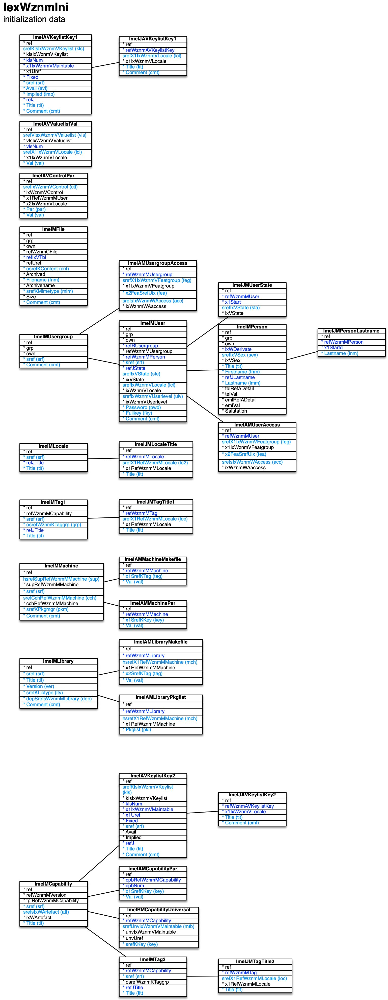

[back](../sbemdl.md)

Initialization data ``IexWznmIni``
===

Schema
---

<em>Figure 1: Initialization data schema - table columns in light blue are part of the input file, table columns in dark blue are inferred</em>

Structure
---

[//]: # (IP structure - BEGIN)

&nbsp;&nbsp;&nbsp;&nbsp;\- Parameters [``[ImeIAVControlPar]``](#1-parameters-imeiavcontrolpar)
 &nbsp;&nbsp;&nbsp;&nbsp;\+ Keys [``[ImeIAVKeylistKey1]``](#2-keys-imeiavkeylistkey1)
 &nbsp;&nbsp;&nbsp;&nbsp;&nbsp;&nbsp;&nbsp;&nbsp;\- Name and comment by locale [``[ImeIJAVKeylistKey1]``](#21-name-and-comment-by-locale-imeijavkeylistkey1)
 &nbsp;&nbsp;&nbsp;&nbsp;\- Values [``[ImeIAVValuelistVal]``](#3-values-imeiavvaluelistval)
 &nbsp;&nbsp;&nbsp;&nbsp;\+ Capability [``[ImeIMCapability]``](#4-capability-imeimcapability)
 &nbsp;&nbsp;&nbsp;&nbsp;&nbsp;&nbsp;&nbsp;&nbsp;\- Parameters [``[ImeIAMCapabilityPar]``](#41-parameters-imeiamcapabilitypar)
 &nbsp;&nbsp;&nbsp;&nbsp;&nbsp;&nbsp;&nbsp;&nbsp;\+ Keys [``[ImeIAVKeylistKey2]``](#42-keys-imeiavkeylistkey2)
 &nbsp;&nbsp;&nbsp;&nbsp;&nbsp;&nbsp;&nbsp;&nbsp;&nbsp;&nbsp;&nbsp;&nbsp;\- Name and comment by locale [``[ImeIJAVKeylistKey2]``](#421-name-and-comment-by-locale-imeijavkeylistkey2)
 &nbsp;&nbsp;&nbsp;&nbsp;&nbsp;&nbsp;&nbsp;&nbsp;\+ Tag [``[ImeIMTag2]``](#43-tag-imeimtag2)
 &nbsp;&nbsp;&nbsp;&nbsp;&nbsp;&nbsp;&nbsp;&nbsp;&nbsp;&nbsp;&nbsp;&nbsp;\- Text by locale [``[ImeIJMTagTitle2]``](#431-text-by-locale-imeijmtagtitle2)
 &nbsp;&nbsp;&nbsp;&nbsp;&nbsp;&nbsp;&nbsp;&nbsp;\- Concerned elements [``[ImeIRMCapabilityUniversal]``](#44-concerned-elements-imeirmcapabilityuniversal)
 &nbsp;&nbsp;&nbsp;&nbsp;\- File [``[ImeIMFile]``](#5-file-imeimfile)
 &nbsp;&nbsp;&nbsp;&nbsp;\+ Library [``[ImeIMLibrary]``](#6-library-imeimlibrary)
 &nbsp;&nbsp;&nbsp;&nbsp;&nbsp;&nbsp;&nbsp;&nbsp;\- Makefile entries [``[ImeIAMLibraryMakefile]``](#61-makefile-entries-imeiamlibrarymakefile)
 &nbsp;&nbsp;&nbsp;&nbsp;&nbsp;&nbsp;&nbsp;&nbsp;\- Package lists [``[ImeIAMLibraryPkglist]``](#62-package-lists-imeiamlibrarypkglist)
 &nbsp;&nbsp;&nbsp;&nbsp;\+ Locale [``[ImeIMLocale]``](#7-locale-imeimlocale)
 &nbsp;&nbsp;&nbsp;&nbsp;&nbsp;&nbsp;&nbsp;&nbsp;\- Name by locale [``[ImeIJMLocaleTitle]``](#71-name-by-locale-imeijmlocaletitle)
 &nbsp;&nbsp;&nbsp;&nbsp;\+ Machine [``[ImeIMMachine]``](#8-machine-imeimmachine)
 &nbsp;&nbsp;&nbsp;&nbsp;&nbsp;&nbsp;&nbsp;&nbsp;\- Makefile entries [``[ImeIAMMachineMakefile]``](#81-makefile-entries-imeiammachinemakefile)
 &nbsp;&nbsp;&nbsp;&nbsp;&nbsp;&nbsp;&nbsp;&nbsp;\- Parameters [``[ImeIAMMachinePar]``](#82-parameters-imeiammachinepar)
 &nbsp;&nbsp;&nbsp;&nbsp;\+ Tag [``[ImeIMTag1]``](#9-tag-imeimtag1)
 &nbsp;&nbsp;&nbsp;&nbsp;&nbsp;&nbsp;&nbsp;&nbsp;\- Text by locale [``[ImeIJMTagTitle1]``](#91-text-by-locale-imeijmtagtitle1)
 &nbsp;&nbsp;&nbsp;&nbsp;\+ User group [``[ImeIMUsergroup]``](#10-user-group-imeimusergroup)
 &nbsp;&nbsp;&nbsp;&nbsp;&nbsp;&nbsp;&nbsp;&nbsp;\- Feature access rights [``[ImeIAMUsergroupAccess]``](#101-feature-access-rights-imeiamusergroupaccess)
 &nbsp;&nbsp;&nbsp;&nbsp;&nbsp;&nbsp;&nbsp;&nbsp;\+ User [``[ImeIMUser]``](#102-user-imeimuser)
 &nbsp;&nbsp;&nbsp;&nbsp;&nbsp;&nbsp;&nbsp;&nbsp;&nbsp;&nbsp;&nbsp;&nbsp;\- Feature access rights [``[ImeIAMUserAccess]``](#1021-feature-access-rights-imeiamuseraccess)
 &nbsp;&nbsp;&nbsp;&nbsp;&nbsp;&nbsp;&nbsp;&nbsp;&nbsp;&nbsp;&nbsp;&nbsp;\- State history [``[ImeIJMUserState]``](#1022-state-history-imeijmuserstate)
 &nbsp;&nbsp;&nbsp;&nbsp;&nbsp;&nbsp;&nbsp;&nbsp;&nbsp;&nbsp;&nbsp;&nbsp;\+ Person [``[ImeIMPerson]``](#1023-person-imeimperson)
 &nbsp;&nbsp;&nbsp;&nbsp;&nbsp;&nbsp;&nbsp;&nbsp;&nbsp;&nbsp;&nbsp;&nbsp;&nbsp;&nbsp;&nbsp;&nbsp;\- Last name history [``[ImeIJMPersonLastname]``](#10231-last-name-history-imeijmpersonlastname)

[//]: # (IP structure - END)

Details
---

### 1 Parameters ``[ImeIAVControlPar]``

[//]: # (IP ImeIAVControlPar.superUse - BEGIN)

Use: manual customization e.g. of UI table column widths. Typically trained in a dedicated user session.

[//]: # (IP ImeIAVControlPar.superUse - END)

[//]: # (IP ImeIAVControlPar.columns - BEGIN)

Column|Content|
-|-|
srefIxWznmVControl (string)|control PnlWznmUsgList.TcoGrp ... PnlWznmSteATrig.TcoCnd|
Par (string)|parameter|
Val (string)|value|

[//]: # (IP ImeIAVControlPar.columns - END)

### 2 Keys ``[ImeIAVKeylistKey1]``

[//]: # (IP ImeIAVKeylistKey1.superUse - BEGIN)

Use: populate non-record specific key lists.

[//]: # (IP ImeIAVKeylistKey1.superUse - END)

[//]: # (IP ImeIAVKeylistKey1.columns - BEGIN)

Column|Content|
-|-|
srefKlsIxWznmVKeylist (string)|key list KlstWznmKAMCapabilityParKey: key KlstWznmKAMControlParKey: key KlstWznmKAMControlParVal: value KlstWznmKAMLibraryMakefileTag: tag KlstWznmKAMMachineMakefileTag: tag KlstWznmKAMMachineParKey: key KlstWznmKAMPersonDetailType: type KlstWznmKMControlOption: options KlstWznmKMFileContent: content KlstWznmKMFileMimetype: MIME type KlstWznmKMLibraryLictype: license type KlstWznmKMMachinePkgmgr: package manager KlstWznmKMRelationOption: options KlstWznmKMReleaseOption: options KlstWznmKMTablecolOption: options KlstWznmKMVectorOption: options KlstWznmKRMCapabilityUniversalKey: key KlstWznmKRMPersonMProjectFunction: function KlstWznmKTaggrp: tag group KlstKWznmCtpGenjtrCustop: WznmCtpGenjtr custom operations KlstKWznmCtpGenuiCustop: WznmCtpGenui custom operations KlstKWznmCtpWrsrvCustop: WznmCtpWrsrv custom operations KlstKWznmCtpWrstkitCustop: WznmCtpWrstkit custom operations KlstKWznmCtpWrwebCustop: WznmCtpWrweb custom operations|
sref (string)|identifier|
Avail (string)|availability rule|
Implied (string)|rule for implied|
Title (string)|name|
Comment (string)|comment|

[//]: # (IP ImeIAVKeylistKey1.columns - END)

### 2.1 Name and comment by locale ``[ImeIJAVKeylistKey1]``

[//]: # (IP ImeIJAVKeylistKey1.superUse - BEGIN)

Super import: keys (1:N)

Use: self-explanatory.

[//]: # (IP ImeIJAVKeylistKey1.superUse - END)

[//]: # (IP ImeIJAVKeylistKey1.columns - BEGIN)

Column|Content|
-|-|
srefX1IxWznmVLocale (string)|locale enus: English (United States)|
Title (string)|Title|
Comment (string)|Comment|

[//]: # (IP ImeIJAVKeylistKey1.columns - END)

### 3 Values ``[ImeIAVValuelistVal]``

[//]: # (IP ImeIAVValuelistVal.superUse - BEGIN)

Use: populate value lists.

[//]: # (IP ImeIAVValuelistVal.superUse - END)

[//]: # (IP ImeIAVValuelistVal.columns - BEGIN)

Column|Content|
-|-|
srefVlsIxWznmVValuelist (string)|value list VlstWznmUMPersonTitle: title|
srefX1IxWznmVLocale (string)|locale enus: English (United States)|
Val (string)|value|

[//]: # (IP ImeIAVValuelistVal.columns - END)

### 4 Capability ``[ImeIMCapability]``

[//]: # (IP ImeIMCapability.superUse - BEGIN)

Use: specify capability templates.

[//]: # (IP ImeIMCapability.superUse - END)

[//]: # (IP ImeIMCapability.columns - BEGIN)

Column|Content|
-|-|
sref (string)|identifier|
srefsIxWArtefact (string)|artefact dbs: database structure bui: basic user interface structure iex: import/export structure srvgblcode: server global code srvjobcode: server job code webgblcode: web UI global code webjobcode: web UI job code|
Title (string)|name|

[//]: # (IP ImeIMCapability.columns - END)

### 4.1 Parameters ``[ImeIAMCapabilityPar]``

[//]: # (IP ImeIAMCapabilityPar.superUse - BEGIN)

Super import: capability (1:N)

Use: specify customization parameter default values.

[//]: # (IP ImeIAMCapabilityPar.superUse - END)

[//]: # (IP ImeIAMCapabilityPar.columns - BEGIN)

Column|Content|
-|-|
x1SrefKKey (string)|key|
Val (string)|value|

[//]: # (IP ImeIAMCapabilityPar.columns - END)

### 4.2 Keys ``[ImeIAVKeylistKey2]``

[//]: # (IP ImeIAVKeylistKey2.superUse - BEGIN)

Super import: capability (1:N)

Use: specify customization parameter keys.

[//]: # (IP ImeIAVKeylistKey2.superUse - END)

[//]: # (IP ImeIAVKeylistKey2.columns - BEGIN)

Column|Content|
-|-|
srefKlsIxWznmVKeylist (string)|key list KlstWznmKAMCapabilityParKey: key|
sref (string)|identifier|
Title (string)|name|
Comment (string)|comment|

[//]: # (IP ImeIAVKeylistKey2.columns - END)

### 4.2.1 Name and comment by locale ``[ImeIJAVKeylistKey2]``

[//]: # (IP ImeIJAVKeylistKey2.superUse - BEGIN)

Super import: keys (1:N)

Use: self-explanatory.

[//]: # (IP ImeIJAVKeylistKey2.superUse - END)

[//]: # (IP ImeIJAVKeylistKey2.columns - BEGIN)

Column|Content|
-|-|
srefX1IxWznmVLocale (string)|locale enus: English (United States)|
Title (string)|name|
Comment (string)|comment|

[//]: # (IP ImeIJAVKeylistKey2.columns - END)

### 4.3 Tag ``[ImeIMTag2]``

[//]: # (IP ImeIMTag2.superUse - BEGIN)

Super import: capability (1:N)

Use: specify capability-related (optional multi-locale) tags.

[//]: # (IP ImeIMTag2.superUse - END)

[//]: # (IP ImeIMTag2.columns - BEGIN)

Column|Content|
-|-|
sref (string)|identifier|
Title (string)|text|

[//]: # (IP ImeIMTag2.columns - END)

### 4.3.1 Text by locale ``[ImeIJMTagTitle2]``

[//]: # (IP ImeIJMTagTitle2.superUse - BEGIN)

Super import: tag (1:N)

Use: self-explanatory.

[//]: # (IP ImeIJMTagTitle2.superUse - END)

[//]: # (IP ImeIJMTagTitle2.columns - BEGIN)

Column|Content|
-|-|
srefX1RefWznmMLocale (string)|locale|
Title (string)|text|

[//]: # (IP ImeIJMTagTitle2.columns - END)

### 4.4 Concerned elements ``[ImeIRMCapabilityUniversal]``

[//]: # (IP ImeIRMCapabilityUniversal.superUse - BEGIN)

Super import: capability (1:N)

Use: define expected elements to relate to in instantiations.

[//]: # (IP ImeIRMCapabilityUniversal.superUse - END)

[//]: # (IP ImeIRMCapabilityUniversal.columns - BEGIN)

Column|Content|
-|-|
srefUnvIxWznmVMaintable (string)|main table TblWznmMBlock: block TblWznmMCard: card TblWznmMCheck: feature check TblWznmMImpexp: import/export TblWznmMImpexpcol: import/export column TblWznmMImpexpcplx: import/export complex TblWznmMJob: job TblWznmMModule: module TblWznmMPreset: presetting TblWznmMRelation: relation TblWznmMSquawk: squawk TblWznmMStub: stub TblWznmMSubset: subset TblWznmMTable: table TblWznmMTablecol: table column|
srefKKey (string)|key|

[//]: # (IP ImeIRMCapabilityUniversal.columns - END)

### 5 File ``[ImeIMFile]``

[//]: # (IP ImeIMFile.superUse - BEGIN)

Use: specify file meta-data for the files to be uploaded in the subsequent initialization step.

[//]: # (IP ImeIMFile.superUse - END)

[//]: # (IP ImeIMFile.columns - BEGIN)

Column|Content|
-|-|
osrefKContent (string)|content appstr: accessor app structure data cftpl: code file template custip: custom insertion points lic: license mod: model data|
Filename (string)|file name|
srefKMimetype (string)|MIME type bmp: image/bmp ... zip: application/zip|
Comment (string)|comment|

[//]: # (IP ImeIMFile.columns - END)

### 6 Library ``[ImeIMLibrary]``

[//]: # (IP ImeIMLibrary.superUse - BEGIN)

Use: for Makefile generation, specify libraries and their dependencies.

[//]: # (IP ImeIMLibrary.superUse - END)

[//]: # (IP ImeIMLibrary.columns - BEGIN)

Column|Content|
-|-|
sref (string)|identifier|
Title (string)|name|
Version (string)|version|
srefKLictype (string)|license type apch2: Apache 2.0 bsd2: BSD 2-clause bsd3: BSD 3-clause gpl: GNU general public lgpl: GNU lesser general public mit: MIT zlib: zlib/libpng|
depSrefsWznmMLibrary (string)|library|
Comment (string)|comment|

[//]: # (IP ImeIMLibrary.columns - END)

### 6.1 Makefile entries ``[ImeIAMLibraryMakefile]``

[//]: # (IP ImeIAMLibraryMakefile.superUse - BEGIN)

Super import: library (1:N)

Use: specify library-specific Makefile entries.

[//]: # (IP ImeIAMLibraryMakefile.superUse - END)

[//]: # (IP ImeIAMLibraryMakefile.columns - BEGIN)

Column|Content|
-|-|
hsrefX1RefWznmMMachine (string)|machine|
x2SrefKTag (string)|tag incpath: include path libpath: library path libs: link libraries|
Val (string)|value|

[//]: # (IP ImeIAMLibraryMakefile.columns - END)

### 6.2 Package lists ``[ImeIAMLibraryPkglist]``

[//]: # (IP ImeIAMLibraryPkglist.superUse - BEGIN)

Super import: library (1:N)

Use: specify package manager bundles required for library.

[//]: # (IP ImeIAMLibraryPkglist.superUse - END)

[//]: # (IP ImeIAMLibraryPkglist.columns - BEGIN)

Column|Content|
-|-|
hsrefX1RefWznmMMachine (string)|machine|
Pkglist (string)|package list|

[//]: # (IP ImeIAMLibraryPkglist.columns - END)

### 7 Locale ``[ImeIMLocale]``

[//]: # (IP ImeIMLocale.superUse - BEGIN)

Use: define locales.

[//]: # (IP ImeIMLocale.superUse - END)

[//]: # (IP ImeIMLocale.columns - BEGIN)

Column|Content|
-|-|
sref (string)|identifier|
Title (string)|name|

[//]: # (IP ImeIMLocale.columns - END)

### 7.1 Name by locale ``[ImeIJMLocaleTitle]``

[//]: # (IP ImeIJMLocaleTitle.superUse - BEGIN)

Super import: locale (1:N)

Use: self-explanatory.

[//]: # (IP ImeIJMLocaleTitle.superUse - END)

[//]: # (IP ImeIJMLocaleTitle.columns - BEGIN)

Column|Content|
-|-|
srefX1RefWznmMLocale (string)|locale|
Title (string)|name|

[//]: # (IP ImeIJMLocaleTitle.columns - END)

### 8 Machine ``[ImeIMMachine]``

[//]: # (IP ImeIMMachine.superUse - BEGIN)

Use: define (cross-)compilation and deploy targets with hierarchical attribute inheritance.

[//]: # (IP ImeIMMachine.superUse - END)

[//]: # (IP ImeIMMachine.columns - BEGIN)

Column|Content|
-|-|
hsrefSupRefWznmMMachine (string)|base machine|
sref (string)|identifier|
hsrefCchRefWznmMMachine (string)|cross-compile host|
srefKPkgmgr (string)|package manager apt: advanced package manager bb: BitBake brew: Homebrew yum: yum|
Comment (string)|comment|

[//]: # (IP ImeIMMachine.columns - END)

### 8.1 Makefile entries ``[ImeIAMMachineMakefile]``

[//]: # (IP ImeIAMMachineMakefile.superUse - BEGIN)

Super import: machine (1:N)

Use: specify machine-specific Makefile entries.

[//]: # (IP ImeIAMMachineMakefile.superUse - END)

[//]: # (IP ImeIAMMachineMakefile.columns - BEGIN)

Column|Content|
-|-|
x1SrefKTag (string)|tag cpp: C++ compiler cppflags: C++ compiler flags statlib: static library tool statlibflags: static library tool flags dynlib: dynamic link library tool dynlibflags: dynamic link library tool flags dynlibext: dynamic link library file extension link: linker linkflags: linker flags incpath: include path libpath: library path libs: link libraries|
Val (string)|value|

[//]: # (IP ImeIAMMachineMakefile.columns - END)

### 8.2 Parameters ``[ImeIAMMachinePar]``

[//]: # (IP ImeIAMMachinePar.superUse - BEGIN)

Super import: machine (1:N)

Use: specify machine-specific parameters, mostly paths.

[//]: # (IP ImeIAMMachinePar.superUse - END)

[//]: # (IP ImeIAMMachinePar.columns - BEGIN)

Column|Content|
-|-|
x1SrefKKey (string)|key whizroot: runtime root directory acvroot: archive root directory binroot: binary root directory monroot: monitoring root directory tmproot: temporary data root directory webroot: web server root directory opengsrvport: default operation engine server port engsrvportbase: default enginer server port base appsrvport: default application server port dbsip: database IP address dbsusername: database user name dbspassword: database password marport: MariaDB server port myport: MySQL server port pgport: PostgreSQL server port whizsdkroot: SDK root directory ncore: number of cores, also for runtime sbeconfig: WhizniumSBE core library configuration buildroot: build root directory libroot: library root directory nddshome: DDS home directory sysroot: root file system path tchroot: tool chain executable directory uasdkroot: OPC UA SDK root directory whizdevroot: development root directory reproot: repository root directory fpgaroot: FPGA root directory javaroot: Java root directory mcuroot: MCU root directory|
Val (string)|value|

[//]: # (IP ImeIAMMachinePar.columns - END)

### 9 Tag ``[ImeIMTag1]``

[//]: # (IP ImeIMTag1.superUse - BEGIN)

Use: specify locale-specific tags used across UI and other code generation.

[//]: # (IP ImeIMTag1.superUse - END)

[//]: # (IP ImeIMTag1.columns - BEGIN)

Column|Content|
-|-|
sref (string)|identifier|
osrefWznmKTaggrp (string)|group access: VecXxxxWAccess item adrtype: address type ctdet: contact detail ctry: country error: VecXxxxVError item expstate: VecXxxxVExpstate item iexsge: import/export complex job stage iop: VecXxxxVIop item lat: VecXxxxVLat item lop: VecXxxxVLop item mimetype: MIME type no: no thing none: none oolop: VecXxxxVOolop item prs: default person prstit: person title qrystate: VecXxxxVQrystate item recaccess: VecXxxxVRecaccess item reqitmode: VecXxxxVReqitmode item sex: sex start: login card stdalr: standard alert message stdiex: standard import/export complex title stdrel: standard relation title stdtbl: standard table title stdtco: standard table column title stdvec: standard vector title userlevel: VecXxxxVUserlevel item usrste: user state wkday: weekday|
Title (string)|text|

[//]: # (IP ImeIMTag1.columns - END)

### 9.1 Text by locale ``[ImeIJMTagTitle1]``

[//]: # (IP ImeIJMTagTitle1.superUse - BEGIN)

Super import: tag (1:N)

Use: self-explanatory.

[//]: # (IP ImeIJMTagTitle1.superUse - END)

[//]: # (IP ImeIJMTagTitle1.columns - BEGIN)

Column|Content|
-|-|
srefX1RefWznmMLocale (string)|locale|
Title (string)|Title|

[//]: # (IP ImeIJMTagTitle1.columns - END)

### 10 User group ``[ImeIMUsergroup]``

[//]: # (IP ImeIMUsergroup.superUse - BEGIN)

Use: self-explanatory.

[//]: # (IP ImeIMUsergroup.superUse - END)

[//]: # (IP ImeIMUsergroup.columns - BEGIN)

Column|Content|
-|-|
sref (string)|identifier|
Comment (string)|comment|

[//]: # (IP ImeIMUsergroup.columns - END)

### 10.1 Feature access rights ``[ImeIAMUsergroupAccess]``

[//]: # (IP ImeIAMUsergroupAccess.superUse - BEGIN)

Super import: user group (1:N)

Use: define access rights to individual parts of the WhizniumSBE UI.

[//]: # (IP ImeIAMUsergroupAccess.superUse - END)

[//]: # (IP ImeIAMUsergroupAccess.columns - BEGIN)

Column|Content|
-|-|
srefX1IxWznmVFeatgroup (string)|feature group VecWznmVCard: card|
x2FeaSrefUix (string)|feature|
srefsIxWznmWAccess (string)|feature access rights edit: edit exec: execute view: view|

[//]: # (IP ImeIAMUsergroupAccess.columns - END)

### 10.2 User ``[ImeIMUser]``

[//]: # (IP ImeIMUser.superUse - BEGIN)

Super import: user group (1:N)

Use: specify users with login and password.

[//]: # (IP ImeIMUser.superUse - END)

[//]: # (IP ImeIMUser.columns - BEGIN)

Column|Content|
-|-|
sref (string)|login|
srefIxVState (string)|state act: active dsg: designated due: due for expiration exp: expired|
srefIxWznmVLocale (string)|locale enus: English (United States)|
srefIxWznmVUserlevel (string)|user level adm: administrator gadm: user group administrator reg: regular user vtor: visitor|
Password (string)|password|
Fullkey (string)|full key (X.509)|
Comment (string)|comment|

[//]: # (IP ImeIMUser.columns - END)

### 10.2.1 Feature access rights ``[ImeIAMUserAccess]``

[//]: # (IP ImeIAMUserAccess.superUse - BEGIN)

Super import: user (1:N)

Use: define WhizniumSBE UI access rights, potentially overriding those of the user's user group.

[//]: # (IP ImeIAMUserAccess.superUse - END)

[//]: # (IP ImeIAMUserAccess.columns - BEGIN)

Column|Content|
-|-|
srefX1IxWznmVFeatgroup (string)|feature group VecWznmVCard: card|
x2FeaSrefUix (string)|feature|
srefsIxWznmWAccess (string)|feature access rights edit: edit exec: execute view: view|

[//]: # (IP ImeIAMUserAccess.columns - END)

### 10.2.2 State history ``[ImeIJMUserState]``

[//]: # (IP ImeIJMUserState.superUse - BEGIN)

Super import: user (1:N)

Use: manage time-dependency of user access permission.

[//]: # (IP ImeIJMUserState.superUse - END)

[//]: # (IP ImeIJMUserState.columns - BEGIN)

Column|Content|
-|-|
srefIxVState (string)|state act: active dsg: designated due: due for expiration exp: expired|

[//]: # (IP ImeIJMUserState.columns - END)

### 10.2.3 Person ``[ImeIMPerson]``

[//]: # (IP ImeIMPerson.superUse - BEGIN)

Super import: user (1:N)

Use: exclusively used as 1:1 with user. Provide user clear name information.

[//]: # (IP ImeIMPerson.superUse - END)

[//]: # (IP ImeIMPerson.columns - BEGIN)

Column|Content|
-|-|
srefIxVSex (string)|sex f: female m: male|
Title (string)|title dr: Dr. drlong: Doctor fam: Fam. famlong: Family mr: Mr. mrlong: Mister mrs: Mrs. mrslong: Mistress ms: Ms. mslong: Miss prof: Prof. proflong: Professor|
Firstname (string)|first name|
Lastname (string)|last name|

[//]: # (IP ImeIMPerson.columns - END)

### 10.2.3.1 Last name history ``[ImeIJMPersonLastname]``

[//]: # (IP ImeIJMPersonLastname.superUse - BEGIN)

Super import: person (1:N)

Use: allow a person's last name to change with time.

[//]: # (IP ImeIJMPersonLastname.superUse - END)

[//]: # (IP ImeIJMPersonLastname.columns - BEGIN)

Column|Content|
-|-|
Lastname (string)|last name|

[//]: # (IP ImeIJMPersonLastname.columns - END)

<small>Markdown for WhizniumSBE v1.1.3 auto-generated (what else ;-) ) by WhizniumSBE on 1 Jan 2021</small>
