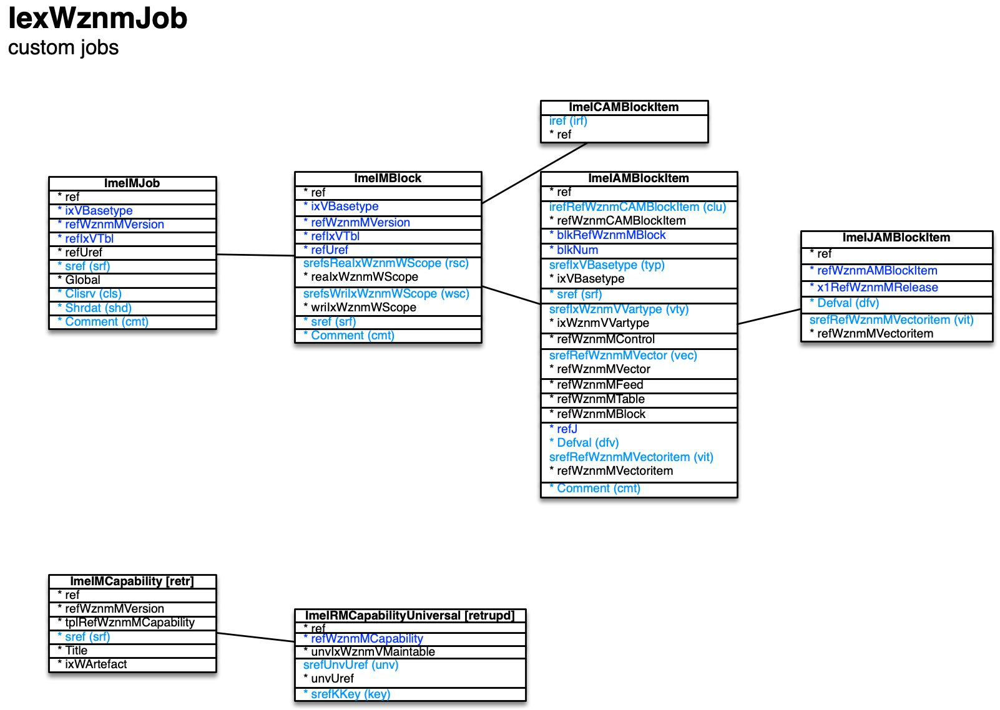

[back](../sbemdl.md)

Custom jobs ``IexWznmJob``
===

Schema
---

<em>Figure 1: Custom jobs schema - table columns in light blue are part of the input file, table columns in dark blue are inferred</em>

Structure
---

[//]: # (IP structure - BEGIN)

&nbsp;&nbsp;&nbsp;&nbsp;\+ Capability [``[ImeIMCapability]``](#1-capability-imeimcapability)
 &nbsp;&nbsp;&nbsp;&nbsp;&nbsp;&nbsp;&nbsp;&nbsp;\- Concerned elements [``[ImeIRMCapabilityUniversal]``](#11-concerned-elements-imeirmcapabilityuniversal)
 &nbsp;&nbsp;&nbsp;&nbsp;\+ Job [``[ImeIMJob]``](#2-job-imeimjob)
 &nbsp;&nbsp;&nbsp;&nbsp;&nbsp;&nbsp;&nbsp;&nbsp;\+ Block [``[ImeIMBlock]``](#21-block-imeimblock)
 &nbsp;&nbsp;&nbsp;&nbsp;&nbsp;&nbsp;&nbsp;&nbsp;&nbsp;&nbsp;&nbsp;&nbsp;\+ Items [``[ImeIAMBlockItem]``](#211-items-imeiamblockitem)
 &nbsp;&nbsp;&nbsp;&nbsp;&nbsp;&nbsp;&nbsp;&nbsp;&nbsp;&nbsp;&nbsp;&nbsp;&nbsp;&nbsp;&nbsp;&nbsp;\- Default value by release [``[ImeIJAMBlockItem]``](#2111-default-value-by-release-imeijamblockitem)
 &nbsp;&nbsp;&nbsp;&nbsp;&nbsp;&nbsp;&nbsp;&nbsp;&nbsp;&nbsp;&nbsp;&nbsp;\- Items cluster [``[ImeICAMBlockItem]``](#212-items-cluster-imeicamblockitem)

[//]: # (IP structure - END)

Details
---

### 1 Capability ``[ImeIMCapability]``

[//]: # (IP ImeIMCapability.superUse - BEGIN)

Use: retrieve capabilities specified in global features.

[//]: # (IP ImeIMCapability.superUse - END)

[//]: # (IP ImeIMCapability.columns - BEGIN)

Column|Content|
-|-|
sref (string)|identifier|

[//]: # (IP ImeIMCapability.columns - END)

### 1.1 Concerned elements ``[ImeIRMCapabilityUniversal]``

[//]: # (IP ImeIRMCapabilityUniversal.superUse - BEGIN)

Super import: capability (1:N)

Use: link capability to version elements added in the preceding import/generate steps.

[//]: # (IP ImeIRMCapabilityUniversal.superUse - END)

[//]: # (IP ImeIRMCapabilityUniversal.columns - BEGIN)

Column|Content|
-|-|
srefUnvUref (string)|identifier of element|
srefKKey (string)|key|

[//]: # (IP ImeIRMCapabilityUniversal.columns - END)

### 2 Job ``[ImeIMJob]``

[//]: # (IP ImeIMJob.superUse - BEGIN)

Use: specify custom, e.g. hardware controlling jobs, which are not related to session / UI management.

[//]: # (IP ImeIMJob.superUse - END)

[//]: # (IP ImeIMJob.columns - BEGIN)

Column|Content|
-|-|
sref (string)|identifier|
Clisrv (bool)|client/server functionality|
Shrdat (bool)|shared data|
Comment (string)|comment|

[//]: # (IP ImeIMJob.columns - END)

### 2.1 Block ``[ImeIMBlock]``

[//]: # (IP ImeIMBlock.superUse - BEGIN)

Super import: job (1:N)

Use: specify job-specific settings blocks which end up in the preferences files.

[//]: # (IP ImeIMBlock.superUse - END)

[//]: # (IP ImeIMBlock.columns - BEGIN)

Column|Content|
-|-|
srefsReaIxWznmWScope (string)|read scope app: app cmbeng: combined engine eng: main engine openg: operation engine|
srefsWriIxWznmWScope (string)|write scope app: app cmbeng: combined engine eng: main engine openg: operation engine|
sref (string)|identifier|
Comment (string)|comment|

[//]: # (IP ImeIMBlock.columns - END)

### 2.1.1 Items ``[ImeIAMBlockItem]``

[//]: # (IP ImeIAMBlockItem.superUse - BEGIN)

Super import: block (1:N)

Use: self-explanatory.

[//]: # (IP ImeIAMBlockItem.superUse - END)

[//]: # (IP ImeIAMBlockItem.columns - BEGIN)

Column|Content|
-|-|
irefRefWznmCAMBlockItem (ubigint)|integer reference to items cluster|
srefIxVBasetype (string)|type var: standard variable conpar: control parameter contit: control title feed: feed rst: record set of query table sub: sub-block|
sref (string)|identifier|
srefIxWznmVVartype (string)|variable data type void: not applicable boolean: boolean tinyint: integer / byte (8bit) utinyint: unsigned integer / byte (8bit) smallint: integer (16bit) usmallint: unsigned integer (16bit) int: integer (32bit) uint: unsigned integer (32bit) bigint: integer (64bit) ubigint: unsigned integer (64bit) float: float double: double string: string booleanvec: boolean vector utinyintvec: unsigned int / byte 8bit vector usmallintvec: unsigned int 16bit vector intvec: integer 32bit vector uintvec: unsigned int 32bit vector ubigintvec: unsigned int 64bit vector floatvec: float vector doublevec: double vector floatmat: float matrix doublemat: double matrix stringvec: string vector vecsref: vector entry string reference scrref: scrambled reference|
srefRefWznmMVector (string)|vecsref variable data type - vector|
Defval (string)|var type - default value|
srefRefWznmMVectoritem (string)|vecsref variable data type - default vector item|
Comment (string)|comment|

[//]: # (IP ImeIAMBlockItem.columns - END)

### 2.1.1.1 Default value by release ``[ImeIJAMBlockItem]``

[//]: # (IP ImeIJAMBlockItem.superUse - BEGIN)

Super import: items (1:N)

Use: customize default for specific releases.

[//]: # (IP ImeIJAMBlockItem.superUse - END)

[//]: # (IP ImeIJAMBlockItem.columns - BEGIN)

Column|Content|
-|-|
Defval (string)|default value|
srefRefWznmMVectoritem (string)|default vector item|

[//]: # (IP ImeIJAMBlockItem.columns - END)

### 2.1.2 Items cluster ``[ImeICAMBlockItem]``

[//]: # (IP ImeICAMBlockItem.superUse - BEGIN)

Super import: block (1:N)

Use: group items.

[//]: # (IP ImeICAMBlockItem.superUse - END)

[//]: # (IP ImeICAMBlockItem.columns - BEGIN)

Column|Content|
-|-|
iref (ubigint)|integer reference|

[//]: # (IP ImeICAMBlockItem.columns - END)

<small>Markdown for WhizniumSBE v1.1.3 auto-generated (what else ;-) ) by WhizniumSBE on 1 Jan 2021</small>
