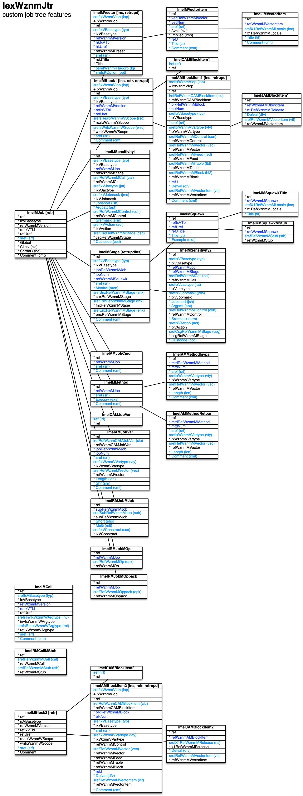

[back](../sbemdl.md)

Custom job tree features ``IexWznmJtr``
===

Schema
---

<em>Figure 1: Custom job tree features schema - table columns in light blue are part of the input file, table columns in dark blue are inferred</em>

Structure
---

[//]: # (IP structure - BEGIN)

&nbsp;&nbsp;&nbsp;&nbsp;\+ Block [``[ImeIMBlock2]``](#1-block-imeimblock2)
 &nbsp;&nbsp;&nbsp;&nbsp;&nbsp;&nbsp;&nbsp;&nbsp;\+ Items [``[ImeIAMBlockItem2]``](#11-items-imeiamblockitem2)
 &nbsp;&nbsp;&nbsp;&nbsp;&nbsp;&nbsp;&nbsp;&nbsp;&nbsp;&nbsp;&nbsp;&nbsp;\- Default value by release [``[ImeIJAMBlockItem2]``](#111-default-value-by-release-imeijamblockitem2)
 &nbsp;&nbsp;&nbsp;&nbsp;&nbsp;&nbsp;&nbsp;&nbsp;\- Items cluster [``[ImeICAMBlockItem2]``](#12-items-cluster-imeicamblockitem2)
 &nbsp;&nbsp;&nbsp;&nbsp;\- Call [``[ImeIMCall]``](#2-call-imeimcall)
 &nbsp;&nbsp;&nbsp;&nbsp;\+ Job [``[ImeIMJob]``](#3-job-imeimjob)
 &nbsp;&nbsp;&nbsp;&nbsp;&nbsp;&nbsp;&nbsp;&nbsp;\- Commands [``[ImeIAMJobCmd]``](#31-commands-imeiamjobcmd)
 &nbsp;&nbsp;&nbsp;&nbsp;&nbsp;&nbsp;&nbsp;&nbsp;\- Variables [``[ImeIAMJobVar]``](#32-variables-imeiamjobvar)
 &nbsp;&nbsp;&nbsp;&nbsp;&nbsp;&nbsp;&nbsp;&nbsp;\- Variables cluster [``[ImeICAMJobVar]``](#33-variables-cluster-imeicamjobvar)
 &nbsp;&nbsp;&nbsp;&nbsp;&nbsp;&nbsp;&nbsp;&nbsp;\+ Block [``[ImeIMBlock1]``](#34-block-imeimblock1)
 &nbsp;&nbsp;&nbsp;&nbsp;&nbsp;&nbsp;&nbsp;&nbsp;&nbsp;&nbsp;&nbsp;&nbsp;\+ Items [``[ImeIAMBlockItem1]``](#341-items-imeiamblockitem1)
 &nbsp;&nbsp;&nbsp;&nbsp;&nbsp;&nbsp;&nbsp;&nbsp;&nbsp;&nbsp;&nbsp;&nbsp;&nbsp;&nbsp;&nbsp;&nbsp;\- Default value by release [``[ImeIJAMBlockItem1]``](#3411-default-value-by-release-imeijamblockitem1)
 &nbsp;&nbsp;&nbsp;&nbsp;&nbsp;&nbsp;&nbsp;&nbsp;&nbsp;&nbsp;&nbsp;&nbsp;\- Items cluster [``[ImeICAMBlockItem1]``](#342-items-cluster-imeicamblockitem1)
 &nbsp;&nbsp;&nbsp;&nbsp;&nbsp;&nbsp;&nbsp;&nbsp;\+ Method [``[ImeIMMethod]``](#35-method-imeimmethod)
 &nbsp;&nbsp;&nbsp;&nbsp;&nbsp;&nbsp;&nbsp;&nbsp;&nbsp;&nbsp;&nbsp;&nbsp;\- Invocation parameters [``[ImeIAMMethodInvpar]``](#351-invocation-parameters-imeiammethodinvpar)
 &nbsp;&nbsp;&nbsp;&nbsp;&nbsp;&nbsp;&nbsp;&nbsp;&nbsp;&nbsp;&nbsp;&nbsp;\- Return parameters [``[ImeIAMMethodRetpar]``](#352-return-parameters-imeiammethodretpar)
 &nbsp;&nbsp;&nbsp;&nbsp;&nbsp;&nbsp;&nbsp;&nbsp;\- Sensitivity [``[ImeIMSensitivity1]``](#36-sensitivity-imeimsensitivity1)
 &nbsp;&nbsp;&nbsp;&nbsp;&nbsp;&nbsp;&nbsp;&nbsp;\+ Stage [``[ImeIMStage]``](#37-stage-imeimstage)
 &nbsp;&nbsp;&nbsp;&nbsp;&nbsp;&nbsp;&nbsp;&nbsp;&nbsp;&nbsp;&nbsp;&nbsp;\- Sensitivity [``[ImeIMSensitivity2]``](#371-sensitivity-imeimsensitivity2)
 &nbsp;&nbsp;&nbsp;&nbsp;&nbsp;&nbsp;&nbsp;&nbsp;&nbsp;&nbsp;&nbsp;&nbsp;\+ Squawk [``[ImeIMSquawk]``](#372-squawk-imeimsquawk)
 &nbsp;&nbsp;&nbsp;&nbsp;&nbsp;&nbsp;&nbsp;&nbsp;&nbsp;&nbsp;&nbsp;&nbsp;&nbsp;&nbsp;&nbsp;&nbsp;\- Text by locale [``[ImeIJMSquawkTitle]``](#3721-text-by-locale-imeijmsquawktitle)
 &nbsp;&nbsp;&nbsp;&nbsp;&nbsp;&nbsp;&nbsp;&nbsp;&nbsp;&nbsp;&nbsp;&nbsp;&nbsp;&nbsp;&nbsp;&nbsp;\- Stubs [``[ImeIRMSquawkMStub]``](#3722-stubs-imeirmsquawkmstub)
 &nbsp;&nbsp;&nbsp;&nbsp;&nbsp;&nbsp;&nbsp;&nbsp;\+ Vector [``[ImeIMVector]``](#38-vector-imeimvector)
 &nbsp;&nbsp;&nbsp;&nbsp;&nbsp;&nbsp;&nbsp;&nbsp;&nbsp;&nbsp;&nbsp;&nbsp;\+ Vector item [``[ImeIMVectoritem]``](#381-vector-item-imeimvectoritem)
 &nbsp;&nbsp;&nbsp;&nbsp;&nbsp;&nbsp;&nbsp;&nbsp;&nbsp;&nbsp;&nbsp;&nbsp;&nbsp;&nbsp;&nbsp;&nbsp;\- Name and comment by locale [``[ImeIJMVectoritem]``](#3811-name-and-comment-by-locale-imeijmvectoritem)
 &nbsp;&nbsp;&nbsp;&nbsp;&nbsp;&nbsp;&nbsp;&nbsp;\- Sub-jobs [``[ImeIRMJobMJob]``](#39-sub-jobs-imeirmjobmjob)
 &nbsp;&nbsp;&nbsp;&nbsp;&nbsp;&nbsp;&nbsp;&nbsp;\- Operation invocations [``[ImeIRMJobMOp]``](#310-operation-invocations-imeirmjobmop)
 &nbsp;&nbsp;&nbsp;&nbsp;&nbsp;&nbsp;&nbsp;&nbsp;\- Operation pack invocations [``[ImeIRMJobMOppack]``](#311-operation-pack-invocations-imeirmjobmoppack)
 &nbsp;&nbsp;&nbsp;&nbsp;\- Stub call sensitivities [``[ImeIRMCallMStub]``](#4-stub-call-sensitivities-imeirmcallmstub)

[//]: # (IP structure - END)

Details
---

### 1 Block ``[ImeIMBlock2]``

[//]: # (IP ImeIMBlock2.superUse - BEGIN)

Use: retrieve previously added XML data block.

[//]: # (IP ImeIMBlock2.superUse - END)

[//]: # (IP ImeIMBlock2.columns - BEGIN)

Column|Content|
-|-|
sref (string)|identifier|

[//]: # (IP ImeIMBlock2.columns - END)

### 1.1 Items ``[ImeIAMBlockItem2]``

[//]: # (IP ImeIAMBlockItem2.superUse - BEGIN)

Super import: block (1:N)

Use: self-explanatory.

[//]: # (IP ImeIAMBlockItem2.superUse - END)

[//]: # (IP ImeIAMBlockItem2.columns - BEGIN)

Column|Content|
-|-|
srefIxWznmVIop (string)|import operation ins: insert retr: retrieve retrupd: retrieve and update|
irefRefWznmCAMBlockItem (ubigint)|integer reference to items cluster|
srefIxVBasetype (string)|type var: standard variable conpar: control parameter contit: control title feed: feed rst: record set of query table sub: sub-block|
sref (string)|identifier|
srefIxWznmVVartype (string)|variable data type void: not applicable boolean: boolean tinyint: integer / byte (8bit) utinyint: unsigned integer / byte (8bit) smallint: integer (16bit) usmallint: unsigned integer (16bit) int: integer (32bit) uint: unsigned integer (32bit) bigint: integer (64bit) ubigint: unsigned integer (64bit) float: float double: double string: string booleanvec: boolean vector utinyintvec: unsigned int / byte 8bit vector usmallintvec: unsigned int 16bit vector intvec: integer 32bit vector uintvec: unsigned int 32bit vector ubigintvec: unsigned int 64bit vector floatvec: float vector doublevec: double vector floatmat: float matrix doublemat: double matrix stringvec: string vector vecsref: vector entry string reference scrref: scrambled reference|
srefRefWznmMVector (string)|vecsref variable data type - vector|
Defval (string)|default value|
srefRefWznmMVectoritem (string)|vecsref variable data type - default vector item|
Comment (string)|comment|

[//]: # (IP ImeIAMBlockItem2.columns - END)

### 1.1.1 Default value by release ``[ImeIJAMBlockItem2]``

[//]: # (IP ImeIJAMBlockItem2.superUse - BEGIN)

Super import: items (1:N)

Use: customize default for specific releases.

[//]: # (IP ImeIJAMBlockItem2.superUse - END)

[//]: # (IP ImeIJAMBlockItem2.columns - BEGIN)

Column|Content|
-|-|
Defval (string)|default value|
srefRefWznmMVectoritem (string)|default vector item|

[//]: # (IP ImeIJAMBlockItem2.columns - END)

### 1.2 Items cluster ``[ImeICAMBlockItem2]``

[//]: # (IP ImeICAMBlockItem2.superUse - BEGIN)

Super import: block (1:N)

Use: group items.

[//]: # (IP ImeICAMBlockItem2.superUse - END)

[//]: # (IP ImeICAMBlockItem2.columns - BEGIN)

Column|Content|
-|-|
iref (ubigint)|integer reference|

[//]: # (IP ImeICAMBlockItem2.columns - END)

### 2 Call ``[ImeIMCall]``

[//]: # (IP ImeIMCall.superUse - BEGIN)

Use: self-explanatory.

[//]: # (IP ImeIMCall.superUse - END)

[//]: # (IP ImeIMCall.columns - BEGIN)

Column|Content|
-|-|
srefIxVBasetype (string)|type chk: record feature check evt: other event pstset: presetting set request recupd: record update event tblmod: table modification event other: other|
srefsInvIxWznmWArgtype (string)|invocation argument types ix: vector item index ref: record reference refs: set of record references sref: string reference intval: integer value dblval: double value boolval: boolean value txtval: text value|
srefsRetIxWznmWArgtype (string)|return argument types ix: vector item index ref: record reference refs: set of record references sref: string reference intval: integer value dblval: double value boolval: boolean value txtval: text value|
sref (string)|identifier|
Comment (string)|comment|

[//]: # (IP ImeIMCall.columns - END)

### 3 Job ``[ImeIMJob]``

[//]: # (IP ImeIMJob.superUse - BEGIN)

Use: retrieve previously added job.

[//]: # (IP ImeIMJob.superUse - END)

[//]: # (IP ImeIMJob.columns - BEGIN)

Column|Content|
-|-|
sref (string)|identifier|

[//]: # (IP ImeIMJob.columns - END)

### 3.1 Commands ``[ImeIAMJobCmd]``

[//]: # (IP ImeIAMJobCmd.superUse - BEGIN)

Super import: job (1:N)

Use: command-line commands.

[//]: # (IP ImeIAMJobCmd.superUse - END)

[//]: # (IP ImeIAMJobCmd.columns - BEGIN)

Column|Content|
-|-|
sref (string)|identifier|
Comment (string)|comment|

[//]: # (IP ImeIAMJobCmd.columns - END)

### 3.2 Variables ``[ImeIAMJobVar]``

[//]: # (IP ImeIAMJobVar.superUse - BEGIN)

Super import: job (1:N)

Use: variables, automatically made available to M2M sessions.

[//]: # (IP ImeIAMJobVar.superUse - END)

[//]: # (IP ImeIAMJobVar.columns - BEGIN)

Column|Content|
-|-|
irefRefWznmCAMJobVar (ubigint)|integer reference to variables cluster|
sref (string)|identifier|
srefIxWznmVVartype (string)|variable data type void: not applicable boolean: boolean tinyint: integer / byte (8bit) utinyint: unsigned integer / byte (8bit) smallint: integer (16bit) usmallint: unsigned integer (16bit) int: integer (32bit) uint: unsigned integer (32bit) bigint: integer (64bit) ubigint: unsigned integer (64bit) float: float double: double string: string booleanvec: boolean vector utinyintvec: unsigned int / byte 8bit vector usmallintvec: unsigned int 16bit vector intvec: integer 32bit vector uintvec: unsigned int 32bit vector ubigintvec: unsigned int 64bit vector floatvec: float vector doublevec: double vector floatmat: float matrix doublemat: double matrix stringvec: string vector vecsref: vector entry string reference scrref: scrambled reference|
srefRefWznmMVector (string)|vecsref variable data type - vector|
Length (uint)|*vec types - length|
Shr (bool)|share between client and server job instances|
Comment (string)|comment|

[//]: # (IP ImeIAMJobVar.columns - END)

### 3.3 Variables cluster ``[ImeICAMJobVar]``

[//]: # (IP ImeICAMJobVar.superUse - BEGIN)

Super import: job (1:N)

Use: group variables.

[//]: # (IP ImeICAMJobVar.superUse - END)

[//]: # (IP ImeICAMJobVar.columns - BEGIN)

Column|Content|
-|-|
iref (ubigint)|integer reference|

[//]: # (IP ImeICAMJobVar.columns - END)

### 3.4 Block ``[ImeIMBlock1]``

[//]: # (IP ImeIMBlock1.superUse - BEGIN)

Super import: job (1:N)

Use: retrieve or insert data blocks.

[//]: # (IP ImeIMBlock1.superUse - END)

[//]: # (IP ImeIMBlock1.columns - BEGIN)

Column|Content|
-|-|
srefIxWznmVIop (string)|import operation ins: insert retr: retrieve retrupd: retrieve and update|
srefIxVBasetype (string)|type cont: form content dpch: dispatch stat: state list stg: setting list tag: tag list|
srefsReaIxWznmWScope (string)|read scope app: app cmbeng: combined engine eng: main engine openg: operation engine|
srefsWriIxWznmWScope (string)|write scope app: app cmbeng: combined engine eng: main engine openg: operation engine|
sref (string)|identifier|
Comment (string)|comment|

[//]: # (IP ImeIMBlock1.columns - END)

### 3.4.1 Items ``[ImeIAMBlockItem1]``

[//]: # (IP ImeIAMBlockItem1.superUse - BEGIN)

Super import: block (1:N)

Use: self-explanatory.

[//]: # (IP ImeIAMBlockItem1.superUse - END)

[//]: # (IP ImeIAMBlockItem1.columns - BEGIN)

Column|Content|
-|-|
srefIxWznmVIop (string)|import operation ins: insert retrupd: retrieve and update|
irefRefWznmCAMBlockItem (ubigint)|integer reference to items cluster|
srefIxVBasetype (string)|type var: standard variable conpar: control parameter contit: control title feed: feed rst: record set of query table sub: sub-block|
sref (string)|identifier|
srefIxWznmVVartype (string)|variable data type void: not applicable boolean: boolean tinyint: integer / byte (8bit) utinyint: unsigned integer / byte (8bit) smallint: integer (16bit) usmallint: unsigned integer (16bit) int: integer (32bit) uint: unsigned integer (32bit) bigint: integer (64bit) ubigint: unsigned integer (64bit) float: float double: double string: string booleanvec: boolean vector utinyintvec: unsigned int / byte 8bit vector usmallintvec: unsigned int 16bit vector intvec: integer 32bit vector uintvec: unsigned int 32bit vector ubigintvec: unsigned int 64bit vector floatvec: float vector doublevec: double vector floatmat: float matrix doublemat: double matrix stringvec: string vector vecsref: vector entry string reference scrref: scrambled reference|
srefRefWznmMControl (string)|conpar, contit types - control|
srefRefWznmMVector (string)|vecsref variable data type - vector|
srefRefWznmMFeed (string)|feed type - feed|
srefRefWznmMTable (string)|rst type - table|
srefRefWznmMBlock (string)|sub type - block|
Defval (string)|var type - default value|
srefRefWznmMVectoritem (string)|vecsref variable data type - default vector item|
Comment (string)|comment|

[//]: # (IP ImeIAMBlockItem1.columns - END)

### 3.4.1.1 Default value by release ``[ImeIJAMBlockItem1]``

[//]: # (IP ImeIJAMBlockItem1.superUse - BEGIN)

Super import: items (1:N)

Use: customize default for specific releases.

[//]: # (IP ImeIJAMBlockItem1.superUse - END)

[//]: # (IP ImeIJAMBlockItem1.columns - BEGIN)

Column|Content|
-|-|
Defval (string)|default value|
srefRefWznmMVectoritem (string)|default vector item|

[//]: # (IP ImeIJAMBlockItem1.columns - END)

### 3.4.2 Items cluster ``[ImeICAMBlockItem1]``

[//]: # (IP ImeICAMBlockItem1.superUse - BEGIN)

Super import: block (1:N)

Use: group items.

[//]: # (IP ImeICAMBlockItem1.superUse - END)

[//]: # (IP ImeICAMBlockItem1.columns - BEGIN)

Column|Content|
-|-|
iref (ubigint)|integer reference|

[//]: # (IP ImeICAMBlockItem1.columns - END)

### 3.5 Method ``[ImeIMMethod]``

[//]: # (IP ImeIMMethod.superUse - BEGIN)

Super import: job (1:N)

Use: methods, automatically made available to M2M sessions.

[//]: # (IP ImeIMMethod.superUse - END)

[//]: # (IP ImeIMMethod.columns - BEGIN)

Column|Content|
-|-|
sref (string)|identifier|
Execsrv (bool)|execute in server job instance|
Comment (string)|comment|

[//]: # (IP ImeIMMethod.columns - END)

### 3.5.1 Invocation parameters ``[ImeIAMMethodInvpar]``

[//]: # (IP ImeIAMMethodInvpar.superUse - BEGIN)

Super import: method (1:N)

Use: self-explanatory.

[//]: # (IP ImeIAMMethodInvpar.superUse - END)

[//]: # (IP ImeIAMMethodInvpar.columns - BEGIN)

Column|Content|
-|-|
sref (string)|identifier|
srefIxWznmVVartype (string)|variable data type void: not applicable boolean: boolean tinyint: integer / byte (8bit) utinyint: unsigned integer / byte (8bit) smallint: integer (16bit) usmallint: unsigned integer (16bit) int: integer (32bit) uint: unsigned integer (32bit) bigint: integer (64bit) ubigint: unsigned integer (64bit) float: float double: double string: string booleanvec: boolean vector utinyintvec: unsigned int / byte 8bit vector usmallintvec: unsigned int 16bit vector intvec: integer 32bit vector uintvec: unsigned int 32bit vector ubigintvec: unsigned int 64bit vector floatvec: float vector doublevec: double vector floatmat: float matrix doublemat: double matrix stringvec: string vector vecsref: vector entry string reference scrref: scrambled reference|
srefRefWznmMVector (string)|vecsref variable data type - vector|
Length (uint)|*vec variable data types - length|
Comment (string)|comment|

[//]: # (IP ImeIAMMethodInvpar.columns - END)

### 3.5.2 Return parameters ``[ImeIAMMethodRetpar]``

[//]: # (IP ImeIAMMethodRetpar.superUse - BEGIN)

Super import: method (1:N)

Use: self-explanatory.

[//]: # (IP ImeIAMMethodRetpar.superUse - END)

[//]: # (IP ImeIAMMethodRetpar.columns - BEGIN)

Column|Content|
-|-|
sref (string)|identifier|
srefIxWznmVVartype (string)|variable data type void: not applicable boolean: boolean tinyint: integer / byte (8bit) utinyint: unsigned integer / byte (8bit) smallint: integer (16bit) usmallint: unsigned integer (16bit) int: integer (32bit) uint: unsigned integer (32bit) bigint: integer (64bit) ubigint: unsigned integer (64bit) float: float double: double string: string booleanvec: boolean vector utinyintvec: unsigned int / byte 8bit vector usmallintvec: unsigned int 16bit vector intvec: integer 32bit vector uintvec: unsigned int 32bit vector ubigintvec: unsigned int 64bit vector floatvec: float vector doublevec: double vector floatmat: float matrix doublemat: double matrix stringvec: string vector vecsref: vector entry string reference scrref: scrambled reference|
srefRefWznmMVector (string)|vecsref variable data type - vector|
Length (uint)|*vec variable data types - length|
Comment (string)|comment|

[//]: # (IP ImeIAMMethodRetpar.columns - END)

### 3.6 Sensitivity ``[ImeIMSensitivity1]``

[//]: # (IP ImeIMSensitivity1.superUse - BEGIN)

Super import: job (1:N)

Use: define triggers to be handled within a job.

[//]: # (IP ImeIMSensitivity1.superUse - END)

[//]: # (IP ImeIMSensitivity1.columns - BEGIN)

Column|Content|
-|-|
srefIxVBasetype (string)|type cal: on call con: on control action uld: on file upload dld: on file download tmr: on timer|
srefRefWznmMCall (string)|cal type - triggering call|
srefIxVJactype (string)|job access type lock: mutex lock try: try mutex lock weak: no mutex lock|
srefIxVJobmask (string)|cal type - triggering job mask void: not applicable all: all jobs imm: immediate sub-jobs self: same job spec: specific job tree: tree of sub-jobs|
Jobshort (string)|cal type, spec triggering job mask - job acronym|
Argpatt (string)|cal type - call argument pattern|
srefRefWznmMControl (string)|con type - triggering control|
Srefmask (string)|tmr type - identifier mask|
srefIxVAction (string)|action chgsge: change stage chgsgesnx: change to on-success next stage chgsgefnx: change to on-failure next stage updmon: update monitor cust: custom|
srefCsgRefWznmMStage (string)|chgsge action - stage to change into|
Custcode (bool)|custom code|

[//]: # (IP ImeIMSensitivity1.columns - END)

### 3.7 Stage ``[ImeIMStage]``

[//]: # (IP ImeIMStage.superUse - BEGIN)

Super import: job (1:N)

Use: establish stage (state) machine for job.

[//]: # (IP ImeIMStage.superUse - END)

[//]: # (IP ImeIMStage.columns - BEGIN)

Column|Content|
-|-|
srefIxVBasetype (string)|type alr: alert err: error immcb: immediate callback opp: ops prepare opiw: ops invoke and wait oppiw: ops prepare, invoke and wait other: other othwc: other with wakeup call|
sref (string)|identifier|
Monitvl (uint)|monitor interval [&#181;s]|
srefSnxRefWznmMStage (string)|next stage on success|
srefFnxRefWznmMStage (string)|next stage on failure|
srefEnxRefWznmMStage (string)|next stage on empty op's|
Comment (string)|comment|

[//]: # (IP ImeIMStage.columns - END)

### 3.7.1 Sensitivity ``[ImeIMSensitivity2]``

[//]: # (IP ImeIMSensitivity2.superUse - BEGIN)

Super import: stage (1:N)

Use: define triggers to be handled within a stage.

[//]: # (IP ImeIMSensitivity2.superUse - END)

[//]: # (IP ImeIMSensitivity2.columns - BEGIN)

Column|Content|
-|-|
srefIxVBasetype (string)|type cal: on call con: on control action uld: on file upload dld: on file download tmr: on timer|
srefRefWznmMCall (string)|cal type - triggering call|
srefIxVJactype (string)|job access type lock: mutex lock try: try mutex lock weak: no mutex lock|
srefIxVJobmask (string)|cal type - triggering job mask void: not applicable all: all jobs imm: immediate sub-jobs self: same job spec: specific job tree: tree of sub-jobs|
Jobshort (string)|cal type, spec triggering job mask - job acronym|
Argpatt (string)|cal type - call argument pattern|
srefRefWznmMControl (string)|con type - triggering control|
Srefmask (string)|tmr type - identifier mask|
srefIxVAction (string)|action chgsge: change stage chgsgesnx: change to on-success next stage chgsgefnx: change to on-failure next stage updmon: update monitor cust: custom|
srefCsgRefWznmMStage (string)|stage to change into|
Custcode (bool)|custom code|

[//]: # (IP ImeIMSensitivity2.columns - END)

### 3.7.2 Squawk ``[ImeIMSquawk]``

[//]: # (IP ImeIMSquawk.superUse - BEGIN)

Super import: stage (1:N)

Use: set human-readable status message during stage.

[//]: # (IP ImeIMSquawk.superUse - END)

[//]: # (IP ImeIMSquawk.columns - BEGIN)

Column|Content|
-|-|
Title (string)|text|
Example (string)|example|

[//]: # (IP ImeIMSquawk.columns - END)

### 3.7.2.1 Text by locale ``[ImeIJMSquawkTitle]``

[//]: # (IP ImeIJMSquawkTitle.superUse - BEGIN)

Super import: squawk (1:N)

Use: self-explanatory.

[//]: # (IP ImeIJMSquawkTitle.superUse - END)

[//]: # (IP ImeIJMSquawkTitle.columns - BEGIN)

Column|Content|
-|-|
srefX1RefWznmMLocale (string)|locale|
Title (string)|text|

[//]: # (IP ImeIJMSquawkTitle.columns - END)

### 3.7.2.2 Stubs ``[ImeIRMSquawkMStub]``

[//]: # (IP ImeIRMSquawkMStub.superUse - BEGIN)

Super import: squawk (1:N)

Use: specify stubs included in squawk as placeholders.

[//]: # (IP ImeIRMSquawkMStub.superUse - END)

[//]: # (IP ImeIRMSquawkMStub.columns - BEGIN)

Column|Content|
-|-|
srefRefWznmMStub (string)|stub|

[//]: # (IP ImeIRMSquawkMStub.columns - END)

### 3.8 Vector ``[ImeIMVector]``

[//]: # (IP ImeIMVector.superUse - BEGIN)

Super import: job (1:N)

Use: define job-specific vectors.

[//]: # (IP ImeIMVector.superUse - END)

[//]: # (IP ImeIMVector.columns - BEGIN)

Column|Content|
-|-|
srefIxWznmVIop (string)|import operation ins: insert retrupd: retrieve and update|
srefIxVBasetype (string)|type lin: linear or: multiple-choice|
sref (string)|identifier|
osrefWznmKTaggrp (string)|source tag group access: VecXxxxWAccess item adrtype: address type ctdet: contact detail ctry: country error: VecXxxxVError item expstate: VecXxxxVExpstate item iexsge: import/export complex job stage iop: VecXxxxVIop item lat: VecXxxxVLat item lop: VecXxxxVLop item mimetype: MIME type no: no thing none: none oolop: VecXxxxVOolop item prs: default person prstit: person title qrystate: VecXxxxVQrystate item recaccess: VecXxxxVRecaccess item reqitmode: VecXxxxVReqitmode item sex: sex start: login card stdalr: standard alert message stdiex: standard import/export complex title stdrel: standard relation title stdtbl: standard table title stdtco: standard table column title stdvec: standard vector title userlevel: VecXxxxVUserlevel item usrste: user state wkday: weekday|
srefsKOption (string)|options noloc: non-localized notit: no titles cmt: comments apdfed: append to feed filfed: fill feed|

[//]: # (IP ImeIMVector.columns - END)

### 3.8.1 Vector item ``[ImeIMVectoritem]``

[//]: # (IP ImeIMVectoritem.superUse - BEGIN)

Super import: vector (1:N)

Use: self-explanatory.

[//]: # (IP ImeIMVectoritem.superUse - END)

[//]: # (IP ImeIMVectoritem.columns - BEGIN)

Column|Content|
-|-|
sref (string)|identifier|
Title (string)|name|
Comment (string)|comment|

[//]: # (IP ImeIMVectoritem.columns - END)

### 3.8.1.1 Name and comment by locale ``[ImeIJMVectoritem]``

[//]: # (IP ImeIJMVectoritem.superUse - BEGIN)

Super import: vector item (1:N)

Use: self-explanatory.

[//]: # (IP ImeIJMVectoritem.superUse - END)

[//]: # (IP ImeIJMVectoritem.columns - BEGIN)

Column|Content|
-|-|
srefX1RefWznmMLocale (string)|locale|
Title (string)|name|
Comment (string)|comment|

[//]: # (IP ImeIJMVectoritem.columns - END)

### 3.9 Sub-jobs ``[ImeIRMJobMJob]``

[//]: # (IP ImeIRMJobMJob.superUse - BEGIN)

Super import: job (1:N)

Use: establish hierarchical structure of jobs.

[//]: # (IP ImeIRMJobMJob.superUse - END)

[//]: # (IP ImeIRMJobMJob.columns - BEGIN)

Column|Content|
-|-|
srefSubRefWznmMJob (string)|job|
Short (string)|acronym|
Multi (bool)|multiple instances|
srefIxVConstract (string)|constructor action void: none cre: create cust: custom|

[//]: # (IP ImeIRMJobMJob.columns - END)

### 3.10 Operation invocations ``[ImeIRMJobMOp]``

[//]: # (IP ImeIRMJobMOp.superUse - BEGIN)

Super import: job (1:N)

Use: operations the return dispatches of which are evaluated in the job.

[//]: # (IP ImeIRMJobMOp.superUse - END)

[//]: # (IP ImeIRMJobMOp.columns - BEGIN)

Column|Content|
-|-|
srefRefWznmMOp (string)|operation|

[//]: # (IP ImeIRMJobMOp.columns - END)

### 3.11 Operation pack invocations ``[ImeIRMJobMOppack]``

[//]: # (IP ImeIRMJobMOppack.superUse - BEGIN)

Super import: job (1:N)

Use: customizable operation packs the return dispatches of which are evaluted in the job.

[//]: # (IP ImeIRMJobMOppack.superUse - END)

[//]: # (IP ImeIRMJobMOppack.columns - BEGIN)

Column|Content|
-|-|
srefRefWznmMOppack (string)|operation pack|

[//]: # (IP ImeIRMJobMOppack.columns - END)

### 4 Stub call sensitivities ``[ImeIRMCallMStub]``

[//]: # (IP ImeIRMCallMStub.superUse - BEGIN)

Use: define which calls trigger which stub updates.

[//]: # (IP ImeIRMCallMStub.superUse - END)

[//]: # (IP ImeIRMCallMStub.columns - BEGIN)

Column|Content|
-|-|
srefRefWznmMCall (string)|call|
srefRefWznmMStub (string)|stub|

[//]: # (IP ImeIRMCallMStub.columns - END)

<small>Markdown for WhizniumSBE v1.1.3 auto-generated (what else ;-) ) by WhizniumSBE on 1 Jan 2021</small>
