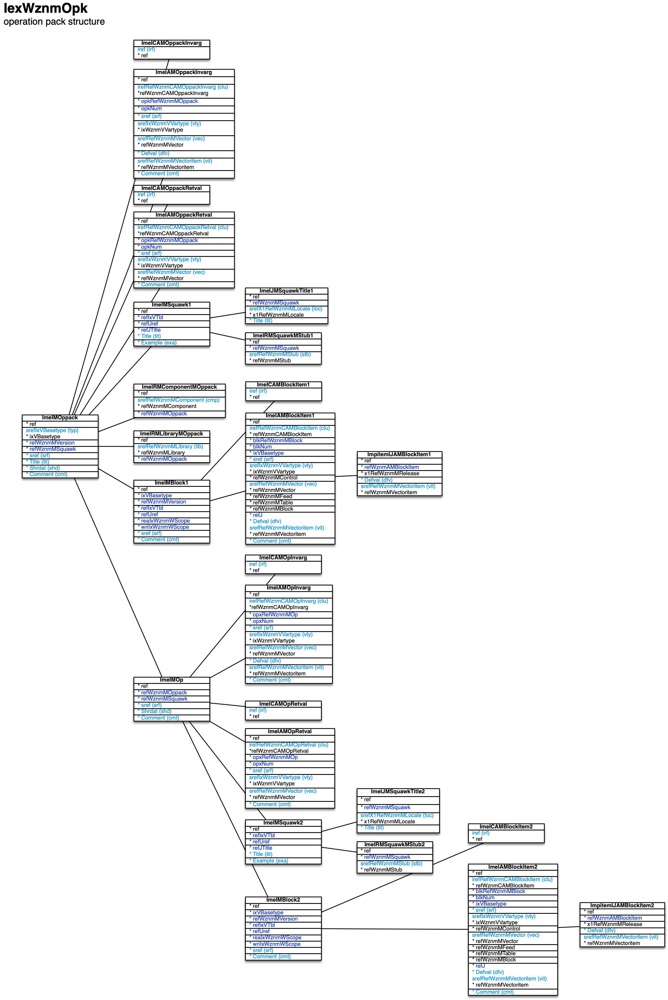

[back](../sbemdl.md)

Operation packs ``IexWznmOpk``
===

Schema
---

<em>Figure 1: Operation packs schema - table columns in light blue are part of the input file, table columns in dark blue are inferred</em>

Structure
---

[//]: # (IP structure - BEGIN)

&nbsp;&nbsp;&nbsp;&nbsp;\+ Operation pack [``[ImeIMOppack]``](#1-operation-pack-imeimoppack)
 &nbsp;&nbsp;&nbsp;&nbsp;&nbsp;&nbsp;&nbsp;&nbsp;\- Invocation arguments [``[ImeIAMOppackInvarg]``](#11-invocation-arguments-imeiamoppackinvarg)
 &nbsp;&nbsp;&nbsp;&nbsp;&nbsp;&nbsp;&nbsp;&nbsp;\- Return values [``[ImeIAMOppackRetval]``](#12-return-values-imeiamoppackretval)
 &nbsp;&nbsp;&nbsp;&nbsp;&nbsp;&nbsp;&nbsp;&nbsp;\- Invocation arguments cluster [``[ImeICAMOppackInvarg]``](#13-invocation-arguments-cluster-imeicamoppackinvarg)
 &nbsp;&nbsp;&nbsp;&nbsp;&nbsp;&nbsp;&nbsp;&nbsp;\- Return values cluster [``[ImeICAMOppackRetval]``](#14-return-values-cluster-imeicamoppackretval)
 &nbsp;&nbsp;&nbsp;&nbsp;&nbsp;&nbsp;&nbsp;&nbsp;\+ Block [``[ImeIMBlock1]``](#15-block-imeimblock1)
 &nbsp;&nbsp;&nbsp;&nbsp;&nbsp;&nbsp;&nbsp;&nbsp;&nbsp;&nbsp;&nbsp;&nbsp;\+ Items [``[ImeIAMBlockItem1]``](#151-items-imeiamblockitem1)
 &nbsp;&nbsp;&nbsp;&nbsp;&nbsp;&nbsp;&nbsp;&nbsp;&nbsp;&nbsp;&nbsp;&nbsp;&nbsp;&nbsp;&nbsp;&nbsp;\- Default value by release [``[ImeIJAMBlockItem1]``](#1511-default-value-by-release-imeijamblockitem1)
 &nbsp;&nbsp;&nbsp;&nbsp;&nbsp;&nbsp;&nbsp;&nbsp;&nbsp;&nbsp;&nbsp;&nbsp;\- Items cluster [``[ImeICAMBlockItem1]``](#152-items-cluster-imeicamblockitem1)
 &nbsp;&nbsp;&nbsp;&nbsp;&nbsp;&nbsp;&nbsp;&nbsp;\+ Operation [``[ImeIMOp]``](#16-operation-imeimop)
 &nbsp;&nbsp;&nbsp;&nbsp;&nbsp;&nbsp;&nbsp;&nbsp;&nbsp;&nbsp;&nbsp;&nbsp;\- Invocation arguments [``[ImeIAMOpInvarg]``](#161-invocation-arguments-imeiamopinvarg)
 &nbsp;&nbsp;&nbsp;&nbsp;&nbsp;&nbsp;&nbsp;&nbsp;&nbsp;&nbsp;&nbsp;&nbsp;\- Return values [``[ImeIAMOpRetval]``](#162-return-values-imeiamopretval)
 &nbsp;&nbsp;&nbsp;&nbsp;&nbsp;&nbsp;&nbsp;&nbsp;&nbsp;&nbsp;&nbsp;&nbsp;\- Invocation arguments cluster [``[ImeICAMOpInvarg]``](#163-invocation-arguments-cluster-imeicamopinvarg)
 &nbsp;&nbsp;&nbsp;&nbsp;&nbsp;&nbsp;&nbsp;&nbsp;&nbsp;&nbsp;&nbsp;&nbsp;\- Return values cluster [``[ImeICAMOpRetval]``](#164-return-values-cluster-imeicamopretval)
 &nbsp;&nbsp;&nbsp;&nbsp;&nbsp;&nbsp;&nbsp;&nbsp;&nbsp;&nbsp;&nbsp;&nbsp;\+ Block [``[ImeIMBlock2]``](#165-block-imeimblock2)
 &nbsp;&nbsp;&nbsp;&nbsp;&nbsp;&nbsp;&nbsp;&nbsp;&nbsp;&nbsp;&nbsp;&nbsp;&nbsp;&nbsp;&nbsp;&nbsp;\+ Items [``[ImeIAMBlockItem2]``](#1651-items-imeiamblockitem2)
 &nbsp;&nbsp;&nbsp;&nbsp;&nbsp;&nbsp;&nbsp;&nbsp;&nbsp;&nbsp;&nbsp;&nbsp;&nbsp;&nbsp;&nbsp;&nbsp;&nbsp;&nbsp;&nbsp;&nbsp;\- Default value by release [``[ImeIJAMBlockItem2]``](#16511-default-value-by-release-imeijamblockitem2)
 &nbsp;&nbsp;&nbsp;&nbsp;&nbsp;&nbsp;&nbsp;&nbsp;&nbsp;&nbsp;&nbsp;&nbsp;&nbsp;&nbsp;&nbsp;&nbsp;\- Items cluster [``[ImeICAMBlockItem2]``](#1652-items-cluster-imeicamblockitem2)
 &nbsp;&nbsp;&nbsp;&nbsp;&nbsp;&nbsp;&nbsp;&nbsp;&nbsp;&nbsp;&nbsp;&nbsp;\+ Squawk [``[ImeIMSquawk2]``](#166-squawk-imeimsquawk2)
 &nbsp;&nbsp;&nbsp;&nbsp;&nbsp;&nbsp;&nbsp;&nbsp;&nbsp;&nbsp;&nbsp;&nbsp;&nbsp;&nbsp;&nbsp;&nbsp;\- Text by locale [``[ImeIJMSquawkTitle2]``](#1661-text-by-locale-imeijmsquawktitle2)
 &nbsp;&nbsp;&nbsp;&nbsp;&nbsp;&nbsp;&nbsp;&nbsp;&nbsp;&nbsp;&nbsp;&nbsp;&nbsp;&nbsp;&nbsp;&nbsp;\- TblWznmRMSquawkMStub [``[ImeIRMSquawkMStub2]``](#1662-stubs-imeirmsquawkmstub2)
 &nbsp;&nbsp;&nbsp;&nbsp;&nbsp;&nbsp;&nbsp;&nbsp;\+ Squawk [``[ImeIMSquawk1]``](#17-squawk-imeimsquawk1)
 &nbsp;&nbsp;&nbsp;&nbsp;&nbsp;&nbsp;&nbsp;&nbsp;&nbsp;&nbsp;&nbsp;&nbsp;\- Text by locale [``[ImeIJMSquawkTitle1]``](#171-text-by-locale-imeijmsquawktitle1)
 &nbsp;&nbsp;&nbsp;&nbsp;&nbsp;&nbsp;&nbsp;&nbsp;&nbsp;&nbsp;&nbsp;&nbsp;\- TblWznmRMSquawkMStub [``[ImeIRMSquawkMStub1]``](#172-stubs-imeirmsquawkmstub1)
 &nbsp;&nbsp;&nbsp;&nbsp;&nbsp;&nbsp;&nbsp;&nbsp;\- TblWznmRMComponentMOppack [``[ImeIRMComponentMOppack]``](#18-part-of-components-imeirmcomponentmoppack)
 &nbsp;&nbsp;&nbsp;&nbsp;&nbsp;&nbsp;&nbsp;&nbsp;\- TblWznmRMLibraryMOppack [``[ImeIRMLibraryMOppack]``](#19-libraries-imeirmlibrarymoppack)

[//]: # (IP structure - END)

Details
---

### 1 Operation pack ``[ImeIMOppack]``

[//]: # (IP ImeIMOppack.superUse - BEGIN)

Use: operations packs bundle operations of related scope.

[//]: # (IP ImeIMOppack.superUse - END)

[//]: # (IP ImeIMOppack.columns - BEGIN)

Column|Content|
-|-|
srefIxVBasetype (string)|type cust: customizable stat: static|
sref (string)|identifier|
Title (string)|name|
Shrdat (bool)|shared data|
Comment (string)|comment|

[//]: # (IP ImeIMOppack.columns - END)

### 1.1 Invocation arguments ``[ImeIAMOppackInvarg]``

[//]: # (IP ImeIAMOppackInvarg.superUse - BEGIN)

Super import: operation pack (1:N)

Use: customizable operation packs only - invocation arguments common to all operations.

[//]: # (IP ImeIAMOppackInvarg.superUse - END)

[//]: # (IP ImeIAMOppackInvarg.columns - BEGIN)

Column|Content|
-|-|
irefRefWznmCAMOppackInvarg (ubigint)|integer reference to invocation arguments cluster|
sref (string)|identifier|
srefIxWznmVVartype (string)|variable data type void: not applicable boolean: boolean tinyint: integer / byte (8bit) utinyint: unsigned integer / byte (8bit) smallint: integer (16bit) usmallint: unsigned integer (16bit) int: integer (32bit) uint: unsigned integer (32bit) bigint: integer (64bit) ubigint: unsigned integer (64bit) float: float double: double string: string booleanvec: boolean vector utinyintvec: unsigned int / byte 8bit vector usmallintvec: unsigned int 16bit vector intvec: integer 32bit vector uintvec: unsigned int 32bit vector ubigintvec: unsigned int 64bit vector floatvec: float vector doublevec: double vector floatmat: float matrix doublemat: double matrix stringvec: string vector vecsref: vector entry string reference scrref: scrambled reference|
srefRefWznmMVector (string)|vecsref variable data type - vector|
Defval (string)|default value|
srefRefWznmMVectoritem (string)|vecsref variable data type - default vector item|
Comment (string)|comment|

[//]: # (IP ImeIAMOppackInvarg.columns - END)

### 1.2 Return values ``[ImeIAMOppackRetval]``

[//]: # (IP ImeIAMOppackRetval.superUse - BEGIN)

Super import: operation pack (1:N)

Use: customizable operation packs only - return values common to all operations.

[//]: # (IP ImeIAMOppackRetval.superUse - END)

[//]: # (IP ImeIAMOppackRetval.columns - BEGIN)

Column|Content|
-|-|
irefRefWznmCAMOppackRetval (ubigint)|integer reference to return values cluster|
sref (string)|identifier|
srefIxWznmVVartype (string)|variable data type void: not applicable boolean: boolean tinyint: integer / byte (8bit) utinyint: unsigned integer / byte (8bit) smallint: integer (16bit) usmallint: unsigned integer (16bit) int: integer (32bit) uint: unsigned integer (32bit) bigint: integer (64bit) ubigint: unsigned integer (64bit) float: float double: double string: string booleanvec: boolean vector utinyintvec: unsigned int / byte 8bit vector usmallintvec: unsigned int 16bit vector intvec: integer 32bit vector uintvec: unsigned int 32bit vector ubigintvec: unsigned int 64bit vector floatvec: float vector doublevec: double vector floatmat: float matrix doublemat: double matrix stringvec: string vector vecsref: vector entry string reference scrref: scrambled reference|
srefRefWznmMVector (string)|vecsref variable data type - vector|
Comment (string)|comment|

[//]: # (IP ImeIAMOppackRetval.columns - END)

### 1.3 Invocation arguments cluster ``[ImeICAMOppackInvarg]``

[//]: # (IP ImeICAMOppackInvarg.superUse - BEGIN)

Super import: operation pack (1:N)

Use: group invocation arguments.

[//]: # (IP ImeICAMOppackInvarg.superUse - END)

[//]: # (IP ImeICAMOppackInvarg.columns - BEGIN)

Column|Content|
-|-|
iref (ubigint)|integer reference|

[//]: # (IP ImeICAMOppackInvarg.columns - END)

### 1.4 Return values cluster ``[ImeICAMOppackRetval]``

[//]: # (IP ImeICAMOppackRetval.superUse - BEGIN)

Super import: operation pack (1:N)

Use: group return values.

[//]: # (IP ImeICAMOppackRetval.superUse - END)

[//]: # (IP ImeICAMOppackRetval.columns - BEGIN)

Column|Content|
-|-|
iref (ubigint)|integer reference|

[//]: # (IP ImeICAMOppackRetval.columns - END)

### 1.5 Block ``[ImeIMBlock1]``

[//]: # (IP ImeIMBlock1.superUse - BEGIN)

Super import: operation pack (1:N)

Use: define operation pack-specific settings blocks.

[//]: # (IP ImeIMBlock1.superUse - END)

[//]: # (IP ImeIMBlock1.columns - BEGIN)

Column|Content|
-|-|
sref (string)|identifier|
Comment (string)|comment|

[//]: # (IP ImeIMBlock1.columns - END)

### 1.5.1 Items ``[ImeIAMBlockItem1]``

[//]: # (IP ImeIAMBlockItem1.superUse - BEGIN)

Super import: block (1:N)

Use: self-explanatory.

[//]: # (IP ImeIAMBlockItem1.superUse - END)

[//]: # (IP ImeIAMBlockItem1.columns - BEGIN)

Column|Content|
-|-|
irefRefWznmCAMBlockItem (ubigint)|TblWznmCAMBlockItem|
sref (string)|identifier|
srefIxWznmVVartype (string)|variable data type void: not applicable boolean: boolean tinyint: integer / byte (8bit) utinyint: unsigned integer / byte (8bit) smallint: integer (16bit) usmallint: unsigned integer (16bit) int: integer (32bit) uint: unsigned integer (32bit) bigint: integer (64bit) ubigint: unsigned integer (64bit) float: float double: double string: string booleanvec: boolean vector utinyintvec: unsigned int / byte 8bit vector usmallintvec: unsigned int 16bit vector intvec: integer 32bit vector uintvec: unsigned int 32bit vector ubigintvec: unsigned int 64bit vector floatvec: float vector doublevec: double vector floatmat: float matrix doublemat: double matrix stringvec: string vector vecsref: vector entry string reference scrref: scrambled reference|
srefRefWznmMVector (string)|vecsref variable data type - vector|
Defval (string)|default value|
srefRefWznmMVectoritem (string)|vecsref variable data type - default vector item|
Comment (string)|comment|

[//]: # (IP ImeIAMBlockItem1.columns - END)

### 1.5.1.1 Default value by release ``[ImeIJAMBlockItem1]``

[//]: # (IP ImeIJAMBlockItem1.superUse - BEGIN)

Super import: items (1:N)

Use: customize default for specific releases.

[//]: # (IP ImeIJAMBlockItem1.superUse - END)

[//]: # (IP ImeIJAMBlockItem1.columns - BEGIN)

Column|Content|
-|-|
Defval (string)|default value|
srefRefWznmMVectoritem (string)|default vector item|

[//]: # (IP ImeIJAMBlockItem1.columns - END)

### 1.5.2 Items cluster ``[ImeICAMBlockItem1]``

[//]: # (IP ImeICAMBlockItem1.superUse - BEGIN)

Super import: block (1:N)

Use: group items.

[//]: # (IP ImeICAMBlockItem1.superUse - END)

[//]: # (IP ImeICAMBlockItem1.columns - BEGIN)

Column|Content|
-|-|
iref (ubigint)|integer reference|

[//]: # (IP ImeICAMBlockItem1.columns - END)

### 1.6 Operation ``[ImeIMOp]``

[//]: # (IP ImeIMOp.superUse - BEGIN)

Super import: operation pack (1:N)

Use: operation to be executed atomically.

[//]: # (IP ImeIMOp.superUse - END)

[//]: # (IP ImeIMOp.columns - BEGIN)

Column|Content|
-|-|
sref (string)|identifier|
Shrdat (bool)|shared data|
Comment (string)|comment|

[//]: # (IP ImeIMOp.columns - END)

### 1.6.1 Invocation arguments ``[ImeIAMOpInvarg]``

[//]: # (IP ImeIAMOpInvarg.superUse - BEGIN)

Super import: operation (1:N)

Use: self-explanatory.

[//]: # (IP ImeIAMOpInvarg.superUse - END)

[//]: # (IP ImeIAMOpInvarg.columns - BEGIN)

Column|Content|
-|-|
irefRefWznmCAMOpInvarg (ubigint)|integer reference to invocation arguments cluster|
sref (string)|identifier|
srefIxWznmVVartype (string)|variable data type void: not applicable boolean: boolean tinyint: integer / byte (8bit) utinyint: unsigned integer / byte (8bit) smallint: integer (16bit) usmallint: unsigned integer (16bit) int: integer (32bit) uint: unsigned integer (32bit) bigint: integer (64bit) ubigint: unsigned integer (64bit) float: float double: double string: string booleanvec: boolean vector utinyintvec: unsigned int / byte 8bit vector usmallintvec: unsigned int 16bit vector intvec: integer 32bit vector uintvec: unsigned int 32bit vector ubigintvec: unsigned int 64bit vector floatvec: float vector doublevec: double vector floatmat: float matrix doublemat: double matrix stringvec: string vector vecsref: vector entry string reference scrref: scrambled reference|
srefRefWznmMVector (string)|vecsref variable data type - vector|
Defval (string)|default value|
srefRefWznmMVectoritem (string)|vecsref variable data type - vector item|
Comment (string)|comment|

[//]: # (IP ImeIAMOpInvarg.columns - END)

### 1.6.2 Return values ``[ImeIAMOpRetval]``

[//]: # (IP ImeIAMOpRetval.superUse - BEGIN)

Super import: operation (1:N)

Use: self-explanatory.

[//]: # (IP ImeIAMOpRetval.superUse - END)

[//]: # (IP ImeIAMOpRetval.columns - BEGIN)

Column|Content|
-|-|
irefRefWznmCAMOpRetval (ubigint)|integer reference to return values cluster|
sref (string)|identifier|
srefIxWznmVVartype (string)|variable data type void: not applicable boolean: boolean tinyint: integer / byte (8bit) utinyint: unsigned integer / byte (8bit) smallint: integer (16bit) usmallint: unsigned integer (16bit) int: integer (32bit) uint: unsigned integer (32bit) bigint: integer (64bit) ubigint: unsigned integer (64bit) float: float double: double string: string booleanvec: boolean vector utinyintvec: unsigned int / byte 8bit vector usmallintvec: unsigned int 16bit vector intvec: integer 32bit vector uintvec: unsigned int 32bit vector ubigintvec: unsigned int 64bit vector floatvec: float vector doublevec: double vector floatmat: float matrix doublemat: double matrix stringvec: string vector vecsref: vector entry string reference scrref: scrambled reference|
srefRefWznmMVector (string)|vecsref variable data type - vector|
Comment (string)|comment|

[//]: # (IP ImeIAMOpRetval.columns - END)

### 1.6.3 Invocation arguments cluster ``[ImeICAMOpInvarg]``

[//]: # (IP ImeICAMOpInvarg.superUse - BEGIN)

Super import: operation (1:N)

Use: group invocation arguments.

[//]: # (IP ImeICAMOpInvarg.superUse - END)

[//]: # (IP ImeICAMOpInvarg.columns - BEGIN)

Column|Content|
-|-|
iref (ubigint)|integer reference|

[//]: # (IP ImeICAMOpInvarg.columns - END)

### 1.6.4 Return values cluster ``[ImeICAMOpRetval]``

[//]: # (IP ImeICAMOpRetval.superUse - BEGIN)

Super import: operation (1:N)

Use: group return values.

[//]: # (IP ImeICAMOpRetval.superUse - END)

[//]: # (IP ImeICAMOpRetval.columns - BEGIN)

Column|Content|
-|-|
iref (ubigint)|integer reference|

[//]: # (IP ImeICAMOpRetval.columns - END)

### 1.6.5 Block ``[ImeIMBlock2]``

[//]: # (IP ImeIMBlock2.superUse - BEGIN)

Super import: operation (1:N)

Use: define operation-specific settings blocks.

[//]: # (IP ImeIMBlock2.superUse - END)

[//]: # (IP ImeIMBlock2.columns - BEGIN)

Column|Content|
-|-|
sref (string)|identifier|
Comment (string)|comment|

[//]: # (IP ImeIMBlock2.columns - END)

### 1.6.5.1 Items ``[ImeIAMBlockItem2]``

[//]: # (IP ImeIAMBlockItem2.superUse - BEGIN)

Super import: block (1:N)

Use: self-explanatory.

[//]: # (IP ImeIAMBlockItem2.superUse - END)

[//]: # (IP ImeIAMBlockItem2.columns - BEGIN)

Column|Content|
-|-|
irefRefWznmCAMBlockItem (ubigint)|TblWznmCAMBlockItem|
sref (string)|identifier|
srefIxWznmVVartype (string)|variable data type void: not applicable boolean: boolean tinyint: integer / byte (8bit) utinyint: unsigned integer / byte (8bit) smallint: integer (16bit) usmallint: unsigned integer (16bit) int: integer (32bit) uint: unsigned integer (32bit) bigint: integer (64bit) ubigint: unsigned integer (64bit) float: float double: double string: string booleanvec: boolean vector utinyintvec: unsigned int / byte 8bit vector usmallintvec: unsigned int 16bit vector intvec: integer 32bit vector uintvec: unsigned int 32bit vector ubigintvec: unsigned int 64bit vector floatvec: float vector doublevec: double vector floatmat: float matrix doublemat: double matrix stringvec: string vector vecsref: vector entry string reference scrref: scrambled reference|
srefRefWznmMVector (string)|vecsref variable data type - vector|
Defval (string)|default value|
srefRefWznmMVectoritem (string)|vecsref variable data type - default vector item|
Comment (string)|comment|

[//]: # (IP ImeIAMBlockItem2.columns - END)

### 1.6.5.1.1 Default value by release ``[ImeIJAMBlockItem2]``

[//]: # (IP ImeIJAMBlockItem2.superUse - BEGIN)

Super import: items (1:N)

Use: customize default for specific releases.

[//]: # (IP ImeIJAMBlockItem2.superUse - END)

[//]: # (IP ImeIJAMBlockItem2.columns - BEGIN)

Column|Content|
-|-|
Defval (string)|default value|
srefRefWznmMVectoritem (string)|default vector item|

[//]: # (IP ImeIJAMBlockItem2.columns - END)

### 1.6.5.2 Items cluster ``[ImeICAMBlockItem2]``

[//]: # (IP ImeICAMBlockItem2.superUse - BEGIN)

Super import: block (1:N)

Use: group items.

[//]: # (IP ImeICAMBlockItem2.superUse - END)

[//]: # (IP ImeICAMBlockItem2.columns - BEGIN)

Column|Content|
-|-|
iref (ubigint)|integer reference|

[//]: # (IP ImeICAMBlockItem2.columns - END)

### 1.6.6 Squawk ``[ImeIMSquawk2]``

[//]: # (IP ImeIMSquawk2.superUse - BEGIN)

Super import: operation (1:N)

Use: set human-readable status message during execution of operation.

[//]: # (IP ImeIMSquawk2.superUse - END)

[//]: # (IP ImeIMSquawk2.columns - BEGIN)

Column|Content|
-|-|
Title (string)|text|
Example (string)|example|

[//]: # (IP ImeIMSquawk2.columns - END)

### 1.6.6.1 Text by locale ``[ImeIJMSquawkTitle2]``

[//]: # (IP ImeIJMSquawkTitle2.superUse - BEGIN)

Super import: squawk (1:N)

Use: self-explanatory.

[//]: # (IP ImeIJMSquawkTitle2.superUse - END)

[//]: # (IP ImeIJMSquawkTitle2.columns - BEGIN)

Column|Content|
-|-|
srefX1RefWznmMLocale (string)|locale|
Title (string)|text|

[//]: # (IP ImeIJMSquawkTitle2.columns - END)

### 1.6.6.2 Stubs ``[ImeIRMSquawkMStub2]``

[//]: # (IP ImeIRMSquawkMStub2.superUse - BEGIN)

Super import: squawk (1:N)

Use: define stubs included in squawk as placeholders.

[//]: # (IP ImeIRMSquawkMStub2.superUse - END)

[//]: # (IP ImeIRMSquawkMStub2.columns - BEGIN)

Column|Content|
-|-|
srefRefWznmMStub (string)|stub|

[//]: # (IP ImeIRMSquawkMStub2.columns - END)

### 1.7 Squawk ``[ImeIMSquawk1]``

[//]: # (IP ImeIMSquawk1.superUse - BEGIN)

Super import: operation pack (1:N)

Use: customizable operation packs only - set human-readable status message during execution of operation pack operation.

[//]: # (IP ImeIMSquawk1.superUse - END)

[//]: # (IP ImeIMSquawk1.columns - BEGIN)

Column|Content|
-|-|
Title (string)|text|
Example (string)|example|

[//]: # (IP ImeIMSquawk1.columns - END)

### 1.7.1 Text by locale ``[ImeIJMSquawkTitle1]``

[//]: # (IP ImeIJMSquawkTitle1.superUse - BEGIN)

Super import: squawk (1:N)

Use: self-explanatory.

[//]: # (IP ImeIJMSquawkTitle1.superUse - END)

[//]: # (IP ImeIJMSquawkTitle1.columns - BEGIN)

Column|Content|
-|-|
srefX1RefWznmMLocale (string)|locale|
Title (string)|text|

[//]: # (IP ImeIJMSquawkTitle1.columns - END)

### 1.7.2 Stubs ``[ImeIRMSquawkMStub1]``

[//]: # (IP ImeIRMSquawkMStub1.superUse - BEGIN)

Super import: squawk (1:N)

Use: define stubs included in squawk as placeholders.

[//]: # (IP ImeIRMSquawkMStub1.superUse - END)

[//]: # (IP ImeIRMSquawkMStub1.columns - BEGIN)

Column|Content|
-|-|
srefRefWznmMStub (string)|stub|

[//]: # (IP ImeIRMSquawkMStub1.columns - END)

### 1.8 Part of components ``[ImeIRMComponentMOppack]``

[//]: # (IP ImeIRMComponentMOppack.superUse - BEGIN)

Super import: operation pack (1:N)

Use: assign operation packs to operation engine components.

[//]: # (IP ImeIRMComponentMOppack.superUse - END)

[//]: # (IP ImeIRMComponentMOppack.columns - BEGIN)

Column|Content|
-|-|
srefRefWznmMComponent (string)|component|

[//]: # (IP ImeIRMComponentMOppack.columns - END)

### 1.9 Libraries ``[ImeIRMLibraryMOppack]``

[//]: # (IP ImeIRMLibraryMOppack.superUse - BEGIN)

Super import: operation pack (1:N)

Use: specify operation pack library requirements.

[//]: # (IP ImeIRMLibraryMOppack.superUse - END)

[//]: # (IP ImeIRMLibraryMOppack.columns - BEGIN)

Column|Content|
-|-|
srefRefWznmMLibrary (string)|library|

[//]: # (IP ImeIRMLibraryMOppack.columns - END)

<small>Markdown for WhizniumSBE v1.1.3 auto-generated (what else ;-) ) by WhizniumSBE on 1 Jan 2021</small>
