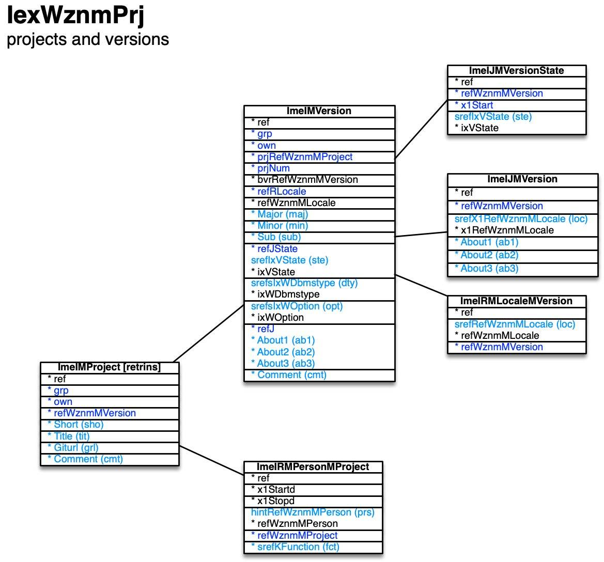

[back](../sbemdl.md)

Projects and versions ``IexWznmPrj``
===

Schema
---

<em>Figure 1: Projects and versions schema - table columns in light blue are part of the input file, table columns in dark blue are inferred</em>

Structure
---

[//]: # (IP structure - BEGIN)

&nbsp;&nbsp;&nbsp;&nbsp;\+ Project [``[ImeIMProject]``](#1-Project-ImeIMProject)
 &nbsp;&nbsp;&nbsp;&nbsp;&nbsp;&nbsp;&nbsp;&nbsp;\+ Version [``[ImeIMVersion]``](#11-Version-ImeIMVersion)
 &nbsp;&nbsp;&nbsp;&nbsp;&nbsp;&nbsp;&nbsp;&nbsp;&nbsp;&nbsp;&nbsp;&nbsp;\- About by locale [``[ImeIJMVersion]``](#111-About-by-locale-ImeIJMVersion)
 &nbsp;&nbsp;&nbsp;&nbsp;&nbsp;&nbsp;&nbsp;&nbsp;&nbsp;&nbsp;&nbsp;&nbsp;\- State history [``[ImeIJMVersionState]``](#112-State-history-ImeIJMVersionState)
 &nbsp;&nbsp;&nbsp;&nbsp;&nbsp;&nbsp;&nbsp;&nbsp;&nbsp;&nbsp;&nbsp;&nbsp;\- Locales [``[ImeIRMLocaleMVersion]``](#113-TblWznmRMLocaleMVersion-ImeIRMLocaleMVersion)
 &nbsp;&nbsp;&nbsp;&nbsp;&nbsp;&nbsp;&nbsp;&nbsp;\- Contributing persons [``[ImeIRMPersonMProject]``](#12-Contributing-persons-ImeIRMPersonMProject)

[//]: # (IP structure - END)

Details
---

### 1 Project ``[ImeIMProject]``

[//]: # (IP ImeIMProject.superUse - BEGIN)

Use: one WhizniumSBE project corresponds to one repository which is iterated through versions.

[//]: # (IP ImeIMProject.superUse - END)

[//]: # (IP ImeIMProject.columns - BEGIN)

Column|Content|
-|-|
Short (string)|four-letter acronym|
Title (string)|name|
Giturl (string)|Git repository URL|
Comment (string)|comment|

[//]: # (IP ImeIMProject.columns - END)

### 1.1 Version ``[ImeIMVersion]``

[//]: # (IP ImeIMVersion.superUse - BEGIN)

Super import: project (1:N)

Use: each version holds full information for writing the code correponding to its respective model description.

[//]: # (IP ImeIMVersion.superUse - END)

[//]: # (IP ImeIMVersion.columns - BEGIN)

Column|Content|
-|-|
Major (usmallint)|major version number|
Minor (usmallint)|minor version number|
Sub (usmallint)|sub version number|
srefIxVState (string)|state newcre: newly created newimp: newly imported dsndeploy: design phase, deployment information imported dsnglobal: design phase, global features imported dsndbstr: design phase, database structure imported dsnbscui: design phase, basic user interface structure imported dsnimpexp: design phase, import/export structure imported dsnoppack: design phase, operation pack structure imported dsncustjob: design phase, custom jobs imported dsngenui: design phase, user interface generated dsncustui: design phase, custom user interface features applied dsngenjtr: design phase, job tree generated dsncustjtr: design phase, custom job tree features applied ready: build-ready abandon: abandonned|
srefsIxWDbmstype (string)|DBMS types mararia: MariaDB Aria marinno: MariaDB InnoDB myinno: MySQL InnoDB myisam: MySQL MyISAM pg: PostgreSQL lite: SQLite|
srefsIxWOption (string)|options accgrpreg: view access for regular users to all grp records accnogoall: access for all users to no-grp/own records apimon: monitoring via API dbsmon: monitoring to database ddspub: DDS publisher uasrv: OPC UA server|
About1 (string)|about text, part 1|
About2 (string)|about text, part 2|
About3 (string)|about text, part 3|
Comment (string)|comment|

[//]: # (IP ImeIMVersion.columns - END)

### 1.1.1 About by locale ``[ImeIJMVersion]``

[//]: # (IP ImeIJMVersion.superUse - BEGIN)

Super import: version (1:N)

Use: self-explanatory.

[//]: # (IP ImeIJMVersion.superUse - END)

[//]: # (IP ImeIJMVersion.columns - BEGIN)

Column|Content|
-|-|
srefX1RefWznmMLocale (string)|locale|
About1 (string)|about text, part 1|
About2 (string)|about text, part 2|
About3 (string)|about text, part 3|
Comment (string)|comment|

[//]: # (IP ImeIJMVersion.columns - END)

### 1.1.2 State history ``[ImeIJMVersionState]``

[//]: # (IP ImeIJMVersionState.superUse - BEGIN)

Super import: version (1:N)

Use: detail the time-dependent state of the version.

[//]: # (IP ImeIJMVersionState.superUse - END)

[//]: # (IP ImeIJMVersionState.columns - BEGIN)

Column|Content|
-|-|
srefIxVState (string)|state newcre: newly created newimp: newly imported dsndeploy: design phase, deployment information imported dsnglobal: design phase, global features imported dsndbstr: design phase, database structure imported dsnbscui: design phase, basic user interface structure imported dsnimpexp: design phase, import/export structure imported dsnoppack: design phase, operation pack structure imported dsncustjob: design phase, custom jobs imported dsngenui: design phase, user interface generated dsncustui: design phase, custom user interface features applied dsngenjtr: design phase, job tree generated dsncustjtr: design phase, custom job tree features applied ready: build-ready abandon: abandonned|

[//]: # (IP ImeIJMVersionState.columns - END)

### 1.1.3 Locales ``[ImeIRMLocaleMVersion]``

[//]: # (IP ImeIRMLocaleMVersion.superUse - BEGIN)

Super import: version (1:N)

Use: specify the locales in which to generate the UI. Preferred/default locale first.

[//]: # (IP ImeIRMLocaleMVersion.superUse - END)

[//]: # (IP ImeIRMLocaleMVersion.columns - BEGIN)

Column|Content|
-|-|
srefRefWznmMLocale (string)|locale|

[//]: # (IP ImeIRMLocaleMVersion.columns - END)

### 1.2 Contributing persons ``[ImeIRMPersonMProject]``

[//]: # (IP ImeIRMPersonMProject.superUse - BEGIN)

Super import: project (1:N)

Use: specify persons involved in the project with their respective roles.

[//]: # (IP ImeIRMPersonMProject.superUse - END)

[//]: # (IP ImeIRMPersonMProject.columns - BEGIN)

Column|Content|
-|-|
hintRefWznmMPerson (string)|person|
srefKFunction (string)|function eng: software engineer mgr: manager pro: programmer tan: test analyst uxd: user experience designer|

[//]: # (IP ImeIRMPersonMProject.columns - END)

<small>Markdown for WhizniumSBE v1.1.3 auto-generated (what else ;-) ) by WhizniumSBE on 1 Jan 2021</small>
