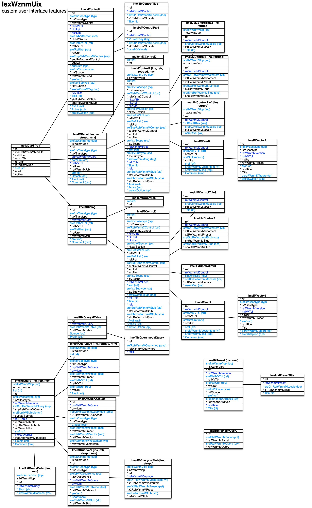

[back](../sbemdl.md)

Custom user interface features ``IexWznmUix``
===

Schema
---

<em>Figure 1: Custom user interface features schema - table columns in light blue are part of the input file, table columns in dark blue are inferred</em>

Structure
---

[//]: # (IP structure - BEGIN)

&nbsp;&nbsp;&nbsp;&nbsp;\+ Card [``[ImeIMCard]``](#1-card-imeimcard)
 &nbsp;&nbsp;&nbsp;&nbsp;&nbsp;&nbsp;&nbsp;&nbsp;\+ Control [``[ImeIMControl1]``](#11-control-imeimcontrol1)
 &nbsp;&nbsp;&nbsp;&nbsp;&nbsp;&nbsp;&nbsp;&nbsp;&nbsp;&nbsp;&nbsp;&nbsp;\- Parameters [``[ImeIAMControlPar1]``](#111-parameters-imeiamcontrolpar1)
 &nbsp;&nbsp;&nbsp;&nbsp;&nbsp;&nbsp;&nbsp;&nbsp;&nbsp;&nbsp;&nbsp;&nbsp;\- Name by locale [``[ImeIJMControlTitle1]``](#112-name-by-locale-imeijmcontroltitle1)
 &nbsp;&nbsp;&nbsp;&nbsp;&nbsp;&nbsp;&nbsp;&nbsp;\+ Dialog [``[ImeIMDialog]``](#12-dialog-imeimdialog)
 &nbsp;&nbsp;&nbsp;&nbsp;&nbsp;&nbsp;&nbsp;&nbsp;&nbsp;&nbsp;&nbsp;&nbsp;\- Controls cluster [``[ImeICControl3]``](#121-controls-cluster-imeiccontrol3)
 &nbsp;&nbsp;&nbsp;&nbsp;&nbsp;&nbsp;&nbsp;&nbsp;&nbsp;&nbsp;&nbsp;&nbsp;\+ Control [``[ImeIMControl3]``](#122-control-imeimcontrol3)
 &nbsp;&nbsp;&nbsp;&nbsp;&nbsp;&nbsp;&nbsp;&nbsp;&nbsp;&nbsp;&nbsp;&nbsp;&nbsp;&nbsp;&nbsp;&nbsp;\- Parameters [``[ImeIAMControlPar3]``](#1221-parameters-imeiamcontrolpar3)
 &nbsp;&nbsp;&nbsp;&nbsp;&nbsp;&nbsp;&nbsp;&nbsp;&nbsp;&nbsp;&nbsp;&nbsp;&nbsp;&nbsp;&nbsp;&nbsp;\- Stub by vector item [``[ImeIJMControl3]``](#1222-stub-by-vector-item-imeijmcontrol3)
 &nbsp;&nbsp;&nbsp;&nbsp;&nbsp;&nbsp;&nbsp;&nbsp;&nbsp;&nbsp;&nbsp;&nbsp;&nbsp;&nbsp;&nbsp;&nbsp;\- Name by locale [``[ImeIJMControlTitle3]``](#1223-name-by-locale-imeijmcontroltitle3)
 &nbsp;&nbsp;&nbsp;&nbsp;&nbsp;&nbsp;&nbsp;&nbsp;&nbsp;&nbsp;&nbsp;&nbsp;&nbsp;&nbsp;&nbsp;&nbsp;\+ Feed [``[ImeIMFeed3]``](#1224-feed-imeimfeed3)
 &nbsp;&nbsp;&nbsp;&nbsp;&nbsp;&nbsp;&nbsp;&nbsp;&nbsp;&nbsp;&nbsp;&nbsp;&nbsp;&nbsp;&nbsp;&nbsp;&nbsp;&nbsp;&nbsp;&nbsp;\- Vector [``[ImeIMVector3]``](#12241-vector-imeimvector3)
 &nbsp;&nbsp;&nbsp;&nbsp;&nbsp;&nbsp;&nbsp;&nbsp;\+ Panel [``[ImeIMPanel]``](#13-panel-imeimpanel)
 &nbsp;&nbsp;&nbsp;&nbsp;&nbsp;&nbsp;&nbsp;&nbsp;&nbsp;&nbsp;&nbsp;&nbsp;\- Controls cluster [``[ImeICControl2]``](#131-controls-cluster-imeiccontrol2)
 &nbsp;&nbsp;&nbsp;&nbsp;&nbsp;&nbsp;&nbsp;&nbsp;&nbsp;&nbsp;&nbsp;&nbsp;\+ Control [``[ImeIMControl2]``](#132-control-imeimcontrol2)
 &nbsp;&nbsp;&nbsp;&nbsp;&nbsp;&nbsp;&nbsp;&nbsp;&nbsp;&nbsp;&nbsp;&nbsp;&nbsp;&nbsp;&nbsp;&nbsp;\- Parameters [``[ImeIAMControlPar2]``](#1321-parameters-imeiamcontrolpar2)
 &nbsp;&nbsp;&nbsp;&nbsp;&nbsp;&nbsp;&nbsp;&nbsp;&nbsp;&nbsp;&nbsp;&nbsp;&nbsp;&nbsp;&nbsp;&nbsp;\- Stub by vector item [``[ImeIJMControl2]``](#1322-stub-by-vector-item-imeijmcontrol2)
 &nbsp;&nbsp;&nbsp;&nbsp;&nbsp;&nbsp;&nbsp;&nbsp;&nbsp;&nbsp;&nbsp;&nbsp;&nbsp;&nbsp;&nbsp;&nbsp;\- Name by locale [``[ImeIJMControlTitle2]``](#1323-name-by-locale-imeijmcontroltitle2)
 &nbsp;&nbsp;&nbsp;&nbsp;&nbsp;&nbsp;&nbsp;&nbsp;&nbsp;&nbsp;&nbsp;&nbsp;&nbsp;&nbsp;&nbsp;&nbsp;\+ Feed [``[ImeIMFeed2]``](#1324-feed-imeimfeed2)
 &nbsp;&nbsp;&nbsp;&nbsp;&nbsp;&nbsp;&nbsp;&nbsp;&nbsp;&nbsp;&nbsp;&nbsp;&nbsp;&nbsp;&nbsp;&nbsp;&nbsp;&nbsp;&nbsp;&nbsp;\- Vector [``[ImeIMVector2]``](#13241-vector-imeimvector2)
 &nbsp;&nbsp;&nbsp;&nbsp;\+ Presetting [``[ImeIMPreset]``](#2-presetting-imeimpreset)
 &nbsp;&nbsp;&nbsp;&nbsp;&nbsp;&nbsp;&nbsp;&nbsp;\- Name by locale [``[ImeIJMPresetTitle]``](#21-name-by-locale-imeijmpresettitle)
 &nbsp;&nbsp;&nbsp;&nbsp;\+ Query [``[ImeIMQuery]``](#3-query-imeimquery)
 &nbsp;&nbsp;&nbsp;&nbsp;&nbsp;&nbsp;&nbsp;&nbsp;\- Clauses [``[ImeIAMQueryClause]``](#31-clauses-imeiamqueryclause)
 &nbsp;&nbsp;&nbsp;&nbsp;&nbsp;&nbsp;&nbsp;&nbsp;\- Order rules [``[ImeIAMQueryOrder]``](#32-order-rules-imeiamqueryorder)
 &nbsp;&nbsp;&nbsp;&nbsp;&nbsp;&nbsp;&nbsp;&nbsp;\+ Query column [``[ImeIMQuerycol]``](#33-query-column-imeimquerycol)
 &nbsp;&nbsp;&nbsp;&nbsp;&nbsp;&nbsp;&nbsp;&nbsp;&nbsp;&nbsp;&nbsp;&nbsp;\- Stub by presetting [``[ImeIJMQuerycolStub]``](#331-stub-by-presetting-imeijmquerycolstub)
 &nbsp;&nbsp;&nbsp;&nbsp;&nbsp;&nbsp;&nbsp;&nbsp;\- Query modifier [``[ImeIMQuerymod]``](#34-query-modifier-imeimquerymod)
 &nbsp;&nbsp;&nbsp;&nbsp;&nbsp;&nbsp;&nbsp;&nbsp;\+ Source tables [``[ImeIRMQueryMTable]``](#35-source-tables-imeirmquerymtable)
 &nbsp;&nbsp;&nbsp;&nbsp;&nbsp;&nbsp;&nbsp;&nbsp;&nbsp;&nbsp;&nbsp;&nbsp;\- Applicability to query modifiers [``[ImeITMQuerymodMQuery]``](#351-applicability-to-query-modifiers-imeitmquerymodmquery)
 &nbsp;&nbsp;&nbsp;&nbsp;\- Queries in panels [``[ImeIRMPanelMQuery]``](#4-queries-in-panels-imeirmpanelmquery)

[//]: # (IP structure - END)

Details
---

### 1 Card ``[ImeIMCard]``

[//]: # (IP ImeIMCard.superUse - BEGIN)

Use: retrieve card defined in basic user interface structure.

[//]: # (IP ImeIMCard.superUse - END)

[//]: # (IP ImeIMCard.columns - BEGIN)

Column|Content|
-|-|
sref (string)|identifier|

[//]: # (IP ImeIMCard.columns - END)

### 1.1 Control ``[ImeIMControl1]``

[//]: # (IP ImeIMControl1.superUse - BEGIN)

Super import: card (1:N)

Use: alerts and menu-related controls.

[//]: # (IP ImeIMControl1.superUse - END)

[//]: # (IP ImeIMControl1.columns - BEGIN)

Column|Content|
-|-|
srefIxVBasetype (string)|type alr: alert men: menu mit: menu item msp: menu separator mrl: URL menu item mtx: menu item text display sge: stage information|
srefHkIxVSection (string)|hook void: none mbar: menu bar|
srefRefIxVTbl (string)|reference void: none|
srefRefUref (string)|reference|
srefSupRefWznmMControl (string)|super control|
supNum (uint)|ordinal number under super control|
srefIxVScope (string)|scope app: app only shr: shared app/engine|
sref (string)|identifier|
srefIxVSubtype (string)|subtype void: none|
srefsWznmMTag (string)|tags|
Title (string)|name|
Avail (string)|availability rule|
Active (string)|activation rule|
srefsKOption (string)|options cap: capitalized title ddd: title complement ' ...'|

[//]: # (IP ImeIMControl1.columns - END)

### 1.1.1 Parameters ``[ImeIAMControlPar1]``

[//]: # (IP ImeIAMControlPar1.superUse - BEGIN)

Super import: control (1:N)

Use: self-explanatory.

[//]: # (IP ImeIAMControlPar1.superUse - END)

[//]: # (IP ImeIAMControlPar1.columns - BEGIN)

Column|Content|
-|-|
x1SrefKKey (string)|key action: triggered action cptwidth: caption width width: width|
srefX2RefWznmMLocale (string)|locale|
osrefKVal (string)|value crdopen: open card dlgopen: open dialog|

[//]: # (IP ImeIAMControlPar1.columns - END)

### 1.1.2 Name by locale ``[ImeIJMControlTitle1]``

[//]: # (IP ImeIJMControlTitle1.superUse - BEGIN)

Super import: control (1:N)

Use: self-explanatory.

[//]: # (IP ImeIJMControlTitle1.superUse - END)

[//]: # (IP ImeIJMControlTitle1.columns - BEGIN)

Column|Content|
-|-|
srefX1RefWznmMLocale (string)|locale|
Title (string)|name|

[//]: # (IP ImeIJMControlTitle1.columns - END)

### 1.2 Dialog ``[ImeIMDialog]``

[//]: # (IP ImeIMDialog.superUse - BEGIN)

Super import: card (1:N)

Use: self-explanatory.

[//]: # (IP ImeIMDialog.superUse - END)

[//]: # (IP ImeIMDialog.columns - BEGIN)

Column|Content|
-|-|
srefIxVBasetype (string)|type new: new record select: record select filter: list filter configuration mnrel: m:n relation mnnew: m:n attribute new import: data import export: data export jump: jump table edit rights: user rights report: report generation cust: custom|
srefRefIxVTbl (string)|reference void: none tbl: table rel: relation iex: import/export complex|
srefRefUref (string)|tbl reference - table, rel reference - relation, iex reference - import/export complex|
sref (string)|identifier|
Comment (string)|comment|

[//]: # (IP ImeIMDialog.columns - END)

### 1.2.1 Controls cluster ``[ImeICControl3]``

[//]: # (IP ImeICControl3.superUse - BEGIN)

Super import: dialog (1:N)

Use: establish control complexes.

[//]: # (IP ImeICControl3.superUse - END)

[//]: # (IP ImeICControl3.columns - BEGIN)

Column|Content|
-|-|
iref (ubigint)|integer reference|

[//]: # (IP ImeICControl3.columns - END)

### 1.2.2 Control ``[ImeIMControl3]``

[//]: # (IP ImeIMControl3.superUse - BEGIN)

Super import: dialog (1:N)

Use: self-explanatory. Hierarchical under dialog items for dialogs with multiple dialog items.

[//]: # (IP ImeIMControl3.superUse - END)

[//]: # (IP ImeIMControl3.columns - BEGIN)

Column|Content|
-|-|
iref (ubigint)|integer reference|
srefIxVBasetype (string)|type alr: alert but: button chk: checkbox cpt: caption csi: color signal cus: custom dit: dialog item dld: file download link dse: dialog item selector hdg: heading hsb: horizontal scroll bar lsb: list scroll bar lst: list mcb: multiple-choice button pup: pop-up menu rbu: radio button sep: separator sge: stage information sld: slider spc: spacer txf: text field txt: text display upd: up/down uld: file upload field vsb: vertical scroll bar|
irefRefWznmCControl (ubigint)|integer reference to controls cluster|
srefHkIxVSection (string)|hook void: none hdr: header cont: content ftr: footer|
srefRefIxVTbl (string)|reference void: none|
srefRefUref (string)|reference|
irefSupRefWznmMControl (ubigint)|integer reference to super control|
srefIxVScope (string)|scope app: app only shr: shared app/engine|
sref (string)|identifier|
srefIxVSubtype (string)|dit type - subtype void: none ditstd: custom single ditarr: custom arrayed ditdld: download dituld: upload ditprg: progress|
srefsWznmMTag (string)|tags|
Title (string)|name|
srefStdRefWznmMStub (string)|standard stub|
srefShoRefWznmMStub (string)|short-form stub|
Avail (string)|availability rule|
Active (string)|activation rule|
srefsKOption (string)|options bicol: bi-column cap: capitalized title ddd: title complement ' ...' flexh: flexible height icon: icon iframe: inline frame live: live data display log: logarithmic scale multsel: multiple item selection mdnup: mouse down/up tracking onoff: on and off states pwd: password rast: value raster s: small t: tall tmstamp: time stamp scale tmdate: date scale tmtime: time scale tricol: tri-column xs: extra small|

[//]: # (IP ImeIMControl3.columns - END)

### 1.2.2.1 Parameters ``[ImeIAMControlPar3]``

[//]: # (IP ImeIAMControlPar3.superUse - BEGIN)

Super import: control (1:N)

Use: self-explanatory.

[//]: # (IP ImeIAMControlPar3.superUse - END)

[//]: # (IP ImeIAMControlPar3.columns - BEGIN)

Column|Content|
-|-|
x1SrefKKey (string)|key action: triggered action cptwidth: caption width height: height icon: icon stdicon: standard icon width: width|
srefX2RefWznmMLocale (string)|locale|
osrefKVal (string)|value dlgclose: close dialog|

[//]: # (IP ImeIAMControlPar3.columns - END)

### 1.2.2.2 Stub by vector item ``[ImeIJMControl3]``

[//]: # (IP ImeIJMControl3.superUse - BEGIN)

Super import: control (1:N)

Use: stub distinction for control displaying table column with universal references.

[//]: # (IP ImeIJMControl3.superUse - END)

[//]: # (IP ImeIJMControl3.columns - BEGIN)

Column|Content|
-|-|
srefX1RefWznmMVectoritem (string)|vector item|
srefStdRefWznmMStub (string)|standard stub|
srefShoRefWznmMStub (string)|short-form stub|

[//]: # (IP ImeIJMControl3.columns - END)

### 1.2.2.3 Name by locale ``[ImeIJMControlTitle3]``

[//]: # (IP ImeIJMControlTitle3.superUse - BEGIN)

Super import: control (1:N)

Use: self-explanatory.

[//]: # (IP ImeIJMControlTitle3.superUse - END)

[//]: # (IP ImeIJMControlTitle3.columns - BEGIN)

Column|Content|
-|-|
srefX1RefWznmMLocale (string)|locale|
Title (string)|name|

[//]: # (IP ImeIJMControlTitle3.columns - END)

### 1.2.2.4 Feed ``[ImeIMFeed3]``

[//]: # (IP ImeIMFeed3.superUse - BEGIN)

Super import: control (1:1)

Use: optional feed for dse, lst, mcb, pup, rbu, sge controls.

[//]: # (IP ImeIMFeed3.superUse - END)

[//]: # (IP ImeIMFeed3.columns - BEGIN)

Column|Content|
-|-|
srefSrcIxVTbl (string)|source void: none vec: vector tbl: table|
srefSrcUref (string)|source vec - vector, source tbl - table|
sref (string)|identifier|
srefsWznmMVectoritem (string)|vec source - vector item subset|
srefsWznmMTag (string)|tags|
Comment (string)|comment|

[//]: # (IP ImeIMFeed3.columns - END)

### 1.2.2.4.1 Vector ``[ImeIMVector3]``

[//]: # (IP ImeIMVector3.superUse - BEGIN)

Super import: feed (1:N)

Use: dedicated vector source for feed.

[//]: # (IP ImeIMVector3.superUse - END)

[//]: # (IP ImeIMVector3.columns - BEGIN)

Column|Content|
-|-|
srefIxVBasetype (string)|type lin: linear or: multiple-choice|
sref (string)|identifier|
osrefWznmKTaggrp (string)|source tag group access: VecXxxxWAccess item adrtype: address type ctdet: contact detail ctry: country error: VecXxxxVError item expstate: VecXxxxVExpstate item iexsge: import/export complex job stage iop: VecXxxxVIop item lat: VecXxxxVLat item lop: VecXxxxVLop item mimetype: MIME type no: no thing none: none oolop: VecXxxxVOolop item prs: default person prstit: person title qrystate: VecXxxxVQrystate item recaccess: VecXxxxVRecaccess item reqitmode: VecXxxxVReqitmode item sex: sex start: login card stdalr: standard alert message stdiex: standard import/export complex title stdrel: standard relation title stdtbl: standard table title stdtco: standard table column title stdvec: standard vector title userlevel: VecXxxxVUserlevel item usrste: user state wkday: weekday|
srefsKOption (string)|options noloc: non-localized notit: no titles cmt: comments apdfed: append to feed filfed: fill feed|

[//]: # (IP ImeIMVector3.columns - END)

### 1.3 Panel ``[ImeIMPanel]``

[//]: # (IP ImeIMPanel.superUse - BEGIN)

Super import: card (1:N)

Use: retrieve panels from auto-generated UI and insert custom panels.

[//]: # (IP ImeIMPanel.superUse - END)

[//]: # (IP ImeIMPanel.columns - BEGIN)

Column|Content|
-|-|
srefIxWznmVIop (string)|import operation ins: insert retr: retrieve retrupd: retrieve and update rmv: remove|
srefIxVBasetype (string)|type headbar: head bar headline: headling line form: form list: list rec: record recform: form for record reclist: list for record|
carNum (uint)|ordinal number under card|
sref (string)|identifier|
Detach (bool)|detachable|
Avail (string)|availability rule|
Comment (string)|comment|

[//]: # (IP ImeIMPanel.columns - END)

### 1.3.1 Controls cluster ``[ImeICControl2]``

[//]: # (IP ImeICControl2.superUse - BEGIN)

Super import: panel (1:N)

Use: establish control complexes.

[//]: # (IP ImeICControl2.superUse - END)

[//]: # (IP ImeICControl2.columns - BEGIN)

Column|Content|
-|-|
iref (ubigint)|integer reference|

[//]: # (IP ImeICControl2.columns - END)

### 1.3.2 Control ``[ImeIMControl2]``

[//]: # (IP ImeIMControl2.superUse - BEGIN)

Super import: panel (1:N)

Use: self-explanatory.

[//]: # (IP ImeIMControl2.superUse - END)

[//]: # (IP ImeIMControl2.columns - BEGIN)

Column|Content|
-|-|
srefIxWznmVIop (string)|import operation ins: insert retr: retrieve retrupd: retrieve and update rmv: remove|
iref (ubigint)|integer reference|
srefIxVBasetype (string)|type but: button chk: checkbox cpt: caption csi: color signal cus: custom dit: dialog item dld: file download link dse: dialog item selector hdg: heading hsb: horizontal scroll bar lsb: list scroll bar lst: list mcb: multiple-choice button pup: pop-up menu rbu: radio button sep: separator sge: stage information sld: slider spc: spacer tbl: table tco: table column tos: table order selector trs: table row selector tsb: table scroll bar txf: text field txt: text display upd: up/down uld: file upload field vsb: vertical scroll bar|
irefRefWznmCControl (ubigint)|integer reference to controls cluster|
srefHkIxVSection (string)|hook void: none side: side hdr: header hdrdetd: header when detached hdrregd: header when regularized cont: content contdetd: content when detached contregd: content when regularized tbl: table ftr: footer|
srefRefIxVTbl (string)|reference void: none dlg: dialog qco: query column rel: relation tbl: table tco: table column|
srefRefUref (string)|dlg reference - dialog, qco reference - query column, rel reference - relation, tbl reference - table, tco reference - table column|
irefSupRefWznmMControl (ubigint)|integer reference to super control|
srefIxVScope (string)|scope app: app only shr: shared app/engine|
sref (string)|identifier|
srefIxVSubtype (string)|subtype void: none|
srefsWznmMTag (string)|tags|
Title (string)|title|
srefStdRefWznmMStub (string)|standard stub|
srefShoRefWznmMStub (string)|short-form stub|
Avail (string)|availability rule|
Active (string)|activation rule|
srefsKOption (string)|options bicol: bi-column cap: capitalized title ddd: title complement ' ...' flexh: flexible height icon: icon iframe: inline frame live: live data display log: logarithmic scale multsel: multiple item selection mdnup: mouse down/up tracking onoff: on and off states pwd: password rast: value raster s: small t: tall tmstamp: time stamp scale tmdate: date scale tmtime: time scale tricol: tri-column xs: extra small|

[//]: # (IP ImeIMControl2.columns - END)

### 1.3.2.1 Parameters ``[ImeIAMControlPar2]``

[//]: # (IP ImeIAMControlPar2.superUse - BEGIN)

Super import: control (1:N)

Use: self-explanatory.

[//]: # (IP ImeIAMControlPar2.superUse - END)

[//]: # (IP ImeIAMControlPar2.columns - BEGIN)

Column|Content|
-|-|
srefIxWznmVIop (string)|import operation ins: insert retrupd: retrieve and update|
x1SrefKKey (string)|key action: triggered action cptwidth: caption width height: height icon: icon stdicon: standard icon width: width|
srefX2RefWznmMLocale (string)|locale|
osrefKVal (string)|value crdopen: open card dlgopen: open dialog|

[//]: # (IP ImeIAMControlPar2.columns - END)

### 1.3.2.2 Stub by vector item ``[ImeIJMControl2]``

[//]: # (IP ImeIJMControl2.superUse - BEGIN)

Super import: control (1:N)

Use: stub distinction for control displaying table column with universal references.

[//]: # (IP ImeIJMControl2.superUse - END)

[//]: # (IP ImeIJMControl2.columns - BEGIN)

Column|Content|
-|-|
srefIxWznmVIop (string)|import operation ins: insert retrupd: retrieve and update|
srefX1RefWznmMVectoritem (string)|vector item|
srefStdRefWznmMStub (string)|standard stub|
srefShoRefWznmMStub (string)|short-form stub|

[//]: # (IP ImeIJMControl2.columns - END)

### 1.3.2.3 Name by locale ``[ImeIJMControlTitle2]``

[//]: # (IP ImeIJMControlTitle2.superUse - BEGIN)

Super import: control (1:N)

Use: self-explanatory.

[//]: # (IP ImeIJMControlTitle2.superUse - END)

[//]: # (IP ImeIJMControlTitle2.columns - BEGIN)

Column|Content|
-|-|
srefIxWznmVIop (string)|import operation ins: insert retrupd: retrieve and update|
srefX1RefWznmMLocale (string)|locale|
Title (string)|name|

[//]: # (IP ImeIJMControlTitle2.columns - END)

### 1.3.2.4 Feed ``[ImeIMFeed2]``

[//]: # (IP ImeIMFeed2.superUse - BEGIN)

Super import: control (1:1)

Use: optional feed for lst, mcb, pup, rbu, sge controls.

[//]: # (IP ImeIMFeed2.superUse - END)

[//]: # (IP ImeIMFeed2.columns - BEGIN)

Column|Content|
-|-|
srefSrcIxVTbl (string)|source void: none vec: vector tbl: table|
srefSrcUref (string)|vec source - vector, tbl source - table|
sref (string)|identifier|
srefsWznmMVectoritem (string)|vector source - vector item|
srefsWznmMTag (string)|tags|
Comment (string)|comment|

[//]: # (IP ImeIMFeed2.columns - END)

### 1.3.2.4.1 Vector ``[ImeIMVector2]``

[//]: # (IP ImeIMVector2.superUse - BEGIN)

Super import: feed (1:N)

Use: dedicated vector source for feed.

[//]: # (IP ImeIMVector2.superUse - END)

[//]: # (IP ImeIMVector2.columns - BEGIN)

Column|Content|
-|-|
srefIxVBasetype (string)|type lin: linear or: multiple-choice|
sref (string)|identifier|
osrefWznmKTaggrp (string)|source tag group access: VecXxxxWAccess item adrtype: address type ctdet: contact detail ctry: country error: VecXxxxVError item expstate: VecXxxxVExpstate item iexsge: import/export complex job stage iop: VecXxxxVIop item lat: VecXxxxVLat item lop: VecXxxxVLop item mimetype: MIME type no: no thing none: none oolop: VecXxxxVOolop item prs: default person prstit: person title qrystate: VecXxxxVQrystate item recaccess: VecXxxxVRecaccess item reqitmode: VecXxxxVReqitmode item sex: sex start: login card stdalr: standard alert message stdiex: standard import/export complex title stdrel: standard relation title stdtbl: standard table title stdtco: standard table column title stdvec: standard vector title userlevel: VecXxxxVUserlevel item usrste: user state wkday: weekday|
srefsKOption (string)|options noloc: non-localized notit: no titles cmt: comments apdfed: append to feed filfed: fill feed|

[//]: # (IP ImeIMVector2.columns - END)

### 2 Presetting ``[ImeIMPreset]``

[//]: # (IP ImeIMPreset.superUse - BEGIN)

Use: self-explanatory.

[//]: # (IP ImeIMPreset.superUse - END)

[//]: # (IP ImeIMPreset.columns - BEGIN)

Column|Content|
-|-|
srefIxWznmVIop (string)|import operation ins: insert rmv: remove|
srefRefIxVTbl (string)|reference void: none tbl: table sbs: subset vec: vector|
srefRefUref (string)|tbl reference - table, sbs reference - subset, vec reference - vector|
srefIxVScope (string)|scope sys: system sess: session car: card pnlrec: record panel pnl: panel|
sref (string)|identifier|
srefIxWznmWArgtype (string)|argument type ix: vector item index ref: record reference refs: set of record references sref: string reference intval: integer value dblval: double value boolval: boolean value txtval: text value|
Title (string)|name|

[//]: # (IP ImeIMPreset.columns - END)

### 2.1 Name by locale ``[ImeIJMPresetTitle]``

[//]: # (IP ImeIJMPresetTitle.superUse - BEGIN)

Super import: presetting (1:N)

Use: self-explanatory.

[//]: # (IP ImeIJMPresetTitle.superUse - END)

[//]: # (IP ImeIJMPresetTitle.columns - BEGIN)

Column|Content|
-|-|
srefX1RefWznmMLocale (string)|locale|
Title (string)|name|

[//]: # (IP ImeIJMPresetTitle.columns - END)

### 3 Query ``[ImeIMQuery]``

[//]: # (IP ImeIMQuery.superUse - BEGIN)

Use: retrieve/remove auto-generated UI queries and add custom queries.

[//]: # (IP ImeIMQuery.superUse - END)

[//]: # (IP ImeIMQuery.columns - BEGIN)

Column|Content|
-|-|
srefIxWznmVIop (string)|import operation ins: insert retr: retrieve rmv: remove|
iref (ubigint)|integer reference|
srefIxVBasetype (string)|type std: standard multbra: multi branch list: list oolist: operator ordered list|
irefSupRefWznmMQuery (ubigint)|integer reference to super query|
srefSupIxVSubrole (string)|super query void: none opr: operator query lref: list reference query|
sref (string)|identifier|
Limofs (bool)|limit and offset|
Comment (string)|comment|

[//]: # (IP ImeIMQuery.columns - END)

### 3.1 Clauses ``[ImeIAMQueryClause]``

[//]: # (IP ImeIAMQueryClause.superUse - BEGIN)

Super import: query (1:N)

Use: SQL WHERE clauses.

[//]: # (IP ImeIAMQueryClause.superUse - END)

[//]: # (IP ImeIAMQueryClause.columns - BEGIN)

Column|Content|
-|-|
irefX1RefWznmMQuerymod (ubigint)|query modifier|
srefIxVBasetype (string)|type ix: custom index ref: custom reference eqn: equation pre: presetting vit: vector item jref: job reference lcl: locale lat: list add type|
Clause (string)|SQL clause|
srefRefWznmMPreset (string)|pre type - presetting|
srefRefWznmMVector (string)|vit type - vector|
srefRefWznmMVectoritem (string)|vit type - vector item|

[//]: # (IP ImeIAMQueryClause.columns - END)

### 3.2 Order rules ``[ImeIAMQueryOrder]``

[//]: # (IP ImeIAMQueryOrder.superUse - BEGIN)

Super import: query (1:N)

Use: SQL ORDER BY clauses.

[//]: # (IP ImeIAMQueryOrder.superUse - END)

[//]: # (IP ImeIAMQueryOrder.columns - BEGIN)

Column|Content|
-|-|
srefIxWznmVIop (string)|import operation ins: insert rmv: remove|
Short (string)|acronym|
srefsWznmMTablecol (string)|table column|

[//]: # (IP ImeIAMQueryOrder.columns - END)

### 3.3 Query column ``[ImeIMQuerycol]``

[//]: # (IP ImeIMQuerycol.superUse - BEGIN)

Super import: query (1:N)

Use: self-explanatory.

[//]: # (IP ImeIMQuerycol.superUse - END)

[//]: # (IP ImeIMQuerycol.columns - BEGIN)

Column|Content|
-|-|
srefIxWznmVIop (string)|import operation ins: insert retr: retrieve retrupd: retrieve and update rmv: remove|
srefIxVBasetype (string)|type tbl: dual field in table stub: stub to record hstub: hierarchical stub to record ustub: universal stub to record stubs: stub to multi records vsref: string ref to vector entry vsrefs: string ref to multi vec entries vtit: title to vector entry vtits: titles to multi vector entries yesno: yes/no of boolean ftmdate: formatted date ftmtime: formatted time ftmstamp: formatted time stamp ftmustamp: formatted time stamp with usecs qidref: query table id ref qwr: write flag qjref: job ref qjenum: job enumerator intval: integer value dblval: double value boolval: boolean value txtval: text value|
srefsIxWOccurrence (string)|occurrence qtb: query table xml: XML btb: base table|
srefRefWznmMTablecol (string)|table column|
sref (string)|identifier|
Short (string)|short-hand tag in XML files|
srefRefWznmMStub (string)|stub|

[//]: # (IP ImeIMQuerycol.columns - END)

### 3.3.1 Stub by presetting ``[ImeIJMQuerycolStub]``

[//]: # (IP ImeIJMQuerycolStub.superUse - BEGIN)

Super import: query column (1:N)

Use: override stub to be used based on universal reference type and/or presetting.

[//]: # (IP ImeIJMQuerycolStub.superUse - END)

[//]: # (IP ImeIJMQuerycolStub.columns - BEGIN)

Column|Content|
-|-|
srefIxWznmVIop (string)|import operation ins: insert retrupd: retrieve and update|
srefX1RefWznmMVectoritem (string)|vector item|
srefX2RefWznmMPreset (string)|presetting|
srefRefWznmMStub (string)|stub|

[//]: # (IP ImeIJMQuerycolStub.columns - END)

### 3.4 Query modifier ``[ImeIMQuerymod]``

[//]: # (IP ImeIMQuerymod.superUse - BEGIN)

Super import: query (1:N)

Use: parametrization of queries.

[//]: # (IP ImeIMQuerymod.superUse - END)

[//]: # (IP ImeIMQuerymod.columns - BEGIN)

Column|Content|
-|-|
srefIxWznmVIop (string)|import operation ins: insert retrupd: retrieve and update rmv: remove|
iref (ubigint)|integer reference|
srefIxVBasetype (string)|type bra: branch exbra: exclusive branch filt: filter jovr: jump table override stovr: sub1n/submn table override|
srefRefWznmMPreset (string)|presetting|
srefRefIxVTbl (string)|reference void: none tco: table column tbl: table|
srefRefUref (string)|tco reference - table column, tbl reference - table|
Avail (string)|availability rule|

[//]: # (IP ImeIMQuerymod.columns - END)

### 3.5 Source tables ``[ImeIRMQueryMTable]``

[//]: # (IP ImeIRMQueryMTable.superUse - BEGIN)

Super import: query (1:N)

Use: self-explanatory.

[//]: # (IP ImeIRMQueryMTable.superUse - END)

[//]: # (IP ImeIRMQueryMTable.columns - BEGIN)

Column|Content|
-|-|
srefRefWznmMTable (string)|table|
Source (bool)|table columns selected into query columns|
Prefix (string)|prefix|

[//]: # (IP ImeIRMQueryMTable.columns - END)

### 3.5.1 Applicability to query modifiers ``[ImeITMQuerymodMQuery]``

[//]: # (IP ImeITMQuerymodMQuery.superUse - BEGIN)

Super import: TblWznmRMQueryMTable (1:N)

Use: specify which query modifiers modify the query.

[//]: # (IP ImeITMQuerymodMQuery.superUse - END)

[//]: # (IP ImeITMQuerymodMQuery.columns - BEGIN)

Column|Content|
-|-|
irefRefWznmMQuerymod (ubigint)|integer reference to query modifier|

[//]: # (IP ImeITMQuerymodMQuery.columns - END)

### 4 Queries in panels ``[ImeIRMPanelMQuery]``

[//]: # (IP ImeIRMPanelMQuery.superUse - BEGIN)

Use: specify which queries source a panel.

[//]: # (IP ImeIRMPanelMQuery.superUse - END)

[//]: # (IP ImeIRMPanelMQuery.columns - BEGIN)

Column|Content|
-|-|
srefRefWznmMPanel (string)|panel|
srefRefWznmMQuery (string)|query|

[//]: # (IP ImeIRMPanelMQuery.columns - END)

<small>Markdown for WhizniumSBE v1.1.3 auto-generated (what else ;-) ) by WhizniumSBE on 1 Jan 2021</small>
