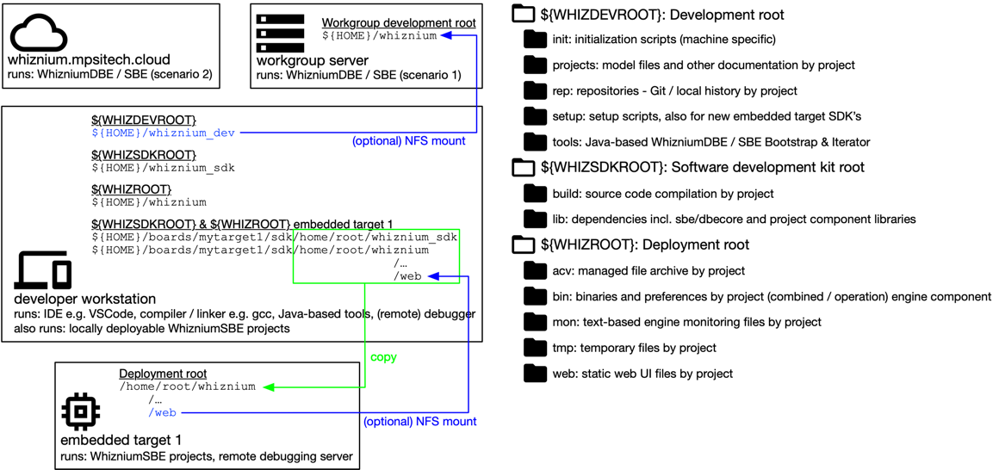
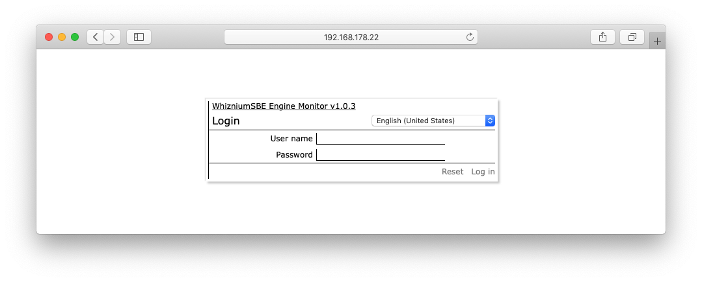

[back](./README.md)

# Setting Up Whiznium On Your Workstation

The following instructions have been tested on a Linux workstation running ubuntu 20.04.

## Overview

To ensure maximum flexibility for both single-user and shared development environments - along with the possibility to have one dedicated SDK for each project (a very common situation for Yocto Embedded Linux software development) - the Whiznium development environment spans across three directories as represented below:



- the development folder ``${WHIZDEVROOT}`` (in this reference installation to be found at ``/home/<username>/whiznium_dev``) contains information and the source code for all projects under developent using Whiznium. Also included are the WhizniumSBE/DBE Bootstrap and Iterator Java tools. The development folder is well-suited for being a shared network drive.

- the SDK folder ``${WHIZSDKROOT}`` (in this reference installation to be found at ``/home/<username>/whiznium_sdk``) is a local folder in which builds of Whiznium applications take place. After basic setup, it is populated with the sbecore, dbecore and WhizniumSBE Engine Monitor sources and libraries. For the case of cross-compilation for Embedded Linux applications, there can be multiple SDK folders on one development workstation.

- the deployment folder ``${WHIZROOT}`` (in this reference installation to be found at ``/home/<username>/whiznium``) contains the binary results of Whiznium projects after build along with eventual XML preferences files. For cross-compilation scenarios, contents of this folder would need to be duplicated onto the target Embedded Linux system.

## Obtaining and setting up the folder structure

- create the directories ``/home/<username>/whiznium_dev``, ``/home/<username>/whiznium`` and ``/home/<username>/whiznium_sdk`` or whichever combination of ``${WHIZDEVROOT}``, ``${WHIZSDKROOT}`` and ``${WHIZROOT}`` have been chosen

- obtain the latest Whiznium package, available from aws s3
```
cd /home/<username>/whiznium_dev
wget https://content.mpsitech.cloud/wznm_v1.1.6_wdbe_v1.1.17.tgz
tar xzf wznm_v1.1.6_wdbe_v1.1.17.tgz
```

- in ``init/ubuntu/init.sh``, adapt the path variables; for the reference installation, only replace ``username`` by the actual username

- run basic setup; this script prompts the path to the Whiznium initialization script edited in the previous step and subsequently installs dependencies, sets up MariaDB for use with Whiznium and builds the Whiznium essentials. The latter comprise the sbecore and dbecore libraries along with the WhizniumSBE Engine Monitor project:
```
cd setup/base
chmod 755 setup_base.sh
./setup_base.sh
```

- when the MariaDB configuration file shows, make sure that in "Fine Tuning" section the following are present:
```
max_connections = 1000000
max_prepared_stmt_count = 1048576
```

- leave nano via ``Ctrl+O``, ``<Enter>``, ``Ctrl+X``

- when prompted for identification towards MariaDB, it is possible to adapt the default user name and password, relevant for pre-existing MariaDB installations

## Test-running WhizniumSBE Engine Monitor

This simple test serves as a quick validation for the setup, ensuring that everything is in place.

- run the application from command line
```
cd /home/<username>/whiznium/bin/wzemcmbd
./Wzemcmbd
Wzemcmbd >> clearAll
```

- e.g. in Chrome, open http://127.0.0.1:14100

This screen should show up:



- log in with username/password: temp/asdf1234
- in the menu _WhizniumSBE Engine Monitor_, choose _Load initialization data ..._
- on the _Initialization file_ tab, pick _Choose file..._ and pick ``${WHIZDEVROOT}/rep/wzem/_ini/wzemcmbd/IexWzemIni.xml``; hit _Upload_
- on the _Import_ tab, hit _Execute_
- close the dialog by clicking _Done_
- in the _Session_ menu, choose _Close session_
- back on the command line, type ``Wzemcmbd >> quit``

The full command line output should read:
```
Welcome to WhizniumSBE Engine Monitor v1.0.3!
	starting 4 job processor threads ... {120017, 120019, 120021, 120023} success
	starting 1 operation processor threads ... {120025} success
	starting application server ... success
Initialization complete.

Wzemcmbd >> clearAll
	temporary account created for user 'temp', expires 18-12-2020 14:50:54; use password 'asdf1234' to log in
Wzemcmbd >> quit
```

If this is the case, Congratulations! Your Whiznium development environment is set up properly.

---

In case of problems, please do not hesitate to contact MPSI Technologles at [support@mpsitech.com](mailto:support@mpsitech.com).
