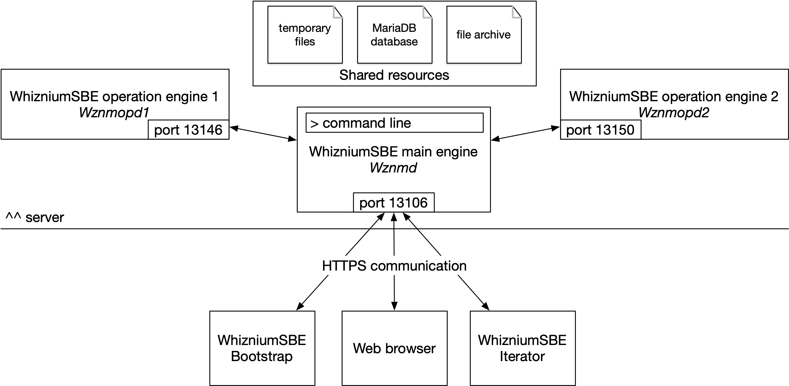
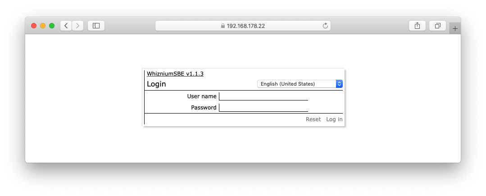

[back](./README.md)

# Setting Up WhizniumSBE On Your Workstation

The following instructions have been tested on a Linux workstation running ubuntu 20.04.

Note: for now it is required to have a local Whizniun installation as obtained by the following instructions. In future, _Whiznium as a Service_, the cloud-based Whiznium solution provided by MPSI Technologies can substitute as a convenient alternative. This solution has the advantage of automatically coming with the latest Whiznium updates.

## Building WhizniumSBE from source

- run WhizniumSBE (_wznm_) setup; this script clones the latest WhizniumSBE sources into ``${WHIZDEVROOT}/rep/wznm`` and performs a full build of the database access library _dbswznm_, the engine _wznmd_ and the two operation engines _wznmopd1_ / _wznmopd2_ within ``${WHIZSDKROOT}/build``:
```
cd ${WHIZDEVROOT}/setup/wznm
chmod 755 setup_wznm.sh
./setup_wznm.sh
```

- [optional] edit WhizniumSBE (wznm) database to deviate from default user (look for ``CREATE USER`` and ``GRANT`` lines):
```
nano ${WHIZDEVROOT}/rep/wznm/_ini/dbswznm_ubuntu/CreateDbsWznmMar.sql
sudo mariadb < ${WHIZDEVROOT}/rep/wznm/_ini/dbswznm_ubuntu/CreateDbsWznmMar.sql
```

- generate a key and self-signed certificate to allow HTTPS:
```
cd /home/<username>/whiznium/bin/wznmd
openssl genrsa -out server.key 4096
openssl req -days 365 -out server.pem -new -x509 -key server.key
```
Note that clients will get confused when different applications (such as WhizniumDBE) on the same computer try using a different key - thus, if you already have certificate and key for your machine, just copy the files into ``/home/<username>/whiznium/bin/wznmd``.

## Test-running WhizniumSBE

WhizniumSBE is a WhizniumSBE project and as such can leverage WhizniumSBE's out-of-the-box feature of distributed computing. The runtime setup consists of the database, one _main engine_ the clients talk to and two _operation engines_ which perform atomic compute operations, e.g. composing single source code files. This scenario is depicted below:



To prepare WhizniumSBE for this configuration, perform the following steps:

- edit ``/home/<username>/whiznium/bin/wznmd/PrefWznmd.xml``:<br>
	``StgWznmAppsrv.port = 13106``<br>
	``StgWznmAppsrv.https = true``<br>
	``StgWznmd.opengsrvport = 13126``<br>
	``StgWznmDatabase.srefIxDbsVDbstype = my``<br>
	``StgWznmDatabase.username = <username>``<br>
	replace all ``${WHIZROOT}`` by ``/home/<username>/whiznium``<br>
	``StgWznmTenant.orgname = <your organization>``<br>
	``StgWznmTenant.orgweb = <your webpage incl. http://>``<br>
- edit ``/home/<username>/whiznium/bin/wznmopd1/PrefWznmopd.xml``:
	``StgWznmDatabase.srefIxDbsVDbstype = my``<br>
	``StgWznmDatabase.username = <username>``<br>
	``StgWznmopd.engport = 13126``<br>
	``StgWznmopd.engsrvportbase = 13146``<br>
	replace all ``${WHIZROOT}`` by ``/home/<username>/whiznium``
- edit ``/home/<username>/whiznium/bin/wznmopd2/PrefWznmopd.xml``:
	``StgWznmDatabase.srefIxDbsVDbstype = my``<br>
	``StgWznmDatabase.username = <username>``<br>
	``StgWznmopd.engport = 13126``<br>
	``StgWznmopd.engsrvportbase = 13146``<br>
	``StgWznmopd.engsrvofs = 4``<br>
	replace all ``${WHIZROOT}`` by ``/home/<username>/whiznium``

To run WhizniumSBE, open three terminals (1), (2) and (3) and run, respectively:

- in (1):
```
cd /home/<username>/whiznium/bin/wznmd
./Wznmd
Wznmd >> clearAll
```

- in (2):
```
cd /home/<username>/whiznium/bin/wznmopd1
./Wznmopd
```

- in (3):
```
cd /home/<username>/whiznium/bin/wznmopd2
./Wznmopd
```

- in (1), verify connections:
```
Wznmd >> showNodes
```

- e.g. in Chrome, open http://127.0.0.1:13106

This screen should show up:



- log in with username/password: temp/asdf1234
- in the _Session_ menu, choose _Close session_
- back on the (1) command line, type ``Wznmd >> quit``

The full (1) command line output should read:
```
Welcome to WhizniumSBE v1.1.3!
	starting 4 job processor threads ... {120292, 120293, 120294, 120295} success
	starting operation engine client thread ... success
	starting operation engine server ... success
	starting application server ... success
Initialization complete.

Wznmd >> clearAll 
	temporary account created for user 'temp', expires 18-12-2020 15:00:12; use password 'asdf1234' to log in
Wznmd >> showNodes
	node 1 at 127.0.0.1:13146 running 4 op processors
	node 2 at 127.0.0.1:13150 running 4 op processors
Wznmd >> quit
```

Actually working with WhizniumSBE requires preparing an initialization file with your environment-specific information, optionally using the WhizniumSBE Bootstrap helper tool. This is descripbed in the first section of the [WhizniumSBE Development Workflow](./sbe.md) document.

# Setting Up WhizniumDBE On Your Workstation

The procedure is almost identical to the coresponding steps for WhizniumSBE. In below text, the differences are highlighted in <mark>yellow</mark>.

## Building WhizniumSBE from source

- run WhizniumDBE (_wdbe_) setup:
```
cd setup/wdbe
chmod 755 setup_wdbe.sh
./setup_wdbe.sh
```

- [optional] edit WhizniumDBE (wdbe) database to deviate from default user (look for ``CREATE USER`` and ``GRANT`` lines):
```
nano ${WHIZDEVROOT}/rep/wdbe/_ini/dbswdbe_ubuntu/CreateDbsWdbeMar.sql
sudo mariadb < ${WHIZDEVROOT}/rep/wdbe/_ini/dbswdbe_ubuntu/CreateDbsWdbeMar.sql
```

- copy certificate and key files from the WhizniumSBE engine's folder:
```
cd /home/<username>/whiznium/bin/wdbed
cp ../wznmd/server.* .
```

## Test-running WhizniumDBE

The WhizniumDBE runtime configuration, in analogy to WhizniumSBE is depicted below:


To prepare WhizniumDBE for this configuration, perform the following steps:

- edit ``/home/<username>/whiznium/bin/wdbed/PrefWdbed.xml``:<br>
	``StgWdbeAppsrv.port = ``<mark>``13105``</mark><br>
	``StgWdbeAppsrv.https = true``<br>
	``StgWdbed.opengsrvport = ``<mark>``13125``</mark><br>
	``StgWdbeDatabase.srefIxDbsVDbstype = my``<br>
	``StgWdbeDatabase.username = <username>``<br>
	replace all ``${WHIZROOT}`` by ``/home/<username>/whiznium``<br>
	``StgWdbeTenant.orgname = <your organization>``<br>
	``StgWdbeTenant.orgweb = <your webpage incl. http://>``<br>
- edit ``/home/<username>/whiznium/bin/wdbeopd1/PrefWdbeopd.xml:``<br>
	``StgWdbeDatabase.srefIxDbsVDbstype = my``<br>
	``StgWdbeDatabase.username = <username>``<br>
	``StgWdbeopd.engport = ``<mark>``13125``</mark><br>
	``StgWdbeopd.engsrvportbase = ``<mark>``13145``</mark><br>
	replace all ``${WHIZROOT}`` by ``/home/<username>/whiznium``<br>
- edit ``/home/<username>/whiznium/bin/wdbeopd2/PrefWdbeopd.xml``:<br>
	``StgWdbeDatabase.srefIxDbsVDbstype = my``<br>
	``StgWdbeDatabase.username = <username>``<br>
	``StgWdbeopd.engport = ``<mark>``13125``</mark><br>
	``StgWdbeopd.engsrvportbase = ``<mark>``13145``</mark><br>
	``StgWdbeopd.engsrvofs = 4``<br>
	replace all ``${WHIZROOT}`` by ``/home/<username>/whiznium``

To run WhizniumDBE, open three terminals (1), (2) and (3) and run, respectively:

- in (1):
```
cd /home/<username>/whiznium/bin/wdbed
./Wdbed
Wdbed >> clearAll
```

- in (2):
```
cd /home/<username>/whiznium/bin/wdbeopd1
./Wdbeopd
```

- in (3):
```
cd /home/<username>/whiznium/bin/wdbeopd2
./Wdbeopd
```

- in (1), verify connections:
```
Wdbed >> showNodes
```

- e.g. in Chrome, open http://127.0.0.1:<mark>13105</mark>

This screen should show up:


- log in with username/password: temp/asdf1234
- in the _Session_ menu, choose _Close session_
- back on the (1) command line, type ``Wdbed >> quit``

The full (1) command line output should read:
```
Welcome to WhizniumDBE v1.1.3!
	starting 4 job processor threads ... {126507, 126508, 126509, 126510} success
	starting operation engine client thread ... success
	starting operation engine server ... success
	starting application server ... success
Initialization complete.

Wdbed >> clearAll
	temporary account created for user 'temp', expires 18-12-2020 16:30:52; use password 'asdf1234' to log in
Wdbed >> showNodes
	node 1 at 127.0.0.1:13145 running 4 op processors
	node 2 at 127.0.0.1:13149 running 4 op processors
Wdbed >> quit
```

A description of how to include WhizniumDBE in the everyday developer experience can be found in the first section of the [WhizniumDBE Development Workflow](./dbe.md) document.

---

In case of problems, please do not hesitate to contact MPSI Technologles at [support@mpsitech.com](mailto:support@mpsitech.com).
