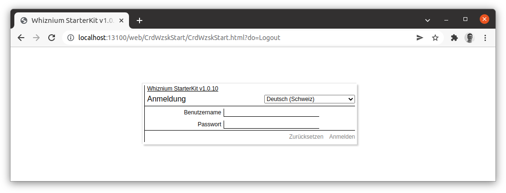
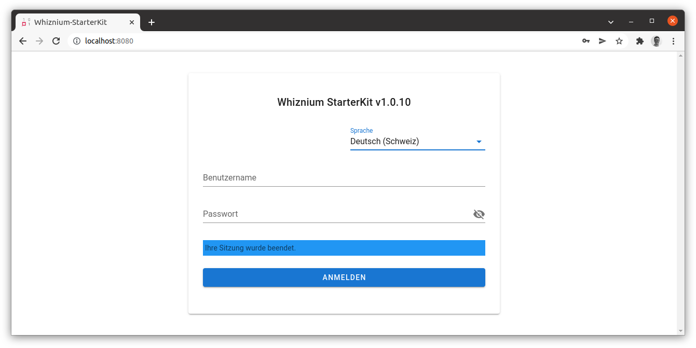
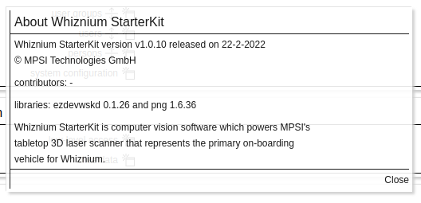
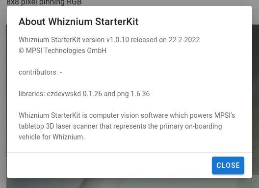
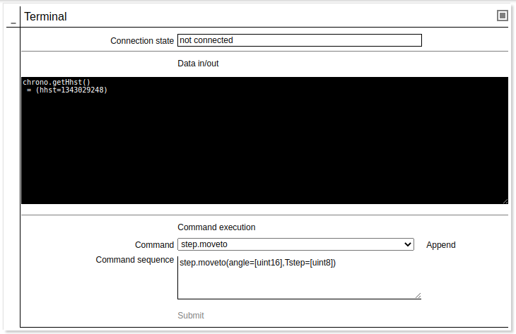
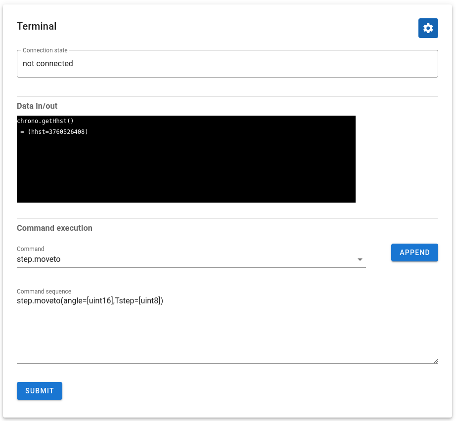
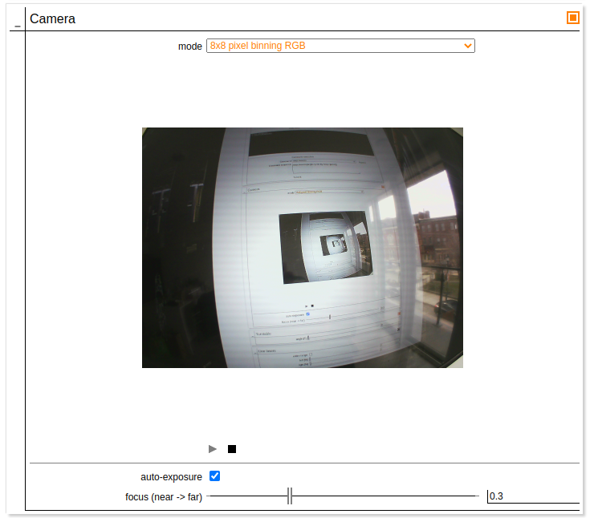
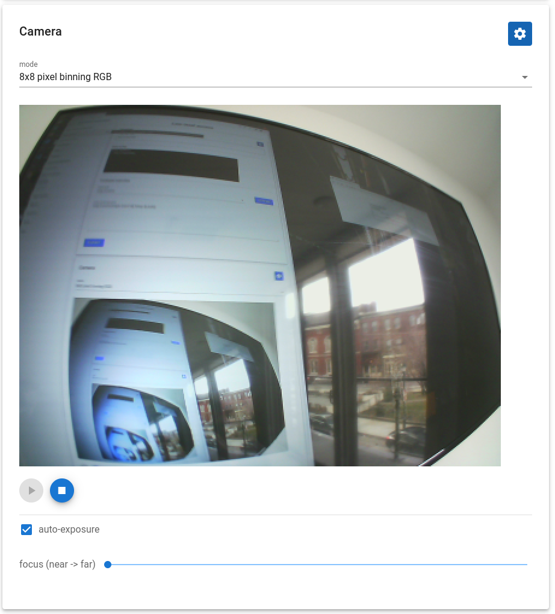
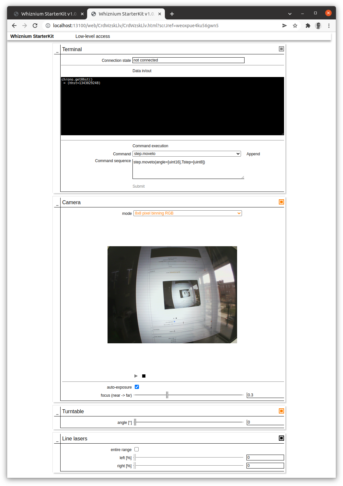
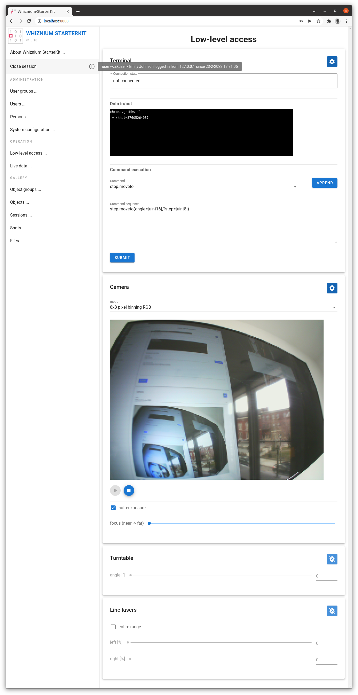

[back](./README.md)

# Vue.js User Interfaces

Whiznium is tuned to generate comprehensive and stable code with minimal memory / CPU load footprint, as this is a fundamental requirement for most applications running on constrained embedded systems. The co-generated web-based user interfaces (webUI's), which are served off the embedded system via an instance of the GNU libmicrohttpd library, are no exception.

However, Whiznium also is about offering its users (developers) and end-users (i.e. users of the finalized prouct) the freedom of choice, not least in technologies.

Adding code generation for Vue.js on top of the existing plan JavaScript webUI's offers the following advantages:

- state-of-the-art end-user experience
- tap into the vast Vue.js expert community for customization of look and feel
- overcome limitations in cross-browser compatibility

In the following, first results, concerning the Whiznium StarterKit's (a tabletop 3D laser scanner) HMI are illustrated.

## Details

### Login screen

Here also demonstrating localization.

(plain JavaScript)

(Vue.js)

### About alert

(plain JavaScript)

(Vue.js)

### Terminal

The terminal allows to pass low-level commands to the individual modules which make up the hardware. Including the monospace text area (a custom element in the Whiznium model) in Vue.js turned out to be straightforward. 

(plain JavaScript)

(Vue.js)

### Camera

Displaying camera frames is accomplished using a HTML5 ``<canvas/>`` element and also requires some JavaScript methods e.g. for Base64-to-binary conversion. This is custom functionality - only slight adaptations to TypeScript syntax were required for the latter. Embedding the canvas in Vue.js turned out to be straightforward. 

(plain JavaScript)

(Vue.js)

## The big picture

Finally, below screenshots offer a holistic view of the starter kit's "Low-level access"  browser view.

(plain JavaScript)

(Vue.js)

---

In case of problems, please do not hesitate to contact MPSI Technologles at [support@mpsitech.com](mailto:support@mpsitech.com).
