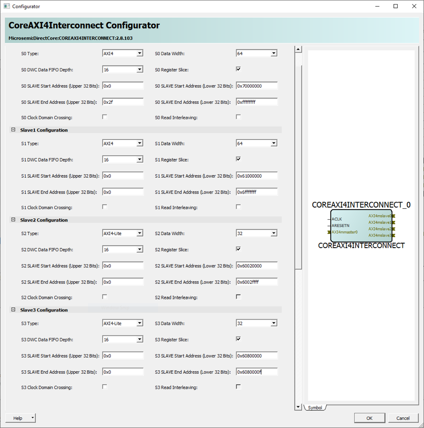
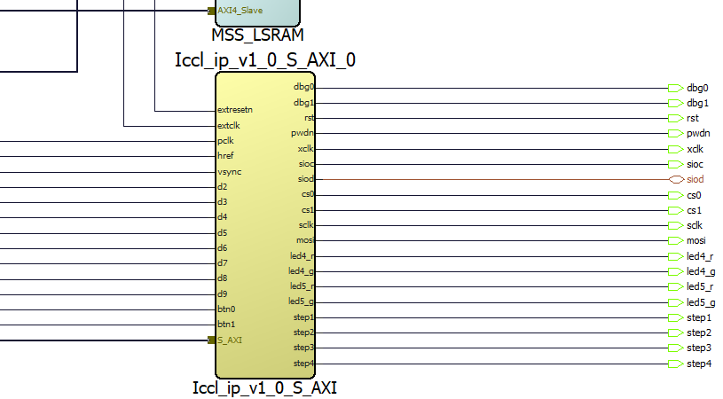

[back](./README.md)

# Running The Libero SoC Design Flow For Whiznium StarterKit Device

This document uses Microchip's PolarFire SoC Icicle kit in terms of hardware.

The following instructions require the finalized Whiznium StarterKit Device Libero SoC IP. The corresponding project can be downloaded, or else can be created from scratch as described [here](./wskdip_libero.md).

The design flow relies on a number of software tools. The tested configuration is:

- (optional) the [RISC-V GNU compiler toolchain](https://github.com/riscv/riscv-gnu-toolchain), specifically the Newlib 64bit version, for cross-compilation of the Hart Software Services (HSS) bare-metal code to be deployed on the E51 monitor core. Installed on a Linux workstation running ubuntu 20.04
- (optional) Microchip's [PolarFire SoC MSS Configurator](https://www.microsemi.com/product-directory/soc-design-tools/5587-pfsoc-mss-configurator-tool#downloads) v2021.1, to be able to adapt the reference Microprocessor Subsystem (MSS), defining re-configurable wiring between RISC-V cores and board features / FPGA fabric. Installed on a workstation running Windows 10
- Microchip's [Libero SoC Software](https://www.microsemi.com/product-directory/design-resources/1750-libero-soc#downloads) v2021.1, managing the RTL design flow from synthesis to bitstream generation. Installed on a workstation running Windows 10
- Microchip's [Programming and Debug Tools](https://www.microsemi.com/product-directory/dev-tools/5592-programming-and-debug#program) v2021.1, specifically the included FPExpress software, required to use the external FlashPro5 programmer for bitstream deployment. Installed on a workstation running Windows 10

## Setting up the Icicle kit reference design

The setup procedure in Libero SoC mainly consists of running .tcl scripts describing the RTL design which are provided by Microchip in a Git repository:

- download the repositories current release (here, 2021.04) from [GitHub](https://github.com/polarfire-soc/icicle-kit-reference-design/releases/tag/2021.04) and extract the archive content into a folder, e.g. ``C:\Users\mpsitech\fpgacode\icicle\wskd``

- in Libero SoC, press Ctrl+U and select the script file ``ICICLE_KIT_SD_CARD.tcl``, then click __Run__

- once completed, navigate to the __Design Flow__ tab and make sure __Synthesize__, __Place and Route__ and __Generate FPGA Array Data__ execute (by double-clicking on the respective items) without errors

## Building the HSS bare-metal project from source

As no modifications to the HSS code are required, it is possible to simply download the result file ``hss-bm1-p0.hex``, provided by Microchip, [here](https://github.com/polarfire-soc/hart-software-services/releases/tag/2021.04).

Alternatively, the binary can be built from source code using the RISC-V GNU compiler toolchain:

- download the repositories current release (here, 2021.04) from [GitHub](https://github.com/polarfire-soc/hart-software-services/releases/tag/2021.04) and extract the archive content into a folder, e.g. ``tmp``, then, assuming gcc for RISC-V is in the path variable, run:
```
cd tmp
cp boards/mpfs-icicle-kit-es/def_config .config
make BOARD=mpfs-icicle-kit-es
```

- the result is placed in ``Default/hss.hex`` and will be needed in the section "Deployment and test"

## Modifiying the Icicle kit reference design to accomodate Whiznium StarterKit Device features

### Freeing pins on the RaspberryPi header

In the reference design, some needed RaspberryPi header pins are occupied by an SPI interface connected to the MSS. In addition some pins are multiplexed with the Mikrobus header where QSPI functionality is implemented by default. While one option is to remove the corresponding output nets and pins and ground the input pins to the MSS, a cleaner way is to modify the MSS.

Update the MSS configuration as follows:

- start PolarFire SoC MSS Configurator and open the file ``script_support\PF_SoC_MSS_Icicle_SD.cfg``
- in the tab __Peripherals__, select QSPI and SPI_0, setting both to "Unused"
- save the configuration and click on __Generate__, placing the result in a new folder ``script_support\components\MSS_SD_wskd``
- close PolarFire SoC MSS Configurator

Incorporate the MSS/wiring changes into the scripts ``script_support\components\MPFS_ICICLE_BASE_DESIGN.tcl`` and ``script_support\simulation\Test_bench.tcl``:

- comment out all ``sd_create_scalar_port``/``sd_connect_pins[_to_constant]`` lines containing references to QSPI or SPI_0
- comment out the lines instantiating QSPI_DATA2_BIBUF and QSPI_DATA3_BIBUF

Adapt the top-level script ``script_support\MPFS_ICICLE_SD_CARD_recursive.tcl`` by removing the ``exec $mss_config ...`` line and changing the subsequent line to
```
import_mss_component -file "$local_dir/script_support/components/MSS_SD_wskd/ICICLE_MSS.cxz"
```

Remove the folder ``MPFS_ICICLE_SD_CARD`` and adapt to the new setup by re-running ``ICICLE_KIT_SD_CARD.tcl`` in Libero SoC.

### Freeing up GPIO's, user LED's and switches

These changes can be performed graphically on the SmartDesign canvas.

Helped by the option __Filter Nets__ with "RPi_GPIO*" filter, identify, then delete the eight nets and pins RPi_GPIO5, 6, 12, 13, 19 .. 21.

The user LED's with schematic names LED1 .. LED4 are freed by deleting the nets and pins LED0 .. LED3, removing the connection to the respective MSS outputs.

The Whiznium StarterKit Device design requires two switches, push-buttons actually, for which SWITCH2 and SWITCH3 need to be freed from their default functionality. This is achieved by deleting the OR-gates SW2_OR_GPIO_2_26 and SW3_OR_GPIO_2_27 first, and establishing direct links GPIO_2_M2F_26 - GPIO_2_F2M_30 and GPIO_2_M2F_27 - GPIO_2_F2M_31, e.g. using __QuickConnect__, respectively.

Lastly, pins SW2 and SW3 can be deleted.

### Adding an AXI4 lite slave to FIC0_MASTER

To communicate between Embedded Linux applications and the Whiznium StarterKit Device logic in the FPGA fabric, a 32bit AXI4 lite slave is used, which is added at a suitable address to the existing FIC0_MASTER block.

- in the MPFS_ICICLE_KIT_BASE_DESIGN SmartDesign, double-click on FIC0_MASTER and increase the __Number of Slaves__ from 3 to 4

- in the __Slave Configuration__ tab, adapt the settings to access the logic at addresses 0x60800000 to 0x6080000F, as follows



- click __OK__, right-click on "FIC0_MASTER" and select __Update component__, save the design and click __Build Hierarchy__.

A __Generate Component__ on the MPFS_ICICLE_KIT_BASE_DESIGN SmartDesign in the __Design Hierarchy__ tab completes all reference design modifications.

### Finishing up by editing the I/O constraints files

- in the file ``constraint\io\ICICLE.pdc`` comment out the ``set_io`` lines for SW2, SW3, LED0 .. LED3

- in the file ``constraint\io\ICICLE_MIKROBUS.pdc`` comment out the ``set_io`` lines for QSPI_DATA2 and QSPI_DATA3

- the file ``constraint\io\ICICLE_Rpi.pdc`` will be skipped alltogether, thus no modifications are required here

## Incorporating the Whiznium StarterKit Device IP

In case the IP has not been created from scratch, it can be downloaded as [.zip file](https://content.mpsitech.cloud/wskd/iccl_core_v1.0.4.zip), and extracted e.g. here ``C:\Users\mpsitech\fpgacode\wskd_core``.

- through __File__ -> __Import__, add the block ``designer\Iccl_ip_v1_0_S_AXI\Iccl_ip_v1_0_S_AXI.cxz`` to the main project
- in the same manner, also add the I/O constraint file ``C:\Users\mpsitech\temp\wskd\fpgawskd\iccl\Iccl.pdc``

To wire up the newly imported block, perform the following steps:

- from the __Design Hierarchy__ tab, drag the "Iccl_ip_v1_0_S_AXI" block onto the MPFS_ICICLE_KIT_BASE_DESIGN SmartDesign
- select the block by clicking on its symbol and open the __QuickConnect__ dialog from the toolbar
- connect "extclk" to "CLOCKS_AND_RESETS/CLK_125MHz"
- connect "extresetn" to "CLOCKS_AND_RESETS/RESETN_CLK_125MHz"
- connect the "S_AXI" bus to "FIC0_MASTER/AXI4mslave3"
- select __Promote to Top Level__ for all other pins
- close the dialog

The relevant section of the canvas should look as shown below, indicating the I/O's required to connect to the 5MP camera, line lasers and turntable stepper motor.



Save the design, click __Build Hierarchy__ and run a final __Generate Component__.

## Synthesis and design implementation

Before launching synthesis, it is required to de-select ``constraint\io\ICICLE_Rpi.pdc`` while selecting ``constraint\io\Iccl.pdc`` in the __Constraint Manager__ -> __I/O Attributes__ tab, and save.

After this, the design flow can be run all the way to __Generate FPGA Array Data__.

## Deployment and test

The goal within Libero SoC is to generate binary data to be deployed using a FlashPro5 JTAG programmer. Before doing this, the HSS payload and the content of the camera interface's parameter ROM (used for camera initialization) have to be co-packaged with the FPGA array data:

- navigate to __Configure Design Initialization Data and Memories__, the __eNVM__ tab
- click __Add ...__ -> __Add Boot Mode 1 Client__
- as file either select the downloaded or built HSS .hex file (see above) and click __OK__

- on the __Fabric RAMs__ tab, double-click on ``Iccl_ip_v_1_0_S_AXI_0/myTop/myCamif/myParrom/Dpsram_size2kB_p8_0``
- switch to __Content from file__ and select ``C:\Users\mpsitech\temp\wskd\fpgawskd\iccl\support\parrom.hex``

- save the project and run __Export FlashPro Express Job__, not changing any parameters

The file which can be processed by FPExpress can be found at ``MPFS_ICICLE_SD_CARD\designer\MPFS_ICICLE_KIT_BASE_DESIGN\export\MPFS_ICICLE_KIT_BASE_DESIGN.job``.

A number of jumper settings should be established / verified before power-on of the PolarFire SoC Icicle kit:

- follow the instructions provided by Microchip's [Getting Started](https://www.microsemi.com/products/fpga-soc/polarfire-soc-icicle-quick-start-guide#getting-started) guide
- make sure J34 and J43 are in the 2-3 or 1.8V position
- J9 should be open to select the external programmer
- supply 3.3V and 5.0V to the RaspberryPi header by populating J46 and J47
- attach the StarterKit's breakout board to the RaspberryPi header J26
- attach the FlashPro5 programmer to J23

With the FlashPro5 programmer connected to the workstation via USB, and the target powered on, FPExpress can be run for programming:

- select __New...__ and insert the path to the file generated above in the __Import FlashPro Express job file__ text field
- to avoid confusion, the __FlashPro Express job project location__ should be the same as the job file's location; click __OK__ to close the dialog
- click __RUN__; programming should take about 1-2 minutes to complete

If the system is now power-cycled - with the Yocto SD card inserted - it should properly boot up Embedded Linux with FPGA support through a character device driver (see [Setting Up A New PolarFire SoC Yocto SDK For Use With Whiznium](./setup_riscv.md)).

---

In case of problems, please do not hesitate to contact MPSI Technologles at [support@mpsitech.com](mailto:support@mpsitech.com).
