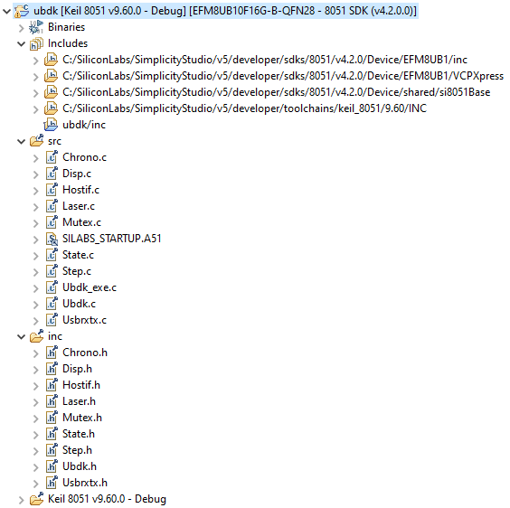

[back](./README.md)

# Running The Simplicity Studio Design Flow For Whiznium StarterKit Device

This document uses SiLabs' Universal Bee development kit in terms of hardware.

The following instructions require the finalized Whiznium StarterKit Device Simplicity Studio solution. The corresponding project can be downloaded, or else can be created from scratch as described [here](./wskdsln_splcty.md).

The design flow relies on SiLabs' [Simplicity Studio 5](https://www.silabs.com/developers/simplicity-studio). The tested installation is running on Windows 10.

## Importing and building the solution

In case the solution has been downloaded as [.sls file](https://content.mpsitech.cloud/wskd/ubdk_v1.0.4.sls), e.g. to here ``C:\Users\mpsitech\mcucode\ubdk.sls``, it can be imported into Simplicity Studio like this:

- from the main menu, select __File__ -> __Import...__
- in the __Import Project__ dialog, navigate to ``C:\Users\mpsitech\mcucode`` using the __Browse...__ button
- under __Detected projects__, select ubdk and click __Next >__ twice, then __Finish__

The project should now appear in the __Project Explorer__ as shown below.

To build the solution, select __Project__ -> __Build Project__ in the main menu.

The binary file ``ubdk.hex`` can be found in the project's ``Keil 8051 v9.60.0 - Debug`` sub-folder.

## Deployment and test

Besides the actual 8-bit MCU target, the Universal Bee development kit hosts a controller / programmer chip which can be used for debugging the target as well. To deploy the binary and test it, select "AEM" as power source and connect the PCB to the workstation using the mini-USB jack on the short side of the board.

By choosing __Run__ -> __Debug__ or by hitting F11, debugging starts and execution should pause at the ``void main(void)`` method of ``Ubdk_exe.c``.

As during any debug run, the target's flash memory is re-programmed with production code, it is subsequently possible to use the board standalone, i.e. without using the debug section.

---

In case of problems, please do not hesitate to contact MPSI Technologles at [support@mpsitech.com](mailto:support@mpsitech.com).
