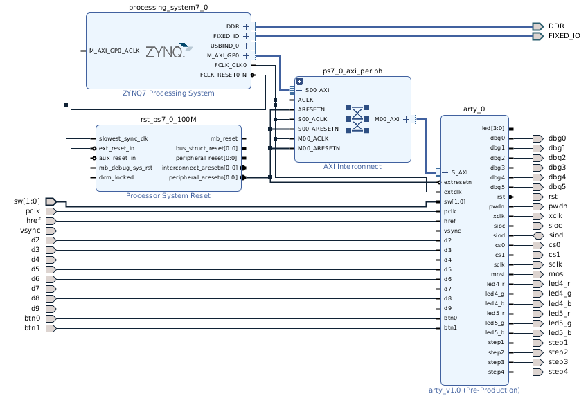

[back](./README.md)

# Running The Vivado Design Flow For Whiznium StarterKit Device

This document uses Digilent's Arty Z7 board in terms of hardware.

The following instructions require the finalized Whiznium StarterKit Device Vivado IP. The corresponding project can be downloaded, or else can be created from scratch as described [here](./wskdip_vivado.md).

The design flow relies on Xilinx's [Vivado 2020.1](https://www.xilinx.com/products/design-tools/vivado.html). The tested installation is running on ubuntu 20.04.

## Setting up the ZYNQ design

Launch Vivado and perform the following steps for setting up the block design project:

- in __Quick Start__, select __Create Project >__, then click __Next >__ on the __New Project__ dialog
- on the __Project Name__ tab, choose "wskd" as __Project name__ and ``/home/mpsitech/fpgacode`` as __Project location__; hit __Next >__ three times
- on the __Add Constraints__ tab, click __Add Files__ and navigate to ``${WHIZDEVROOT}/rep/wskd/fpgawskd/arty``, then select ``Arty.xdc``, click __OK__, then __Next >__
- on the __Default Part__ tab, either select the __Part__ "xc7z020clg400-1" or the __Board__ "Arty Z7-20", hit __Next >__ then __Finish__
- click on __Create Block Design__, then __OK__
- on the canvas, hit __+__
- double-click on __ZYNQ7 Processing System__, then on __Run Block Automation__ and __OK__
- double-click on the ZYNQ component and navigate to __Clock Configuration__ -> __Basic Clocking__ -> __PL Fabric Clocks__
- change the __Requested Frequency__ for "FCLK_CLK0" to 100MHz and click __OK__

## Incorporating the Whiznium StarterKit Device IP

In case the IP has not been created from scratch, it can be downloaded as [.zip file](https://content.mpsitech.cloud/wskd/arty_core_v1.0.4.zip), and extracted e.g. here ``/home/mpsitech/fpgacode/wskd_core``.

The IP repository location is added as follows:

- open __Settings__, then navigate to __Project Settings__ -> __IP__ -> __Repository__
- under __IP Repositories__, click __+__ and select ``/home/mpsitech/fpgacode/wskd_core/wskd_core.srcs``, then click __Select__, then __OK__
- save the project

Back on the canvas, add the Whiznium StarterKit Device IP:

- with a right-click and __Add IP...__, __Search__ for "Arty_ip_v2_0_AXI_v1_0" and double-click on it
- click on __Run Connection Automation__ and __OK__
- re-name the Arty component to "Arty_ip_v2_0_AXI" (eliminating the "_0") by navigating to the __Block Properties__ -> __General__ tab and overwriting __Name__
- using the pen tool, connect "extresetn" to "FCLK_RESET0_N" and "extclk" to "FCLK_CLK0"
- save the project
- right-click on the Arty component and select __Make External__
- remove the pin "led[3:0]"
- for each other inferred pin, remove the "_0" postfix by clicking on it and updating the name in __External Port Properties__ -> __General__

The relevant section of the canvas should look as shown below, indicating the I/O's required to connect to the 5MP camera, line lasers and turntable stepper motor.

## Synthesis and design implementation

As a prerequisite for synthesis, it is required for the design to have a top VHDL module which for block designs is an auto-generared wrapper. For this, right-click on __Hierarchy__ -> __Sources__ -> __Design Sources__, "design_1" and select __Create HDL Wrapper...__, then click __OK__.

After this, the design flow can be run all the way to __Generate Bitstream__.

## Deployment and test

The bitstream, located at ``wskd.runs/impl_1/design1_wrapper.bit``, can be tested individually via the Vivado Hardware Manager. For this, the Arty board needs to be connected to the workstation via USB.

For use with the PetaLinux / Yocto workflow, selecting __File__ -> __Export__ -> __Export Hardware...__ from the main menu will update the hardware description.

---

In case of problems, please do not hesitate to contact MPSI Technologles at [support@mpsitech.com](mailto:support@mpsitech.com).
