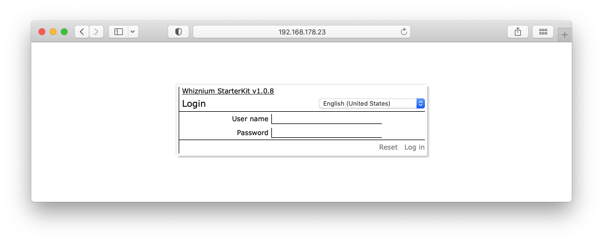

[back](./README.md)

# Setting Up The Whiznium StarterKit Project

Building the Whiznium StarterKit project (developed using WhizniumSBE) is straightforward. It involves (cross-)compilation of the sources for the C++ SQLite database access library ``dbswzsk`` and the C++ _combined daemon_ ``wzskcmbd``. The compilation results, along with the web-based UI files and a customized preferences file are then deployed on the target.

A single script, ``${WHIZDEVROOT}/setup/wzsk/setup_wzsk.sh`` performs the required actions for the currently four reference targets, Embedded Linux (Toradex Apalis i.MX6 / _tdx), FPGA (Digilent Arty Zynq / _plnx), RISC-V (Microchip Icicle PolarFire SoC / _riscv) and workstation (SiLabs Universal Bee / _ubuntu).

The setup script can be executed using:
```
cd ${WHIZDEVROOT}/setup/wzsk
chmod 755 setup_wzsk.sh
./setup_wzsk.sh
```

When prompted, adapt the path to the initialization script folder and for the machine postfix, the defaults are for the _tdx target.

- for all embedded targets, copy the updated target SDK folder ``${SYSROOT}${WHIZROOT}`` to the SD card

## Target-specific run preparations

All targets with separate Whiznium StarterKit Device software project (i.e. all except for Embedded Linux) require preparation of the corresponding hardware. While in-detail descriptions for generating the corresponding binaries from scratch can be found in the sub-sections of [WhizniumDBE topics](./README.md), finalized files are made available as part of the Whiznium package. 

### FPGA (Digilent Arty Zynq / _plnx)

The hardware definition is comprised of the file ``${WHIZDEVROOT}/setup/plnx/design_1_wrapper.xsa`` and the folder contents of ``${WHIZDEVROOT}/setup/plnx/arty_wrp.sdk``. Also included is the bitstream, required to initialize the FPGA.

No additional steps are required, because the first-stage bootloader on the boot partition of the SD card takes care of FPGA initialization. Copying of above mentioned sources to the SD is part of the instructions at [Setting Up A New PetaLinux SDK For Use With Whiznium](./setup_peta.md).

### RISC-V (Microchip Icicle PolarFire SoC / _riscv)

The hardware definition is provived by means of an _FPExpress_ project, comprised of ``${WHIZDEVROOT}/setup/riscv/MPFS_ICICLE_KIT_BASE_DESIGN.pro`` and the folder contents of ``${WHIZDEVROOT}/setup/riscv/projectData``.

- plug in FlashPro5 programmer into the PolarFire SoC Icicle kit and connect it to the workstation via USB
- power on the target
- launch FPExpress
- select __Job Projects__ -> __Open...__ and select the .pro file mentioned above
- once the project is loaded, clicking on __RUN__ programs the binary data into the FPGA-SoC
- close FPExpress and optionally power-cycle the board while removing the programming adapter

### Workstation (SiLabs Universal Bee / _ubuntu)

The project's binary can be found in the file ``${WHIZDEVROOT}/setup/ubuntu/ubdk.hex``.

- select "AEM" as power source on the Universal Bee developer kit
- connect the PCB to the workstation using the mini-USB jack on the short side of the board
- launch Simplicity Studio
- select the __Flash Programmer__ icon in the toolbar
- if not already selected, pick "EFM8UB1 Universal Bee STK" under the __Change Device__ link
- for __File__, enter the path to the binary mentioned above
- clicking on __Program__ transfers the binary to the MCU's flash memory
- close Simplicity Studio, remove the mini-USB cable and select "USB" as power source

## Test-running Whiznium StarterKit

This simple test serves as a quick validation for setup and deployment, ensuring that everything is in place and that hardware is connected.

- for the Embedded Linux, FPGA and RISC-V targets, make sure the hardeware has an Ethernet connection to the local network and power it up
- for the workstation target, connect the micro-USB jack on the long side of the Universal Bee developer kit to the workstation
- run the application from command line
```
cd /home/<username>/whiznium/bin/wzskcmbd
./Wzskcmbd
Wzskcmbd >> clearAll
```
For all embedded targets, &lt;username&gt; is root.

- e.g. in Chrome, open http://&lt;IP address&gt;:13100
- the correct IP address can be found in router settings or using the target's console interface and the Linux tool ifconfig

This screen should show up:



- log in with username/password: temp/asdf1234
- in the menu __Whiznium StarterKit__, choose __Load initialization data ...__
- on the __Initialization file__ tab, pick __Choose file...__ and pick ``${WHIZDEVROOT}/rep/wzsk/_ini/wzskcmbd/IexWzskIni.xml``; hit __Upload__
- on the __Import__ tab, hit __Execute__
- close the dialog by clicking __Done__
- in the __Session__ menu, choose __Close session__
- back on the command line, type ``Wzskcmbd >> quit``

The full command line output should read:
```
Welcome to Whiznium StarterKit v1.0.9!
	starting 4 job processor threads ... {5114, 5115, 5116, 5117} success
	starting 1 operation processor threads ... {5118} success
	starting application server ... success
Initialization complete.

Wzskcmbd >> clearAll
	temporary account created for user 'temp', expires 16-11-2021 14:56:10; use password 'asdf1234' to log in
Wzskcmbd >> quit
```

---

In case of problems, please do not hesitate to contact MPSI Technologles at [support@mpsitech.com](mailto:support@mpsitech.com).
